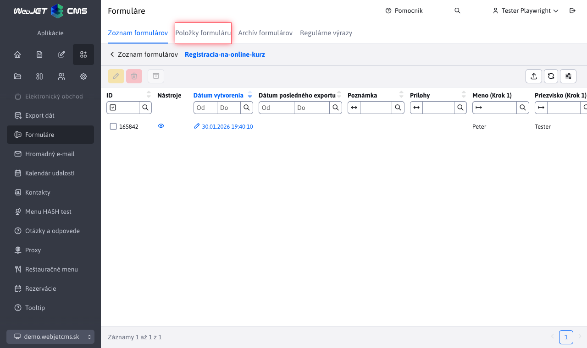

# Položky formuláře

Přes kartu položky formuláře umíte vytvářet vícekrokové formuláře. Tyto formuláře umožňují rozdělení formulářů na více kroků, což zlepšuje uživatelskou zkušenost a zvyšuje přehlednost. Samozřejmě můžete vytvářet jednoduché formuláře pouze s jedním krokem.

## Vytvoření formuláře

Formulář můžete vytvořit v sekci **Aplikace > Formuláře**, přesněji v kartě [Seznam formulářů](../form/README.md). Seznam obsahuje formuláře všech typů, včetně vícekrokových, ale při vytvoření nového se vždy vytvoří vícekrokový formulář.

Klepnutím na tlačítko přidat se zobrazí dialog pro [vytvoření nového formuláře](../form/README.md#vytvoření-formuláře).

Musíte zadat unikátní název formuláře a chcete-li odesílat odpovědi na email i vaši email adresu. Více informací k polím formuláře naleznete v sekci [Vytvoření formuláře](../form/README.md#vytvoření-formuláře).

## Položky formuláře

V seznamu odeslaných formulářů se pro formulář typu vícekrokový zobrazuje karta **Položky formuláře**.

Klepnutím na tuto kartu se zobrazí sekce, kde můžeme formuláři přidávat položky a kroky.

Karta **Položky formuláře** je rozdělena na tři sloupce:
- **Kroky formuláře** - tabulka obsahující seznam kroků formuláře.
- **Položky formuláře** - tabulka obsahující seznam položek (jednotlivá formulářová pole) formuláře patřících do právě vybraného kroku.
- **Náhled formuláře** - zobrazení náhledu právě zvoleného kroku formuláře.

## Kroky formuláře

První sloupec zobrazuje seznam kroků formuláře. V tomto seznamu můžeme přidávat, duplikovat, mazat, upravovat a měnit pořadí kroků formuláře. Každý vytvořený krok tedy představuje reálný krok ve formuláři, který se zobrazí uživateli. K jednotlivým krokům můžete přidávat položky formuláře, které se zobrazí v daném kroku.

Můžete vyplnit Úvodní text, který se zobrazí na začátku kroku. V kartě Pokročilé můžete změnit text tlačítka pro přechod na další krok (nebo odeslání formuláře, pokud jde o poslední krok). V kartě Kód skriptu můžete vložit vlastní HTML/JavaScript kód, který se vloží a provede při zobrazení kroku.

### Duplikování

Při duplikování kroku se zkopírují všechny položky, které se v daném kroku nacházejí, do nového kroku. Tímto způsobem můžeme rychle vytvořit podobné kroky bez nutnosti přidávat všechny položky znovu.

### Mazání

Při mazání kroku se odstraní všechny položky, které se v daném kroku nacházejí. Před mazáním je vhodné zkontrolovat, zda v daném kroku nejsou žádné důležité položky, které bychom chtěli zachovat.

## Položky formuláře

Druhý sloupec obsahuje položky formuláře (nebo položky kroku formuláře), které se zobrazí až po zvolení kroku v prvním sloupci. V této tabulce můžete přidávat, duplikovat, upravovat, mazat a měnit pořadí položek formuláře. Položky se přidávají do právě zvoleného kroku (takže jednotlivé kroky formulář se nebudou navzájem ovlivňovat).

### Přidávání a úprava položek

Editor pro přidávání a úpravu položek je speciální tím, že mění svůj obsah podle zvoleného typu pole (položky). To znamená, že pro každý typ položky (např. Jméno, Příjmení atd.) se zobrazí různá nastavení a možnosti konfigurace. Podle zvoleného typu položky můžete nastavit parametry jako:
- **Typ pole** - určuje jaký druh vstupu bude položka představovat (např. textové pole, výběr z rozbalovacího seznamu, zaškrtávací políčko atd.). Jednotlivá pole [připravuje designér web sídla](../formsimple/README.md#informace-pro-web-designéra) a jsou stejné jako pro aplikaci formulář snadno.
- **Povinné pole** - zda je položka povinná k vyplnění.
- **Povolená hodnota** - pro pokročilou validaci vstupu uživatele umíte zvolit libovolný počet regulárních výrazů, které musí být splněny, aby byl vstup platný. Více se o nich dozvíte v sekci [Regulární výrazy](../form/regexps.md).
- **Název pole** - název, který se zobrazí uživateli. Pokud není zadán použije se název shodný s typem pole.

V kartě Pokročilé můžete nastavit další volitelné parametry jako:
- **Krok formuláře** - krok, ke kterému položka patří, můžete tak snadno položku přesunout do jiného kroku.
- **Pořadí** - určuje pořadí položky v rámci kroku.
- **Předvyplněná hodnota** - hodnota, která se zobrazí vyplněná v poli, uživatel tak nemusí nastavit hodnotu, pokud je všeobecně známá. Pro pole typu výběrové pole sem zadejte čárkovou oddělovaný seznam hodnot, například `začiatočník,pokročilý,expert`.
- **Zástupný text** - text, který se zobrazí v poli jako nápověda pro uživatele pokud není pole vyplněno (je prázdné).
- **Tooltip** - pokud zadáte hodnotu tooltipu, zobrazí se při názvu pole informační bublina.

Chcete-li definovat vlastní položky formulářů, nebo chcete změnit stávající, zda změnit jaká nastavení jsou dostupná pro jednotlivé typy položek, podívejte se do dokumentace v sekci [Položky formulářů](../formsimple/README.md#informace-pro-web-designéra).

!>**Upozornění:** při úpravě položky formuláře nedoporučujeme měnit typ položky, ale raději nahradit původní položku novou.

### Řádkové zobrazení

Můžete se setkat se situací, kdy Vám editor nedovolí přidat zvolenou položku. To může nastat, pokud se jedná o speciální položku určenou pro řádkové zobrazení formuláře (obecně mají tyto položky v názvu "řádkové zobrazení"). Dokud formulář nebude v režimu řádkového zobrazení, tyto položky sice ve výběru uvidíte, ale nebudete je moci použít.

Formulář přepnete do režimu řádkového zobrazení v [nastaveních formuláře](../form/README.md#vytvoření-formuláře).

### Značky

Pokud chcete v položce formuláře použít informace o aktuálním přihlášeném uživateli (např. jeho jméno, email, atd.), můžete použít speciální značky. Tyto značky se automaticky nahradí příslušnými hodnotami při zobrazení formuláře uživateli. Pro nepřihlášené uživatele budou tyto značky nahrazeny prázdnou hodnotou. Hodnotu zadejte do pole **Předvyplněná hodnota** položky formuláře.

Dostupné značky jsou:
- `!LOGGED_USER_NAME!` - jméno a příjmení (je-li konf. proměnná `fullNameIncludeTitle` nastavena na true obsahuje i titul)
- `!LOGGED_USER_FIRSTNAME!` - jméno
- `!LOGGED_USER_LASTNAME!` - příjmení
- `!LOGGED_USER_TITLE!` - titul
- `!LOGGED_USER_LOGIN!` - přihlašovací jméno
- `!LOGGED_USER_EMAIL!` - emailová adresa
- `!LOGGED_USER_COMPANY!` - firma
- `!LOGGED_USER_CITY!` - město
- `!LOGGED_USER_ADDRESS!` - adresa (ulice)
- `!LOGGED_USER_COUNTRY!` - stát
- `!LOGGED_USER_PHONE!` - telefon
- `!LOGGED_USER_ZIP!` - PSČ
- `!LOGGED_USER_ID!` - ID uživatele
- `!LOGGED_USER_BIRTH_DATE!` - datum narození
- `!LOGGED_USER_FIELDA!` - volné pole A
- `!LOGGED_USER_FIELDB!` - volné pole B
- `!LOGGED_USER_FIELDC!` - volné pole C
- `!LOGGED_USER_FIELDD!` - volné pole D
- `!LOGGED_USER_FIELDE!` - volné pole E
- `!LOGGED_USER_GROUPS!` - seznam skupin uživatelů

## Náhled formuláře

Třetí sloupec sekce **Obsah formuláře** je náhled formuláře. Tento náhled zobrazuje aktuální krok formuláře tak, podobně jako jej uvidí uživatel. Náhled se aktualizuje vždy, když nastane nějaká změna v tabulce kroky nebo položky formuláře. Tímto způsobem můžete orientačně vidět, jak bude formulář vypadat po provedení změn.

Na konci každého kroku se automaticky vygeneruje tlačítko, jehož text se mění podle toho, zda je krok poslední nebo ne. Není-li poslední, tlačítko bude mít text **Přejít na další krok**, jinak **Odeslat formulář**. Text tlačítka můžete změnit v nastavení kroku, například na **Pokračovat** nebo **Registrovat se**.

!>**Upozornění:** Náhled formuláře se ve výsledku může graficky lišit od skutečného zobrazení ve webové aplikaci, jelikož záleží na použité šabloně a stylech stránky ve které bude formulář vložen. Náhled slouží hlavně k představě o rozložení a obsahu formuláře.

## Vložení formuláře do stránky

Vytvořený formulář můžete vložit do web stránky pomocí aplikace Formulář ve které vyberete název vytvořeného formuláře.

## Konfigurační proměnné

Dostupné konfigurační proměnné pro vícekrokové formuláře:
- `multistepform_nameFields` - seznam názvů polí, která budou považována za pole pro jméno. Mezi těmito poli se bude hledat jméno, které by se použilo jako oslovení v emailech. Použije se pouze **první** nalezeno neprázdné jméno.
- `multistepform_emailFields` - seznam názvů polí, která budou považována za pole pro emailovou adresu. Mezi těmito poli se bude hledat emailová adresa, na kterou se odešle potvrzení o přijetí formuláře. Použije se **všechny** nalezeny a validní emailové adresy.
- `multistepform_attachmentDefaultName` - přednastavený název přílohy v emailech, který se použije pokud se nepodaří získat skutečný název souboru přílohy.
- `multistepform_subjectDefaultValue` - přednastavený překladový klíč pro předmět emailu, který se použije, pokud není zadaný předmět v nastaveních/atributech formuláře.
