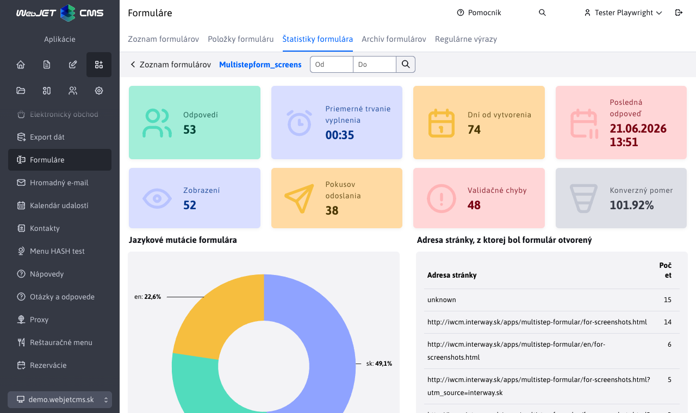

# Statistiky formuláře

Sekce **Statistiky formuláře** poskytuje přehled o odpovědích odeslaných přes vícekrokový formulář. Zobrazuje souhrnná čísla, grafické vizualizace odpovědí na jednotlivé položky formuláře a pokročilé statistiky vyplnění formuláře.

## Souhrnné statistiky

V horní části stránky se nacházejí základní informační karty:

| Karta | Popis |
| --- | --- |
| **Odpovědí** | Počet vyplněných a odeslaných formulářů ve zvoleném období. |
| **Průměrné trvání vyplnění** | Průměrný čas, který respondenti strávili vyplňováním formuláře ve zvoleném období, ve formátu `MM:SS`. |
| **Dnů od vytvoření** | Počet dní, které uplynuly od vytvoření formuláře. U formuláře vytvořeného v aktuální den se zobrazí hodnota `< 1`. |
| **Poslední odpověď** | Datum a čas poslední odeslané odpovědi ve zvoleném období. |

Po klepnutí na tlačítko **Zobrazit pokročilou statistiku** se zobrazí i další karty:

| Karta | Popis |
| --- | --- |
| **Zobrazení** | Počet zobrazení vícekrokového formuláře návštěvníkům. |
| **Pokusů** | Počet pokusů dokončit formulář odesláním posledního kroku. |
| **Chyby** | Součet validačních chyb položek a systémových chyb při práci s kroky formuláře. |
| **Poměr** | Poměr počtu odpovědí vůči celkovému počtu zobrazení formuláře v procentech. |

## Filtrování období

V horní liště stránky je datový filtr **Od - Do**. Po změně rozsahu a kliknutí na tlačítko filtrování se přepočítají odpovědi, grafy položek formuláře a statistiky, které se váží na uložená odeslání. Pokud rozsah nezadáte, použije se výchozí rozsah posledních 30 dnů.

| Údaj | Chování při datovém filtru |
| --- | --- |
| **Odpovědi**, **Průměrné trvání vyplnění**, **Poslední odpověď**, grafy položek, jazykové mutace, adresa nasazeného formuláře a systémové chyby | Počítají se ze zvoleného období. |
| **Zobrazení**, **Pokusů** a validační chyby položek | Jedná se o průběžná počítadla od nasazení sledování, datový filtr je zpětně nerozděluje. |
| **Dnů od vytvoření** | Počítá se od vytvoření formuláře bez ohledu na zvolený rozsah. |

!>**Upozornění:** Starší historické odpovědi vytvořené před rozšířením statistik nemusí obsahovat jazyk, adresu nasazení formuláře ani počítadla chyb.

## Grafy položek formuláře

Pod souhrnnými kartami se zobrazují grafy pro jednotlivé položky formuláře, které mají povoleno zobrazení statistiky. Pro každou takovou položku se vykreslí samostatný graf s rozdělením odpovědí ve zvoleném období.

!>**Upozornění:** Graf se zobrazí pouze pro ty položky formuláře, které mají zapnutou možnost **Zobrazit statistiku** v kartě [Statistika](./README.md#statistika) při editaci položky.

Každý graf obsahuje v pravém horním rohu tlačítko<button class="btn btn-sm btn-outline-secondary chart-more-btn"><i class="ti ti-settings"></i></button> , které otevře dialog s kartou **Statistika** pro konfiguraci grafu. Tato karta je přímo spárována s kartou [Statistika](./README.md#statistika) dostupnou při editaci položky formuláře.

## Úprava grafů

Chcete-li změnit typ grafu, jeho chování nebo barvy, otevřete dialog přes tlačítko nastavení v pravém horním rohu příslušného grafu. Po změně a uložení preferencí se graf automaticky překreslí bez nutnosti opětovného načtení stránky a použije aktuálně nastavený datový rozsah.

Dostupné možnosti konfigurace grafu jsou stejné jako nastavení v kartě [Statistika](./README.md#statistika) při editaci položky formuláře:

- **Typ grafu** – určuje, jakým typem grafu chcete data reprezentovat.
- **Počet hodnot** – počet nejčastějších hodnot, které se zobrazí v grafu.
- **Zobrazit "Ostatní"** – zbývající hodnoty za hranicí **Počet hodnot** se sloučí do jedné položky „Ostatní".
- **Zobrazit "Nezodpovězené"** – nezodpovězené odpovědi se zobrazí jako samostatná položka „Nezodpovězené".
- **Srovnávat laxně** – při seskupování odpovědí se ignoruje velikost písmen a diakritika (např. `Áno` a `ano` se spočítají jako stejná odpověď).
- **Vybrat barevné schéma pro graf** – výběr barevného schématu z dostupných palet (každá obsahuje 5 barev, při větším počtu hodnot se barvy opakují).

## Pokročilá statistika

Klepnutím na tlačítko **Zobrazit pokročilou statistiku** se zobrazí další statistické informace.

| Graf | Popis |
| --- | --- |
| **Jazykové mutace formuláře** | Rozdělení odeslaných odpovědí podle jazyka stránky, do které byl formulář vložen. Jazyk se zjišťuje ze složky nebo šablony stránky. |
| **Adresa nasazeného formuláře** | Přehled nejčastějších URL adres stránek, ze kterých byl formulář odeslán. Pokud se adresa nedá zjistit, zařadí se do hodnoty `unknown`. |
| **Počet chyb podle položky** | Rozdělení validačních chyb podle položek formuláře. Zobrazí se 5 nejčastějších položek, zbytek se sloučí do hodnoty **Ostatní**. |
| **Počet chyb podle akce** | Rozdělení systémových chyb podle akce **Získání kroku** nebo **Uložení kroku** ve zvoleném období. |
| **Zobrazení a odeslání** | Čárový graf odeslání a systémových chyb podle dnů. |

Pokročilé grafy jsou pevně dány a nemají samostatné tlačítko nastavení grafu. Datový filtr **ovlivňuje** graf typu **Počet chyb podle akce** a **Časový vývoj systémových chyb**, data jsou získávána z auditu.

## Jak se údaje sbírají

- **Zobrazení formuláře** se započítá při zobrazení aplikace vícekrokového formuláře na stránce.
- **Pokus o odeslání** se započítá při dokončení posledního kroku formuláře.
- Pokud validace kroku selže, započtou se validační chyby konkrétních položek. Takový neúspěšný krok nezvýší počet pokusů o odeslání formuláře.
- Při uložené odpovědi se eviduje trvání vyplnění, jazyk stránky a adresa stránky, ze které byl formulář odeslán.
- Při chybě načítání nebo uložení kroku se vytvoří záznam v audit logu typu **Vícekrokový formulář - Uživatelé**.
