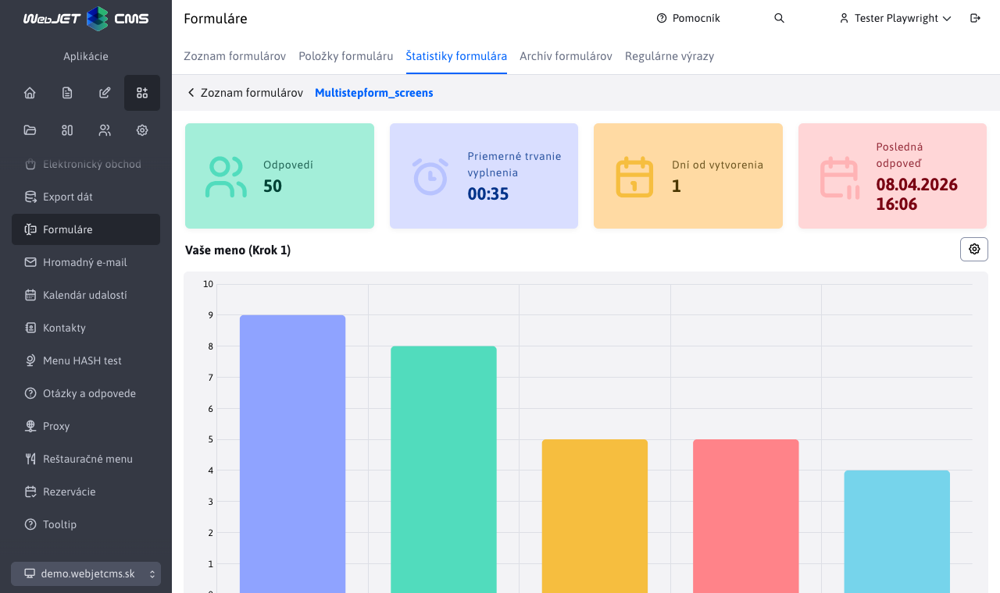

# Statistiky formuláře

Sekce **Statistiky formuláře** poskytuje přehled o odpovědích odeslaných přes vícekrokový formulář. Zobrazuje souhrnná čísla i grafické vizualizace odpovědí na jednotlivé položky formuláře.

## Souhrnné statistiky

V horní části stránky se nacházejí čtyři informační karty:

| Karta | Popis |
| --- | --- |
| **Odpovědí** | Celkový počet vyplněných a odeslaných formulářů. |
| **Průměrné trvání vyplnění** | Průměrný čas, který respondenti strávili vyplňováním formuláře, ve formátu `MM:SS`. |
| **Dnů od vytvoření** | Počet dní, které uplynuly od vytvoření formuláře. |
| **Poslední odpověď** | Datum a čas poslední odeslané odpovědi. |

## Grafy položek formuláře

Pod souhrnnými kartami se zobrazují grafy pro jednotlivé položky formuláře, které mají povoleno zobrazení statistiky. Pro každou takovou položku se vykreslí samostatný graf s rozdělením odpovědí.

!>**Upozornění:** Graf se zobrazí pouze pro ty položky formuláře, které mají zapnutou možnost **Zobrazit statistiku** v kartě [Statistika](./README.md#statistika) při editaci položky.

Každý graf obsahuje v pravém horním rohu tlačítko<button class="btn btn-sm btn-outline-secondary chart-more-btn"><i class="ti ti-settings"></i></button> , které otevře dialog s kartou **Statistika** pro konfiguraci grafu. Tato karta je přímo spárována s kartou [Statistika](./README.md#statistika) dostupnou při editaci položky formuláře.

## Úprava grafů

Chcete-li změnit typ grafu, jeho chování nebo barvy, otevřete dialog přes tlačítko nastavení v pravém horním rohu příslušného grafu. Po změně a uložení preferencí se grafy automaticky překreslí bez nutnosti opětovného načtení stránky.

Dostupné možnosti konfigurace grafu jsou stejné jako nastavení v kartě [Statistika](./README.md#statistika) při editaci položky formuláře:

- **Typ grafu** – určuje, jakým typem grafu chcete data reprezentovat.
- **Počet hodnot** – počet nejčastějších hodnot, které se zobrazí v grafu.
- **Zobrazit "Ostatní"** – zbývající hodnoty za hranicí **Počet hodnot** se sloučí do jedné položky „Ostatní".
- **Zobrazit "Nezodpovězené"** – nezodpovězené odpovědi se zobrazí jako samostatná položka „Nezodpovězené".
- **Srovnávat laxně** – při seskupování odpovědí se ignoruje velikost písmen a diakritika (např. `Áno` a `ano` se spočítají jako stejná odpověď).
- **Vybrat barevné schéma pro graf** – výběr barevného schématu z dostupných palet (každá obsahuje 5 barev, při větším počtu hodnot se barvy opakují).