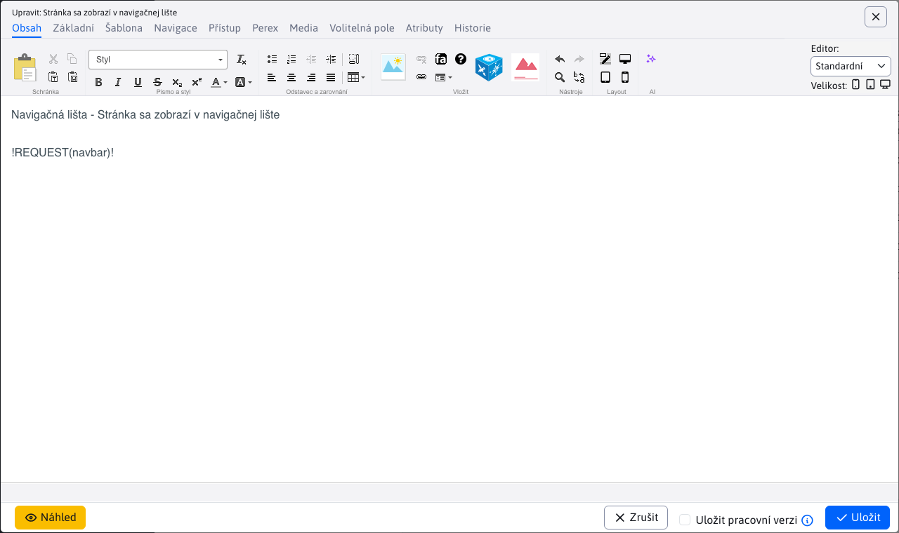

# Navigační lišta

Navigační lišta (navbar/breadcrumb/drobková navigace) zobrazuje ve web stránce klikatelnou cestu k aktuálně zobrazené web stránce. Na názvy adresářů lze kliknout a dostat se jednoduše o úroveň níže. Příklad:


Zobrazení položky v navigační liště je závislé na nastavení pole Navigační lišta v kartě Navigace adresáře web stránek. Má následující možnosti:
- Stejně jako menu - zobrazení v navigační liště se chová stejně jako je nastaveno pole pro zobrazení v menu.
- Zobrazit - položka se v navigační liště zobrazí.
- Nezobrazit - položka se v navigační liště nezobrazí (a to včetně podsložek).

Při možnosti zobrazit můžete ještě zobrazené webové stránce nastavit možnost zobrazení (typicky se jedná o poslední položku v navigační liště). Ta je rovněž v kartě Navigace a obsahuje možnosti:
- Zobrazit - web stránka se v navigační liště zobrazí.
- Nezobrazit - web stránka se v navigační liště nezobrazí.


## Použití

Navigační lišta se vkládá přímo do JSP šablony jako značka:

```html
<iwcm:write name="navbar"/>
```

nebo je možné ji vložit přímo do web stránky jako výraz:

```html
!REQUEST(navbar)!
```


