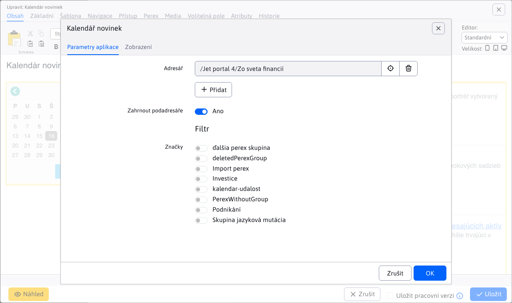

# Kalendář novinek

Aplikace **Kalendář novinek** a **Novinky** jsou navzájem propojeny - po výběru data v kalendáři se zobrazí seznam novinek filtrovaný podle zvoleného data. Zobrazí se novinky se shodným datem v poli Datum začátku.

## Nastavení aplikací

### Sdílená složka pro Novinky a Kalendář novinek:

Obě aplikace musí být nastaveny na stejnou složku novinek. Pokud se tato nastavení neshodují, **Kalendář novinek** nebude schopen správně filtrovat novinky pro vybrané datum. Propojení mezi aplikacemi funguje tak, že první aplikace **Novinky** vložena za **Kalendář novinek** v editoru s ním bude automaticky propojena.

Do stránky tedy vložte aplikaci Kalendář novinek a následně aplikaci Novinky.

