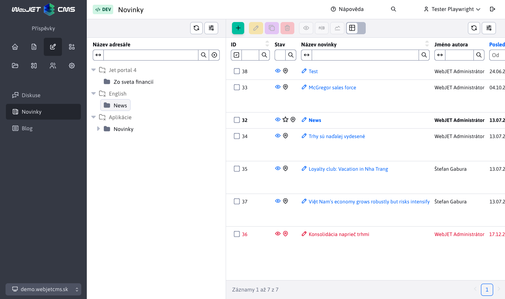
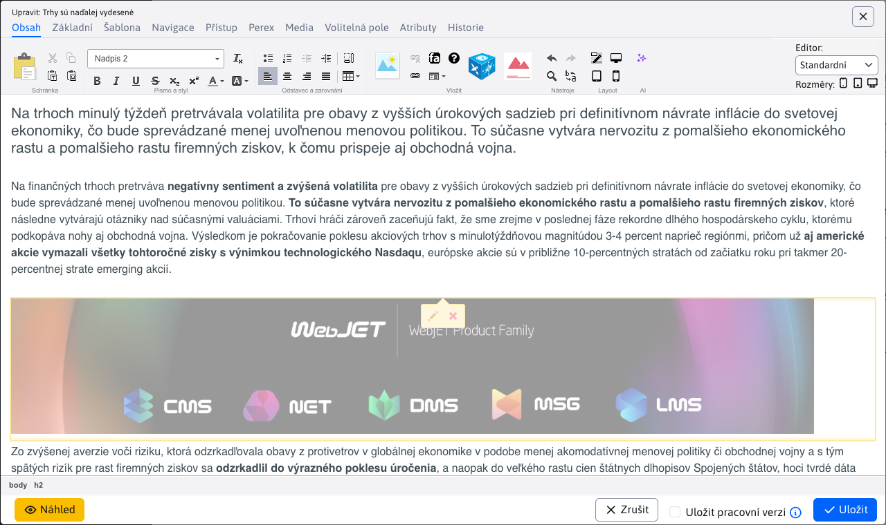
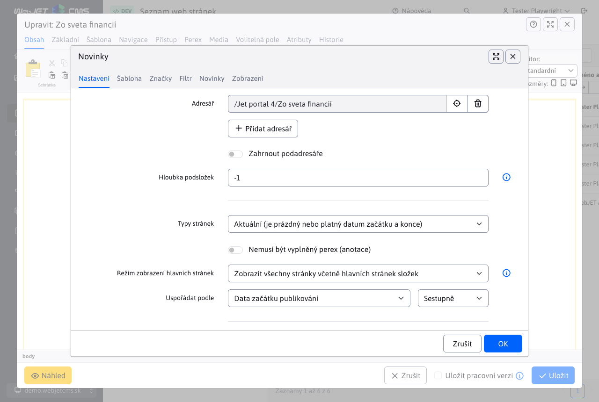
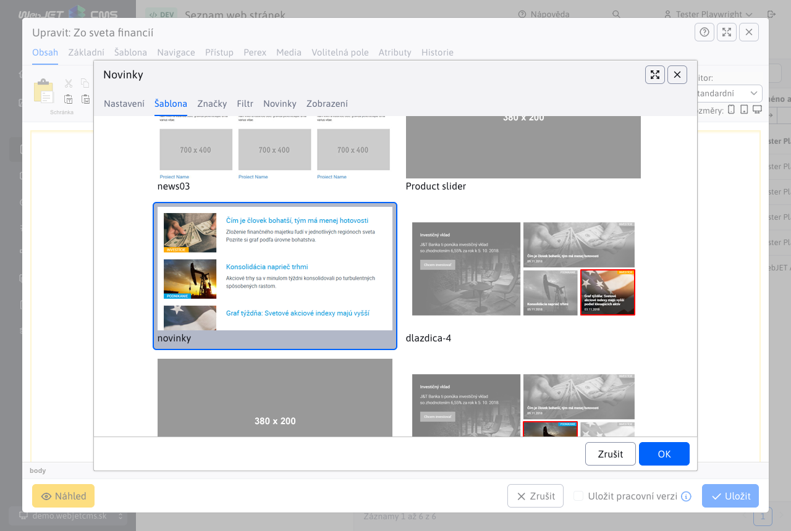
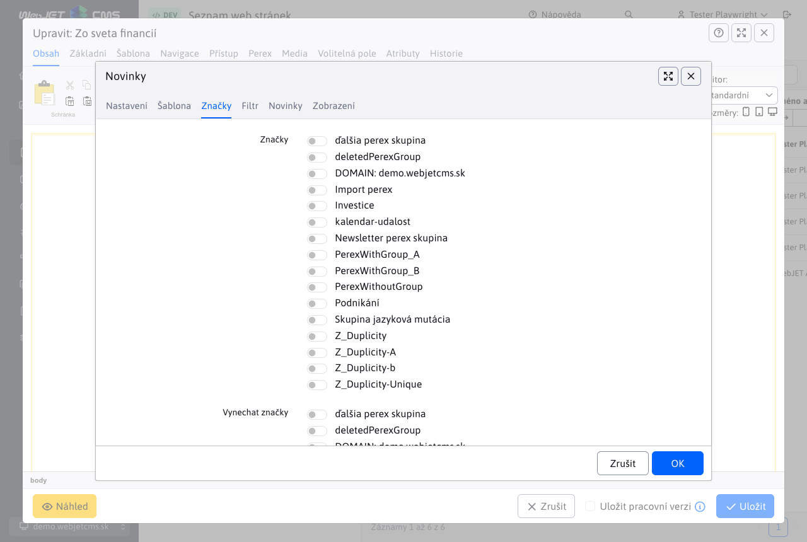
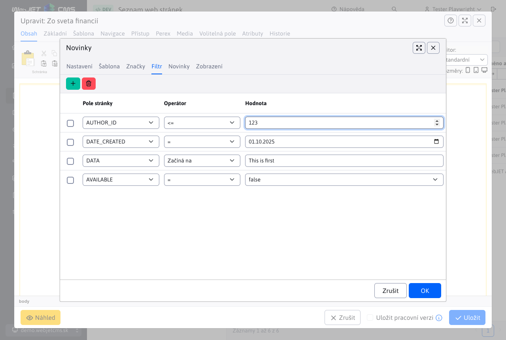
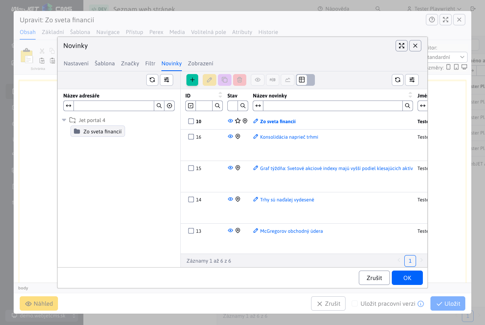

# Novinky

Aplikace Novinky, vloží do stránky seznam web stránek v zadané složce. Používá se pro vkládání seznamu novinek, tiskových zpráv, ale i jiných podobných výpisů (seznam kontaktních míst, osobních kontaktů, produktů a podobně).


## Seznam novinek

Seznam novinek v administraci se nachází v menu Příspěvky/Novinky. Vlevo se zobrazuje strom složek, vpravo tabulka novinek z vybrané složky. Složky můžete rozbalit a vybírat i jejich podsložky. Strom slouží k výběru složky; samotné složky se spravují v části Web stránky.



Složky s novinkami se určují:

- automaticky - je-li konf. proměnná `newsAdminGroupIds` nastavená na prázdnou hodnotu získá se seznam ID složek s novinkami vyhledáváním výrazu `!INCLUDE(/components/news/` v tělech stránek a dohledáním nastavené ID složky `groupIds`. Kořenové složky blogerů a jejich podsložky se vynechávají.
- podle konf. proměnné `newsAdminGroupIds`, kde je možné zadat čárkou oddělený seznam ID složek, například. `17,23*,72`, přičemž pokud ID složky končí na znak `*` načtou se při výběru i novinky (web stránky) z pod složek.

Strom zobrazuje také jejich společné nadřazené složky, například `Aplikácie → Novinky → 2026`. Nadřazené složky, které nejsou součástí nastaveného seznamu novinek ani jeho podsložek, mají bílou ikonu složky a slouží pouze k rozbalování větví. Jejich výběr nemění seznam novinek a nelze v nich takto vytvořit novinku. Ostatní složky mimo nastavený rozsah se nezobrazují.

Nad stromem můžete vyhledávat složky podle názvu včetně dosud nerozbalených podsložek. Tlačítko obnovení načte aktuální strukturu. Zobrazují se pouze dostupné složky aktuální domény podle práv uživatele.

Tlačítkem <button class="btn btn-sm btn-outline-secondary" type="button"><span><i class="ti ti-adjustments-horizontal"></i></span></button> nad stromem můžete změnit poměr šířky stromu a tabulky nebo nastavit pevnou šířku stromu v pixelech. Nastavení se uloží pro přihlášeného uživatele samostatně pro tuto aplikaci.

Při výběru složky s nastavením `*` zůstává zachován seznam novinek včetně podsložek. Výběr konkrétní podsložky zobrazí pouze jeho novinky, pokud také nemá výslovně nastaveno `*`. Nová novinka se vytváří ve vybrané složce. Výběr se zachovává v odkazu na stránku, například `/apps/news/admin/#23*`. Pokud není dostupná žádná složka, zobrazí se prázdný seznam a vytváření novinek je vypnuté.

Klepnutím na název novinky se otevře editor shodný s [editorem stránek](../../webpages/editor/README.md).



## Nastavení aplikace ve web stránce

Aplikace vložená do web stránky má následující karty:

### Parametry aplikace

V záložce parametry aplikace nastavujete základní chování aplikace a její nastavení.



- **Adresář** - Výběr adresářů (složek web stránek), ze kterých se budou vybírat novinky (stránky).
- **Zahrnout podadresáře** - zvolením této možnosti se načtou novinky iz podadresářů zvolených adresářů z pole Adresář.
- **Hloubka podsložek** - při zobrazení novinek z pod složek lze nastavit maximální hloubku hledání pod složek. Hodnota méně než 1 nastaví hledání bez omezení.
- **Typy stránek** - výběr stránek podle datové platnosti
  - Aktuálně - je platné datum začátku a konce - zobrazí se pouze novinky, jejichž datum platnosti (začátek a konec pulikování) je v rozmezí aktuálního data.
  - Staré – zobrazí se novinky, které mají datum konce v minulosti (archiv).
  - Všechny – zobrazí se novinky bez ohledu na datum začátku a konce jejich publikování.
  - Následující – zobrazí se pouze novinky, které mají datum začátku publikování v budoucnosti.
  - Aktuálně platné - zobrazí se pouze novinky s vyplněným datem začátku (konec nemusí být vyplněn) a konce jejichž rozsah je platný v aktuální datum a čas.
- **Režim zobrazení hlavních stránek** - nastavuje zobrazení hlavních stránek pod složek. Často máte strukturu Novinky a v něm roky 2025, 2026 a podobně. V seznamu novinek nechcete zobrazovat hlavní stránky těchto složek, jelikož je to typicky stránka se seznamem. Nebo naopak, potřebujete zobrazit pouze hlavní stránky pod složek.
- **Uspořádat podle** - určuje způsob uspořádání seznamu novinek
  - Priority
  - Data začátku publikování
  - data konání
  - Data poslední změny
  - Názvu stránky
  - Místa
  - ID stránky
  - Ratingu - hodnocení stránky (např. při použití eshopu) - hodnocení se nastavuje pomocí aplikace hodnocení stránky.
- **Vzestupně** - standardně se uspořádá seznam sestupně (např. od nejnovější novinky po nejstarší), zaškrtnutím tohoto pole bude uspořádání naopak - od nejstarší po nejnovější
- **Stránkování** - pokud zaškrtnete zobrazí se i stránkování seznamu novinek (je-li počet novinek větší než hodnota v poli Počet položek na stránce)
- **Počet položek na stránce** - počet zobrazených novinek na jedné stránce, pokud je stránkování nezaškrtnuté podle této hodnoty se načte z databáze počet novinek, vhodné např. na úvodní stránku kde chcete mít zobrazeno např. 3 novinky a odkaz na seznam všech novinek, ale stránkování nechcete zobrazit.
- **Přeskočit prvních** - počet záznamů, které chcete přeskočit při načítání seznamu (např. pokud máte ve stránce dvě aplikace pod sebou s jiným designem a ve druhé chcete přeskočit počet záznamů z první aplikace)
- **Nemusí být vyplněn perex (anotace)** - standardně se zobrazí jen novinky, které mají vyplněnou anotaci (perex), pokud zaškrtnete toto pole, načtou se i ty, které anotaci (perex) vyplněnou nemají
- **Načtení s textem stránky (méně optimální)** - standardně se z databáze nenačítá text stránky, pokud jej pro zobrazení potřebujete, zaškrtněte toto pole. Načtení ale bude pomalejší a náročnější na výkon databáze a serveru.
- **Kontrolovat duplicitu** - pokud stránka obsahuje více aplikací novinky v jedné stránce, eviduje se seznam již zobrazených novinek. Již existující se vyřadí ze seznamu. Nemusí ale následně sedět počet zobrazených záznamů, zároveň se ale nestane, že bude na jedné stránce zobrazena stejná novinka víckrát.
- **Vyloučit hlavní stránky složek** - pokud je zvoleno vyloučí se hlavní stránky složek (při možnosti Zahrnout podadresáře). Předpokládá se, že podadresáře obsahují hlavní stránku se seznamem novinek v této složce. Takové stránky se vyloučí a nepoužijí se v seznamu novinek.
- **Vložit třídy do `Velocity` šablony** - speciální pole pro programátora, kterým lze zadefinovat Java třídu (program), kterou lze následně použít v šabloně. Pokud nemáte přesné instrukce co do tohoto pole vložit ponechte jej prázdné.

### Šablona

V kartě šablona volíte vizuální způsob zobrazení seznamu novinek.



Máte-li právo [Novinky - úprava šablon](../../../frontend/templates/news/README.md) můžete vytvořit novou designovou šablonu novinek a upravovat stávající.

### Perex skupiny

V kartě Perex skupiny můžete vytvářet podmínky pro zobrazení novinek jen ze zvolených perex skupin. Používají se k označení kupř. Top zprávy na úvodní stránce a podobně.

Zároveň pokud potřebujete ze seznamu vyloučit perex skupinu nastavte ji do pole Nezobrazit zvolené perex skupiny.



Používá se to v případě, že máte na úvodní stránce v horní části sekci TOP Novinky kde zobrazujete novinky označené příznakem TOP a následně pod tím máte seznam ostatních novinek. Vyloučením perex skupiny TOP z druhého seznamu novinek zamezíte duplicitě.

### Filtr

V kartě filtr můžete definovat pokročilé možnosti zobrazení novinek podle databázových atributů a podmínek. Mezi jednotlivými podmínkami se používá `A/AND`, tedy musí být splněny všechny zadané podmínky filtru.



### Novinky

V kartě novinky se zobrazí strom složek a seznam novinek. Kořenové složky se načítají podle zvolených adresářů z karty Parametry aplikace; ve stromu můžete vybírat i jejich podsložky. Vidíte tak seznam novinek a můžete jednoduše stávající novinky upravovat (upravit nadpis, fotografii, případně text novinky). Rovněž můžete vytvořit novou novinku.



## Vyhledávání

Aplikace podporuje také dynamické vyhledávání/filtrování novinek přímo na web stránce pomocí URL parametrů. Umíte tak ve web stránce přidat filtrování zobrazených novinek podle přání návštěvníka (např. podle kategorie, dat atd.). Vyhledávání/filtrování se zadává do URL parametrů ve formátu:

```txt
search[fieldName_searchType]=value
search[title_co]=test
```

přičemž hodnota `searchType` může mít následující možnosti:

- `eq` - ​​přesná shoda
- `gt` - ​​více než
- `ge` - ​​více než včetně
- `le` - ​​méně než včetně
- `lt` - ​​méně než
- `sw` - ​​začíná na
- `ew` - ​​končí na
- `co` - ​​obsahuje
- `swciai` - ​​začíná na bez ohledu na velikost písmen a diakritiku
- `ewciai` - ​​končí na bez ohledu na velikost písmen a diakritiku
- `cociai` - ​​obsahuje bez ohledu na velikost písmen a diakritiku

Při zadávání URL parametrů může nastat problém s odmítnutím hodnoty `[]` a zobrazením chyby `400 - Bad Request`, v takovém případě použijte náhradu `[=%5B, ]=%5D`, příklad volání:

```txt
/zo-sveta-financii/?search%5Btitle_co%5D=konsolidacia
```

URL parametr `search` se může vyskytovat vícekrát, pro více parametrů se použije spojení `AND`.

## Možné konfigurační proměnné

- ```newsAdminGroupIds``` - ​​Seznam ID složek s novinkami. ID jsou odděleny čárkami.
