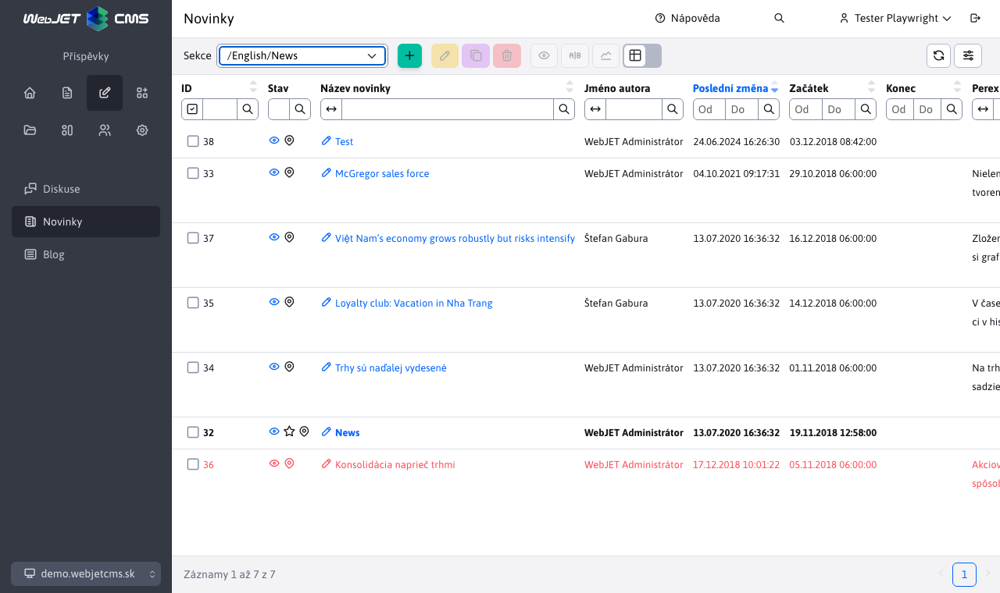
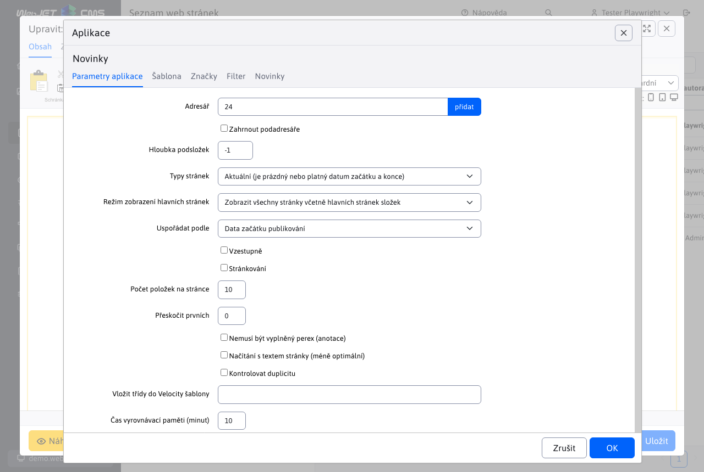
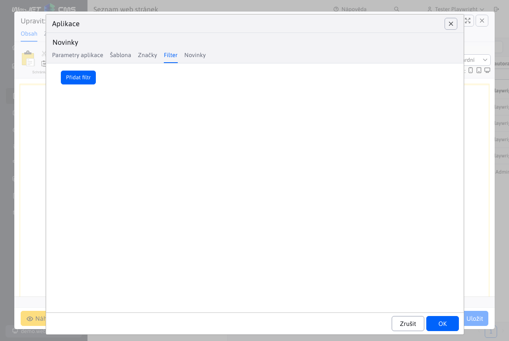

# Novinky

Aplikace Zprávy vloží do stránky seznam webových stránek v zadané složce. Slouží k vložení seznamu novinek, tiskových zpráv, ale i dalších podobných výpisů (seznam kontaktních míst, osobních kontaktů, produktů apod.).


# Seznam novinek

Seznam novinek v administraci je podobný seznamu webových stránek, ale neobsahuje stromovou strukturu. Nachází se v nabídce Příspěvky/Novinky. V horní části můžete vybrat složku, která se má v tabulce zobrazit.



Hodnoty v poli pro výběr složky v záhlaví jsou generovány:
- automaticky - pokud je konf. proměnná `newsAdminGroupIds` je nastavena na prázdnou hodnotu, seznam ID složek se získá vyhledáním termínu `!INCLUDE(/components/news/` v tělech stránek a sledováním nastaveného ID složky `groupIds`.
- podle konf. proměnné `newsAdminGroupIds` kde můžete zadat čárkou oddělený seznam ID složek, např. `17,23*,72`, kde pokud ID složky končí znakem `*` při výběru se načtou také zprávy (webové stránky) z podsložek.

Kliknutím na název zprávy se otevře editor, který je totožný s editorem [editor stránek](../../webpages/editor.md).


# Nastavení aplikace na webové stránce

Aplikace vložená do webové stránky má následující karty:

## Parametry aplikace

Na kartě Parametry aplikace se nastavuje základní chování aplikace a její nastavení.



- Adresář - ID adresářů (složek webových stránek), ze kterých budou vybírány novinky (stránky). Pomocí tlačítka Přidat můžete vybrat více ID adresářů.
- Včetně podadresářů - při výběru této možnosti se načítají také zprávy z podadresářů vybraných adresářů z pole Adresář.
- Typy stránek - výběr stránek podle data platnosti
  - Aktuální - je platné datum začátku a konce - zobrazí se pouze novinky, jejichž datum platnosti (začátek a konec pulikace) je v rozsahu aktuálního data.
  - Staré - zobrazí se novinky, které mají datum ukončení v minulosti (archiv).
  - Všechny - novinky se zobrazí bez ohledu na datum začátku a konce jejich zveřejnění.
  - Další - zobrazí se pouze novinky, které mají budoucí datum zahájení publikování.
  - Aktuálně platné - zobrazí se pouze zprávy s vyplněným datem zahájení (datum ukončení nemusí být vyplněno) a datem ukončení, jejichž rozsah je platný v aktuálním datu a čase.
- Uspořádat podle - určuje, jak je seznam novinek uspořádán.
  - Priorita
  - Datum zahájení zveřejňování
  - Datum konání akce
  - Datum poslední změny
  - Název stránky
  - Místa
  - ID stránky
  - Hodnocení - hodnocení stránky (např. při použití e-shopu) - hodnocení se nastavuje pomocí aplikace pro hodnocení stránek.
- Vzestupně - ve výchozím nastavení je seznam seřazen sestupně (např. od nejnovějších zpráv po nejstarší), zaškrtnutím tohoto políčka se pořadí obrátí - od nejstarších po nejnovější.
- Stránkování - pokud je zaškrtnuto, zobrazí se také stránkování seznamu novinek (pokud je počet novinek větší než hodnota v poli Počet položek na stránce).
- Počet položek na stránce - počet zobrazených novinek na jedné stránce, pokud je stránkování odškrtnuto, podle této hodnoty se počet novinek načítá z databáze, vhodné například pro úvodní stránku, kde chcete mít zobrazeny například 3 novinky a odkaz na seznam všech novinek, ale nechcete zobrazovat stránkování.
- Přeskočit první - počet záznamů, které chcete přeskočit při načítání seznamu (např. pokud máte na stránce pod sebou dvě aplikace s odlišným designem a chcete přeskočit počet záznamů z první aplikace v druhé aplikaci).
- Anotace (perex) nemusí být vyplněna - ve výchozím nastavení se zobrazí pouze novinky, které mají anotaci (perex) vyplněnou, pokud toto políčko zaškrtnete, načtou se i novinky, které anotaci (perex) vyplněnou nemají.
- Načíst s textem stránky (méně optimální) - ve výchozím nastavení se text stránky z databáze nenačítá, pokud jej potřebujete zobrazit, zaškrtněte toto políčko. Načítání však bude pomalejší a náročnější na výkon databáze a serveru.
- Kontrola duplicity - pokud stránka obsahuje více aplikací novinek na jedné stránce, zaznamená se seznam již zobrazených novinek. Stávající jsou ze seznamu odstraněny. Počet zobrazených záznamů se však následně nemusí shodovat, ale zároveň se nestane, že by se stejná novinka na jedné stránce zobrazovala vícekrát.
- Vyloučit stránky hlavní složky - pokud je vybráno, jsou vyloučeny stránky hlavní složky (pro Včetně podadresářů). Předpokládá se, že podsložky obsahují hlavní stránku se seznamem novinek v dané složce. Takové stránky jsou vyloučeny a v seznamu novinek se nepoužívají.
- Vložení tříd do `Velocity` šablony - speciální pole pro programátora, kde může definovat třídu (program) jazyka Java, kterou lze následně použít v šabloně. Pokud nemáte přesné instrukce, co do tohoto pole vložit, nechte ho prázdné.
- Doba vyrovnávací paměti (minuty) - počet minut, po které je seznam novinek zapamatován. Načítání seznamu novinek může být náročné na výkon databáze, doporučujeme nastavit vyrovnávací dobu alespoň na 10 minut. Tím se zrychlí zobrazení stránky (zejména pokud se seznam novinek nachází například na domovské stránce).

## Šablona

Na kartě Šablona vyberete vizuální způsob zobrazení seznamu novinek.


Pokud máte správně nastavenou možnost Zprávy a tiskové zprávy - Vytvářet a upravovat šablony, můžete vytvořit novou šablonu návrhu zpráv a upravit stávající. Šablony designu zpráv se upravují ve vlastním editoru. Ve výchozím nastavení doporučujeme provádět pouze drobné úpravy kódu HTML šablony a používat možnosti, které nabízí kontextová nabídka v editoru šablony zpravodaje.

Šablony zpráv používané [Velocity Engine](https://velocity.apache.org/engine/2.3/vtl-reference.html) pro zobrazení, takže je možné definovat cykly, podmínky a další programový kód. Připraveny jsou šablony s jedním, dvěma a třemi sloupci. Doporučujeme, aby šablony upravovali pouze uživatelé, kteří vědí, co dělají, a znají syntaxi `Velocity Engine`. Doporučujeme vycházet z připravených šablon a v případě potřeby je upravit. Standardní editor by neměl mít právo upravovat šablony newsletteru, měl by je pouze používat.

Při úpravách šablon je v dialogovém okně k dispozici kontextová nabídka (po kliknutí pravým tlačítkem myši do pole Kód HTML nebo Kód stránkování HTML), která umožňuje snadné vkládání programových bloků. Šablony lze duplikovat, proto doporučujeme začít vytvořením kopie existující šablony a poté pouze upravit kód HTML.

Uložení náhledového obrázku šablony do složky `/components/news/images/MENO-SABLONY.png`.

Některé příklady práce s pokročilými objekty:

```velocity
//nastavenie premennej podla pageParams objektu:
#set ($anonymousQuestions = $pageParams.getBooleanValue("anonymousQuestions", false))

//nastavenie premennej:
#set ($fileType = $media.mediaLink.split("[.]"))

//prechod cez zoznam perex skupin a nastavenie CSS triedy podla mena perex skupiny
<div class="grid-item grid-item-$doc.docId
#foreach($perexGroup in $doc.perexGroupNames)
    #if ($perexGroup == "news-red")
    grid-item-red
    #elseif ($perexGroup == "news-green")
    grid-item-green
    #elseif ($perexGroup == "news-blue")
    grid-item-blue
    #end
#end
" data-doc-id="$doc.docId">

//nacitanie medii a vypis
#foreach($media in $MediaDB.getMedia($doc, "files"))
    #set ($fileType = $media.mediaLink.split("[.]"))
    #if($fileType[1].equals('jpg') || $fileType[1].equals('png') || $fileType[1].equals('gif')) <a rel='wjimageviewer' href="$media.mediaLink"  > </a> #end
#end

//nacitanie medii a vypis
<div class="row"> #foreach($media in $MediaDB.getMedia($doc, "files"))
    #set ($fileType = $media.mediaLink.split("[.]"))
    #if(!$fileType[1].equals('jpg') && !$fileType[1].equals('png') && !$fileType[1].equals('gif')) <a href="$media.mediaLink" class="col-md-4 text-truncate icon-$fileType[1]" target="_blank"> $media.mediaTitleSk</a> #end
#end </div>

//vypis diskusnych prispevkov
//vyzaduje pridanie sk.iway.iwcm.forum.ForumDB do parametra Vlozit triedu do Velocity sablony
#set($forumDb = $ForumDB.getForumFieldsForDoc(null, $doc.docId))
#set($commentCount = $forumDb.size())
#set($showComment = 3)
#set($e = $commentCount - $showComment)
#foreach($forum in $forumDb)
    <div class="comment" #if($foreach.count > $e)style="display:block;"#end>
    <div class="comment-header"> $forum.autorFullName <span>$forum.questionDateDisplayDate $forum.questionDateDisplayTime</span> </div>
    <p>$forum.question</p>
</div>
#end

//vypis texu podla prihlaseneho/neprihlaseneho pouzivatela
#if ($actionBean.getCurrentUser()) LOGGED #end
#if (!$actionBean.getCurrentUser()) NOT-LOGGED #end

//zoznam vsetkych stranok ako odkazy - standardne $pages pouziva format 1 2 3 ... 7 8 9, pagesAll obsahuje 1 2 3 4 5 6 7 8 9
//v pages je objekt PaginationInfo, obsahuje property label, pageNumber, url, active, actual, first, last, link a getLi() pre ziskanie celeho HTML kodu LI elementu
$pagesAll
//celkovy pocet stran strankovania, napr 23, da sa ziskat aj z $lastPage.pageNumber
$totalPages

//podmienene zobrazenie ak je zadany perex obrazok
#if ($doc.perexImage!="")<a href="$context.link($doc)"></a>#end
```

Pokud potřebujete zobrazit datum prvního uložení webové stránky, nastavte proměnnou conf. `editorAutoFillPublishStart` na hodnotu `true`. Po nastavení editor automaticky vyplní pole Datum zahájení na kartě Perex editoru aktuálním datem. Toto datum lze v případě potřeby změnit také ručně. V šabloně pak můžete použít následující objekty:

```velocity
//datum a cas posledneho ulozenia
$doc.lastUpdateDate $doc.lastUpdateTime

//datum a cas vytvorenia
$doc.publishStartString
```

## Skupina Perex

Na kartě Skupiny Perex můžete vytvořit podmínky pro zobrazování zpráv pouze z vybraných skupin Perex. Slouží např. k označení Top novinky na domovské stránce apod.

Pokud potřebujete ze seznamu vyloučit skupinu perexů, nastavte ji v poli Nezobrazovat vybrané skupiny perexů.


Používá se, pokud máte v horní části domovské stránky sekci TOP zprávy, kde se zobrazují zprávy označené příznakem TOP, a pod nimi seznam dalších zpráv. Vyloučením perexu skupiny TOP z druhého seznamu novinek zabráníte duplicitě.

## Filtr

Na kartě Filtr můžete definovat pokročilé možnosti zobrazování zpráv podle atributů databáze a podmínek. Mezi jednotlivými podmínkami se používá `A/AND`, tj. musí být splněny všechny zadané podmínky filtru.



## Novinky

Na kartě Zprávy se zobrazuje seznam novinek, které se načítají podle vybraných adresářů na kartě Parametry aplikace. Můžete si prohlédnout seznam novinek a snadno upravovat existující novinky (upravovat název, fotografii nebo text novinky). Můžete také vytvořit novou položku novinek.


# Vyhledávání

Aplikace také podporuje dynamické vyhledávání/filtraci zpráv přímo na webové stránce pomocí parametrů URL. Filtrování zobrazených novinek na webové stránce můžete doplnit podle přání návštěvníka (např. podle kategorie, data apod.). Vyhledávání/filtrace se zadává do parametrů URL ve formátu:

```
search[fieldName_searchType]=value
search[title_co]=test
```

kde hodnota searchType může mít následující možnosti:
- `eq` - přesná shoda
- `gt` - více než
- `ge` - více než včetně
- `le` - méně než včetně
- `lt` - méně než
- `sw` - počínaje
- `ew` - končí na adrese
- `co` - obsahuje
- `swciai` - začíná na libovolné velikosti písmen a diakritiky
- `ewciai` - koncovka bez rozlišení velkých a malých písmen a diakritiky
- `cociai` - obsahuje písmena a diakritiku bez rozlišení velikosti písmen.

Při zadávání parametrů URL může nastat problém s odmítnutím hodnoty `[]` a zobrazení chyby `400 - Bad Request`, v takovém případě použijte náhradní `[=%5B, ]=%5D`, příklad volání:

```
/zo-sveta-financii/?search%5Btitle_co%5D=konsolidacia
```

Vyhledávání parametrů URL může probíhat vícekrát, pro více parametrů se používá spojení `AND`.

# Možné konfigurační proměnné

- `newsAdminGroupIds` - Seznam ID složek zpráv. ID jsou oddělena čárkami.
