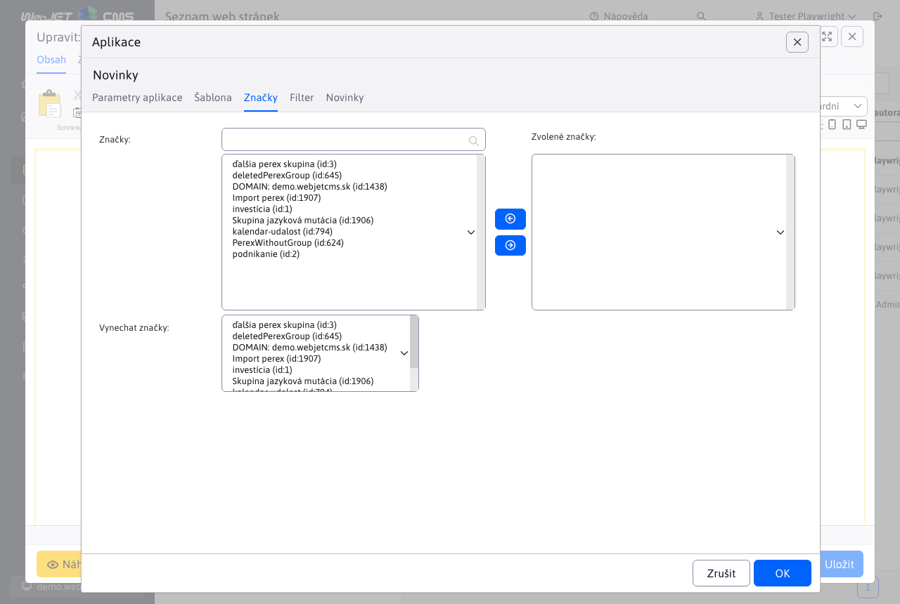
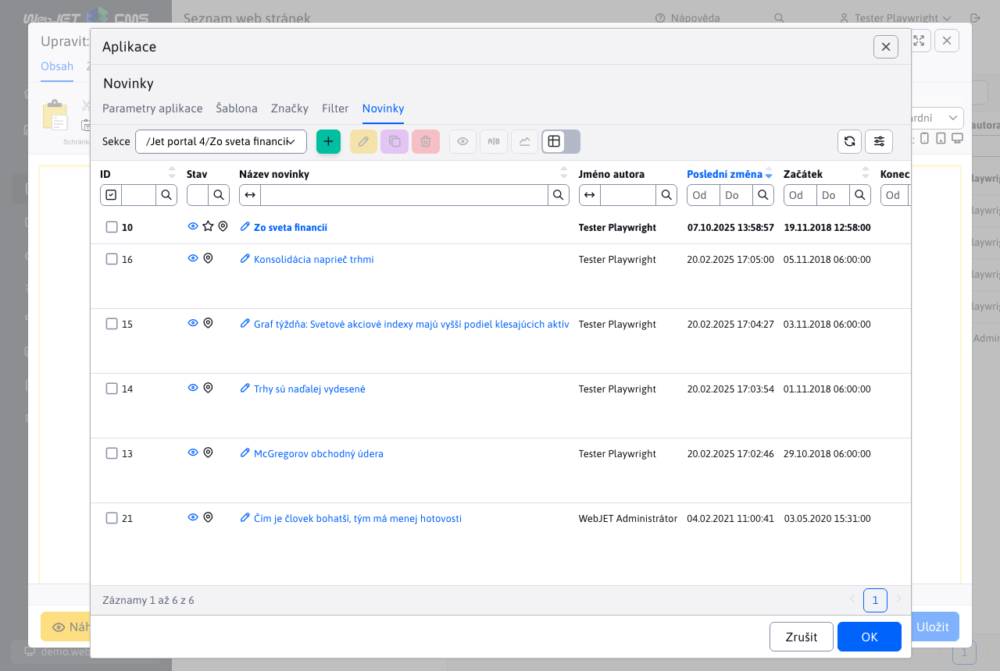

# Novinky

Aplikace Novinky, vloží do stránky seznam web stránek v zadané složce. Používá se pro vkládání seznamu novinek, tiskových zpráv, ale i jiných podobných výpisů (seznam kontaktních míst, osobních kontaktů, produktů a podobně).


# Seznam novinek

Seznam novinek v administraci je podobný seznamu web stránek, ale neobsahuje stromovou strukturu. Nachází se v menu Příspěvky/Novinky. V horní části lze vybrat složku pro zobrazení v tabulce.


Hodnoty ve výběrovém poli složky v hlavičce se generují:
- automaticky - je-li konf. proměnná `newsAdminGroupIds` nastavena na prázdnou hodnotu získá se seznam ID složek s novinkami vyhledáváním výrazu `!INCLUDE(/components/news/` v tělech stránek a dohledáním nastaveného ID složky `groupIds`.
- podle konf. proměnné `newsAdminGroupIds`, kde je možné zadat cedkou oddělený seznam ID složek, například. `17,23*,72`, přičemž pokud ID složky končí na znak `*` načítají se při výběru i novinky (web stránky) z pod složek.

Klepnutím na název novinky se otevře editor shodný s [editorem stránek](../../webpages/editor.md).


# Nastavení aplikace ve web stránce

Aplikace vložená do web stránky má následující karty:

## Parametry aplikace

V záložce parametry aplikace nastavujete základní chování aplikace a její nastavení.


- Adresář - ID adresářů (složek web stránek), ze kterých se budou vybírat novinky (stránky). Tlačítkem Přidat, můžete vybrat více ID adresářů.
- Zahrnout podadresáře - zvolením této možnosti se načtou novinky iz podadresářů zvolených adresářů z pole Adresář.
- Typy stránek - výběr stránek podle datumové platnosti
  - Aktuálně - je platné datum začátku a konce - zobrazí se jen novinky, jejichž datum platnosti (začátek a konec pulikování) je v rozmezí aktuálního data.
  - Staré – zobrazí se novinky, které mají datum konce v minulosti (archiv).
  - Všechny – zobrazí se novinky bez ohledu na datum začátku a konce jejich publikování.
  - Následující – zobrazí se jen novinky, které mají datum začátku publikování v budoucnosti.
  - Aktuálně platné - zobrazí se pouze novinky s vyplněným datem začátku (konec nemusí být vyplněn) a konce jejichž rozsah je platný v aktuální datum a čas.
- Uspořádat podle - určuje způsob uspořádání seznamu novinek
  - Priority
  - Data začátku publikování
  - Data konání
  - Data poslední změny
  - Názvu stránky
  - Místa
  - ID stránky
  - Ratingu - hodnocení stránky (např. při použití eshopu) - hodnocení se nastavuje pomocí aplikace hodnocení stránky.
- Vzestupně - standardně se uspořádá seznam sestupně (např. od nejnovější novinky po nejstarší), zaškrtnutím tohoto pole bude uspořádání naopak - od nejstarší po nejnovější
- Stránkování - pokud zaškrtnete zobrazí se i stránkování seznamu novinek (je-li počet novinek větší než hodnota v poli Počet položek na stránce)
- Počet položek na stránce - počet zobrazených novinek na jedné stránce, je-li stránkování nezaškrtnuto podle této hodnoty se načte z databáze počet novinek, vhodné například. na úvodní stránku kde chcete mít zobrazeno např. 3 novinky a odkaz na seznam všech novinek, ale stránkování nechcete zobrazit.
- Přeskočit prvních - počet záznamů, které chcete přeskočit při načítání seznamu (např. pokud máte ve stránce dvě aplikace pod sebou s jiným designem a ve druhé chcete přeskočit počet záznamů z první aplikace)
- Nemusí být vyplněn perex (anotace) - standardně se zobrazí jen novinky, které mají vyplněnou anotaci (perex), pokud zaškrtnete toto pole, načtou se i ty, které anotaci (perex) vyplněnou nemají
- Načtení s textem stránky (méně optimální) - standardně se z databáze nenačítá text stránky, pokud jej pro zobrazení potřebujete, zaškrtněte toto pole. Načtení ale bude pomalejší a náročnější na výkon databáze a serveru.
- Kontrolovat duplicitu - pokud stránka obsahuje více aplikací novinky v jedné stránce, eviduje se seznam již zobrazených novinek. Již existující se vyřadí ze seznamu. Nemusí ale následně sedět počet zobrazených záznamů, zároveň se ale nestane, že bude na jedné stránce zobrazena stejná novinka víckrát.
- Vyloučit hlavní stránky složek - pokud je zvoleno vyloučí se hlavní stránky složek (při možnosti Zahrnout podadresáře). Předpokládá se, že podadresáře obsahují hlavní stránku se seznamem novinek v této složce. Takové stránky se vyloučí a nepoužijí se v seznamu novinek.
- Vložit třídy do `Velocity` šablony - speciální pole pro programátora, kterým lze zadefinovat Java třídu (program), kterou lze následně použít v šabloně. Pokud nemáte přesné instrukce co do tohoto pole vložit ponechte jej prázdné.
- Čas vyrovnávací paměti (minuty) - počet minut pamatování seznamu novinek. Načtení seznamu novinek může být náročné na výkon databáze, doporučujeme nastavit vyrovnávací paměť na minimálně 10 minut. Urychlí to zobrazení stránky (hlavně pokud je seznam novinek např. na úvodní stránce).

## Šablona

V kartě šablona volíte vizuální způsob zobrazení seznamu novinek.


Máte-li právo Novinky a tiskové zprávy - Vytvoření a úprava šablon můžete vytvořit novou designovou šablonu novinek a upravovat stávající. Designové šablony novinek se upravují ve vlastním editoru. Standardně doporučujeme provádět jen drobné úpravy v HTML kódu šablony a využít možností, které vám nabízí kontextové menu v editoru šablon novinek.

Šablony novinek používají [Velocity Engine](https://velocity.apache.org/engine/2.3/vtl-reference.html) pro zobrazení, je tedy možné definovat cykly, podmínky a jiný programový kód. Připraveny jsou šablony s jedním, dvěma i třemi sloupci. Šablony doporučujeme editovat pouze uživateli, kteří vědí co dělají a znají syntax `Velocity Engine`. Doporučujeme vycházet z připravených šablon a případně je jen upravovat. Standardní redaktor by neměl mít právo na editaci šablon novinek, měl by je jen používat.

Při úpravě šablon je v dialogovém okně dostupné kontextové menu (když kliknete pravým tlačítkem do pole HTML kód nebo HTML kód stránkování) pomocí kterého snadno vložíte programové bloky. Šablony lze duplikovat, doporučujeme vám tedy začít vytvořením kopie stávající šablony a následně jen upravit HTML kód.

Náhledový obrázek pro šablonu uložte do `/components/news/images/MENO-SABLONY.png`.

Několik ukázek práce s pokročilými objekty:

```velocity
//nastavenie premennej podla pageParams objektu:
#set ($anonymousQuestions = $pageParams.getBooleanValue("anonymousQuestions", false))

//nastavenie premennej:
#set ($fileType = $media.mediaLink.split("[.]"))

//prechod cez zoznam perex skupin a nastavenie CSS triedy podla mena perex skupiny
<div class="grid-item grid-item-$doc.docId
#foreach($perexGroup in $doc.perexGroupNames)
    #if ($perexGroup == "news-red")
    grid-item-red
    #elseif ($perexGroup == "news-green")
    grid-item-green
    #elseif ($perexGroup == "news-blue")
    grid-item-blue
    #end
#end
" data-doc-id="$doc.docId">

//nacitanie medii a vypis
#foreach($media in $MediaDB.getMedia($doc, "files"))
    #set ($fileType = $media.mediaLink.split("[.]"))
    #if($fileType[1].equals('jpg') || $fileType[1].equals('png') || $fileType[1].equals('gif')) <a rel='wjimageviewer' href="$media.mediaLink"  > </a> #end
#end

//nacitanie medii a vypis
<div class="row"> #foreach($media in $MediaDB.getMedia($doc, "files"))
    #set ($fileType = $media.mediaLink.split("[.]"))
    #if(!$fileType[1].equals('jpg') && !$fileType[1].equals('png') && !$fileType[1].equals('gif')) <a href="$media.mediaLink" class="col-md-4 text-truncate icon-$fileType[1]" target="_blank"> $media.mediaTitleSk</a> #end
#end </div>

//vypis diskusnych prispevkov
//vyzaduje pridanie sk.iway.iwcm.forum.ForumDB do parametra Vlozit triedu do Velocity sablony
#set($forumDb = $ForumDB.getForumFieldsForDoc(null, $doc.docId))
#set($commentCount = $forumDb.size())
#set($showComment = 3)
#set($e = $commentCount - $showComment)
#foreach($forum in $forumDb)
    <div class="comment" #if($foreach.count > $e)style="display:block;"#end>
    <div class="comment-header"> $forum.autorFullName <span>$forum.questionDateDisplayDate $forum.questionDateDisplayTime</span> </div>
    <p>$forum.question</p>
</div>
#end

//vypis texu podla prihlaseneho/neprihlaseneho pouzivatela
#if ($actionBean.getCurrentUser()) LOGGED #end
#if (!$actionBean.getCurrentUser()) NOT-LOGGED #end

//zoznam vsetkych stranok ako odkazy - standardne $pages pouziva format 1 2 3 ... 7 8 9, pagesAll obsahuje 1 2 3 4 5 6 7 8 9
//v pages je objekt PaginationInfo, obsahuje property label, pageNumber, url, active, actual, first, last, link a getLi() pre ziskanie celeho HTML kodu LI elementu
$pagesAll
//celkovy pocet stran strankovania, napr 23, da sa ziskat aj z $lastPage.pageNumber
$totalPages

//podmienene zobrazenie ak je zadany perex obrazok
#if ($doc.perexImage!="")<a href="$context.link($doc)"></a>#end
```

Pokud potřebujete zobrazovat datum prvního uložení web stránky nastavte konf. proměnnou `editorAutoFillPublishStart` na hodnotu `true`. Po nastavení bude editor automaticky vyplňovat pole Datum začátku v kartě Perex v editoru aktuálním datem. Toto datum lze v případě potřeby i manuálně změnit. Následně v šabloně můžete použít následující objekty:

```velocity
//datum a cas posledneho ulozenia
$doc.lastUpdateDate $doc.lastUpdateTime

//datum a cas vytvorenia
$doc.publishStartString
```

## Perex skupiny

V kartě Perex skupiny můžete vytvářet podmínky pro zobrazení novinek jen ze zvolených perex skupin. Používají se k označení například. Top zprávy na úvodní stránce a podobně.

Zároveň pokud potřebujete ze seznamu vyloučit perex skupinu nastavte ji do pole Nezobrazit zvolené perex skupiny.



Používá se to v případě, že máte na úvodní stránce v horní části sekci TOP Novinky kde zobrazujete novinky označené příznakem TOP a následně pod tím máte seznam ostatních novinek. Vyloučením perex skupiny TOP z druhého seznamu novinek zamezíte duplicitě.

## Filtr

V kartě filtr můžete definovat pokročilé možnosti zobrazení novinek podle databázových atributů a podmínek. Mezi jednotlivými podmínkami se používá `A/AND`, tedy musí být splněny všechny zadané podmínky filtru.


## Novinky

V kartě novinky se zobrazí seznam novinek, které se načtou podle zvolených adresářů z karty Parametry aplikace. Vidíte tak seznam novinek a můžete jednoduše stávající novinky upravovat (upravit nadpis, fotografii, případně text novinky). Rovněž můžete vytvořit novou novinku.



# Vyhledávání

Aplikace podporuje také dynamické vyhledávání/filtrování novinek přímo na web stránce pomocí URL parametrů. Umíte tak ve web stránce přidat filtrování zobrazených novinek podle přání návštěvníka (např. podle kategorie, dat atd.). Vyhledávání/filtrování se zadává do URL parametrů ve formátu:

```
search[fieldName_searchType]=value
search[title_co]=test
```

přičemž hodnota searchType může mít následující možnosti:
- `eq` - přesná shoda
- `gt` - více než
- `ge` - více než včetně
- `le` - méně než včetně
- `lt` - méně než
- `sw` - začíná na
- `ew` - končí na
- `co` - obsahuje
- `swciai` - začíná na bez ohledu na velikost písmen a diakritiku
- `ewciai` - končí na bez ohledu na velikost písmen a diakritiku
- `cociai` - obsahuje bez ohledu na velikost písmen a diakritiku

Při zadávání URL parametrů může nastat problém s odmítnutím hodnoty `[]` a zobrazením chyby `400 - Bad Request`, v takovém případě použijte náhradu `[=%5B, ]=%5D`, příklad volání:

```
/zo-sveta-financii/?search%5Btitle_co%5D=konsolidacia
```

URL parametr search se může vyskytovat vícekrát, pro více parametrů se použije spojení `AND`.

# Možné konfigurační proměnné

- `newsAdminGroupIds` - Seznam ID složek s novinkami. ID jsou odděleny čárkami.
