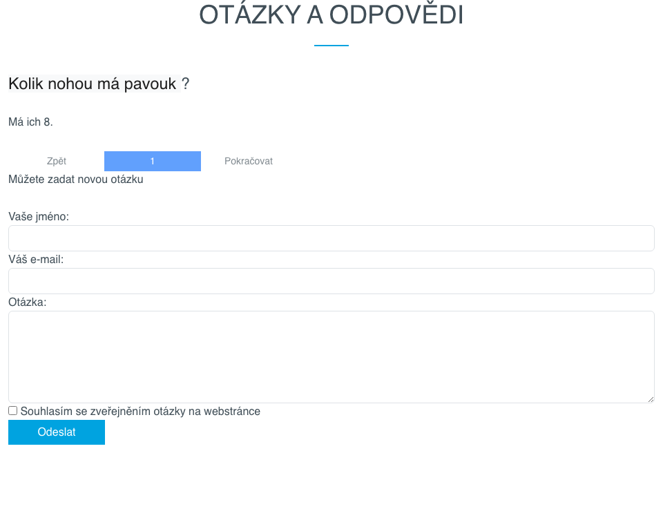
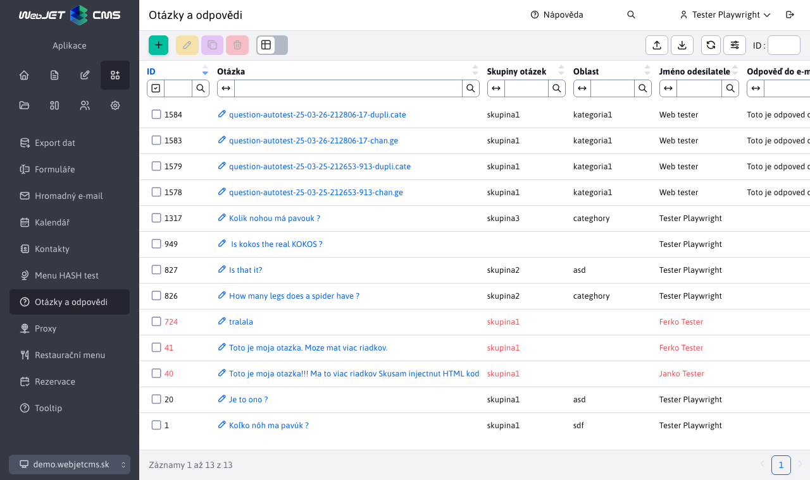

# Otázky a odpovědi

Aplikace Otázky a odpovědi umožňuje vkládat na stránku často kladené otázky a odpovědi. Je možné je kategorizovat podle skupin. Nová otázka přijde na zadaný e-mail.

## Parametry aplikace

- Vložit
  - Otázky s odpověďmi
  - Formulář pro položení otázky
- Issue Group - zadejte název skupiny, ze které budou příspěvky vybírány pro zobrazení na webu.
- Počet otázek na stránce (zobrazí se, pokud je vybrána možnost: Otázky s odpověďmi)
- E-mail pro zasílání dotazů (zobrazí se, pokud je vybrána možnost: Poptávkový formulář)

Otázky jsou roztříděny do skupin, které zadáte při odesílání žádosti. Pokud potřebujete vytvořit více podskupin, můžete soubor upravit. `/components/qa/qa-ask.jsp` kde nahradíte skryté pole `categoryName` pro výběrové menu, které návštěvníkům umožní vybrat podskupinu.

## Administrace

Přehled všech příspěvků v sekci Otázky a odpovědi si můžete prohlédnout výběrem možnosti Otázky a odpovědi v části Aplikace. Otázky, na které není odpověď, jsou zobrazeny červeně.

Po kliknutí na otázku se zobrazí formulář s parametry otázky a odpovědí. Kromě toho, že se otázka a odpověď zobrazí na stránce, lze je také odeslat e-mailem na adresu tazatele. Pokud tazatel neoznačil možnost **Souhlasím se zveřejněním otázky na webových stránkách**, může být odpověď zaslána pouze na jeho e-mail (možnost Zobrazit na webových stránkách ponechte nezaškrtnutou). Kliknutím na tlačítko Uložit potvrďte provedené změny.

Pokud zadáte "Odpovědět na e-mail" a vyberete možnost **Zobrazení na webové stránce**, text z "Odpovědět na e-mail" se automaticky zkopíruje do "Odpovědět na stránku".

Aplikace podporuje nastavení [volitelná pole](../../../frontend/webpages/customfields/README.md).
