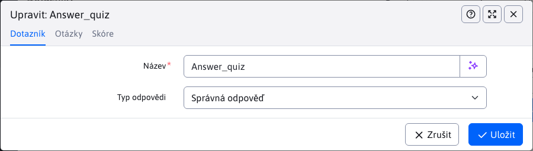
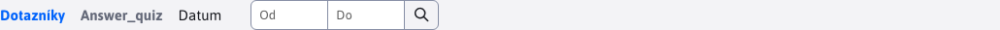

# Dotazníky

Aplikace Dotazníky slouží k přípravě a správě dotazníků. Kromě správy samotných dotazníků umožňuje také správu otázek a odpovědí pro dotazník. Dostupná je také statistická sekce, kde je přehled jednotlivých výsledků dotazníku.

Pro vytvoření jsou zapotřebí 2 parametry:
- Název
- Typ odpovědi

Parametr Typ odpovědi má na výsledný vzhled i nastavování dotazníku velký vliv. Podporuje 2 typy:
- Správná odpověď - vždy je správná pouze jedna odpověď z několika a tato správná odpověď má hodnotu 1 bod
- Bodová odpověď - správných může být i více odpovědí, a každá správná odpověď může mít jinou bodovou hodnotu

## Otázky

Správa otázek se provádí prostřednictvím vnořené datatabulky, přímo v kartě **Otázky** editoru dotazníků. Samotný vzhled této tabulky i editoru je ovlivněn zvoleným parametrem dotazníku **Typ odpovědi**.

Na následujícím obrázku vidíme vnořenou datatabulku v kartě dotazy pro možnost **Správná odpověď**. Napovídá nám také sloupec Správná odpověď, jelikož tyto typy otázek mohou mít pouze jednu správnou odpověď.

Na následujícím obrázku vidíme vnořenou datatabulku v kartě dotazy pro možnost **Bodová odpověď**. Oproti předchozí verzi, můžeme vidět, že sloupec Správná odpověď se v této tabulce nenachází, nakolik správných může být více odpovědí. Přibyly nám však sloupce Body, reprezentující získaný počet bodů při volbě dané odpovědi. Odpověď se považuje za **správnou** pouze pokud je za ni uděleno **více než 0 bodů**.

### Vytváření otázek a odpovědí

Při vytváření dotazu se nám VŽDY zobrazí možnost zadat 1-6 odpovědí. Pokud odpověď není vyplněna, v dotazníku se nezobrazí. Povinná je pouze otázka a alespoň jedna odpověď. Odpovědi i samotná otázka může být graficky upravena editorem, takže mohou obsahovat komplexnější texty. Můžete zadat také obrázek, který se v dotazníku zobrazí nad příslušnou otázkou.

Na následujícím obrázku vidíme editor Otázek pro možnost **Správná odpověď**. Po vyplnění libovolného počtu odpovědí je třeba zvolit Správnou odpověď.

Na následujícím obrázku vidíme editor Otázek pro možnost **Bodová odpověď**. Jako iv případě datatabulky, zde se nenachází Správná odpověď, ale místo toho, můžete přiřadit body, k jednotlivým odpovědím. Při definování odpovědí na otázku můžete nastavit jako body i hodnotu 0 a tehdy je odpověď považována za nesprávnou (pokud hodnotu body nevyplníte, automaticky se nastaví hodnota 0). Všechny zadané číselné hodnoty bodů musí být kladné (včetně nuly).

## Bodové ohodnocení

Správa hodnocení se provádí prostřednictvím vnořené datatabulky, přímo v kartě **Bodové ohodnocení** editoru dotazníků. V tabulce můžete definovat ohodnocení, které se zobrazí uživateli po dokončení testu. Například může jít o stupnici ke známce.

Nové ohodnocení zadáme vyplněním hodnot od-do (kladné hodnoty bodů) a textem hlášení.

## Nastavení pořadí

Pořadí, s jakým se budou otázky/ohodnocení zobrazovat je dáno hodnotou parametru pořadí. Tento parametr je při vytváření otázky/hodnocení skryt a při editaci již je viditelný. Při vytváření se na pozadí nastaví jako největší existující hodnota pořadí v databázi (pro konkrétní dotazník) + 10. Pokud žádná hodnota v databázi neexistuje, přednastaví se na hodnotu 10. Při editaci tak umíte změnou hodnoty určit pořadí (hodnota nesmí být záporná). Otázky/ohodnocení s nejmenší hodnotou parametru pořadí budou první.

## Vytváření otázek/ohodnocení před samotným Dotazníkem

Aplikace Dotazníky umožňuje vytvoření a správu otázek/ohodnocení ještě před vytvořením samotného Dotazníku. Možné to je díky tomu, že karty **Otázky** a **Bodové ohodnocení** jsou viditelné i při vytváření dotazníku.

Takové vytvořené otázky/ohodnocení, které byly vytvořeny před samotným dotazníkem nejsou dočasně vázány z žádnému dotazníku (nenavázané), dokud není uložen nový dotazník. Po uložení nového dotazníku se k němu naváží. Pokud se uživatel rozhodne dotazník neuložit, již vytvořené záznamy se nesmažou a zůstávají mu dále dostupné v kartách při vytváření dotazníku (např. pokud znovu otevře okno pro vytvoření). Jiní uživatelé nenavázané otázky/ohodnocení nevidí (je to pro uživatel) a také nejsou viditelné ani při editaci jiných dotazníků. Pokud se rozhodnete, že nový dotazník se nebude vytvářet a nechcete ani již vytvořené dotazy/ohodnocení, které čekají na navázání, můžete je libovolně vymazat nebo editovat přes okno vytvoření dotazníku (přímo v kartách).

## Možné chyby

Možné chyby, na které je třeba si dávat pozor:
- Pokud nevyplníte žádnou odpověď, uložení otázky se nezdaří a budete vyzváni k vyplnění alespoň jedné odpovědi.
- To, jak je zvolena Správná odpověď (u dotazníku typu **Správná odpověď**) je výhradně na vás. Když, jako správnou odpověď zvolíte nezadefinovanou (prázdnou) odpověď, otázka se uloží, ale nikdy nebude možné na ni odpovědět správně, protože prázdná odpověď se nezobrazí.
- Pokud při definování odpovědí u dotazníku typu **Bodová odpověď** zapomenete těmto odpovědím přiřadit body, automaticky se nastaví na 0. To znamená, že zvolením takové odpovědi se nezískají žádné body a odpověď je považována za nesprávnou.

## Statistika dotazníků

Aplikace dotazníky nabízí také statistickou část. Po označení záznamu dotazníku v tabulce se přesměrujete na statistickou část stisknutí tlačítka . Stejně jako v případě tabulky otázek se statistická sekce liší v závislosti na typu odpovědi daného dotazníku. Některé prvky však mají společné.

Společná je hlavička stránky s rozšířeným filtrem, pro filtrování dat v určitém datovém rozsahu. Filtr funguje na principu:
- pokud žádný rozsah není zadán, automatický vrátí data za poslední měsíc (+- 30 dní)
- pokud je nastaven rozsah pouze OD, tak filtr vrátí data v rozsahu nastaveného OD do aktuálního data
- pokud je nastaven rozsah pouze DO, tak filtr vrátí data v měsíčním rozsahu s koncem v zadaném DO

Pro obě typy odpovědí jsou společné PRVNÍ 2 grafy a tabulka dat (složení sloupců tabulky se také mění v závislosti na typu odpovědi dotazníku, aby to více logicky vyhovovalo datům). Společné grafy jsou:
- Procento správných odpovědí na jednotlivé otázky, za zvolené období (zaokrouhleno), pomocí sloupcového grafu reprezentuje procento správných odpovědí (ze všech) za daný časový rozsah. Hodnoty v % jsou zaokrouhleny na celá čísla. Z grafu můžete snadno odpozorovat, které dotazy byly zodpovězeny s největší nebo nejmenší úspěšností.
- Počet správných a nesprávných odpovědí za zvolené období – pro všechny otázky, pomocí čárového grafu reprezentuje kolik bylo správných a nesprávných odpovědí (v celých číslech) za daný den. Počítají se odpovědi všech uživatelů za všechny dotazy dohromady. Z grafu tak snadno vyčtete, ve který den byl poměr dobrých a špatných odpovědí na otázky lepší či horší. Graf obsahuje také čáru, reprezentující počet všech odpovědí (pro lepší vizualizaci poměru správných/nesprávných ke všem).

**Správná odpověď**

Statistika dotazníku s odpovědí typu **Správná odpověď** obsahuje 2 další grafy:
- Počet správných odpovědí za zvolené období - pro jednotlivé otázky, čárový graf reprezentující počet správných odpovědí na jednotlivé dotazy v daný den. Poskytuje přehled o tom, které otázky konkrétně v který den měly nejvíce/nejméně SPRÁVNÍCH odpovědí. Od všech uživatelů spolu.
- Počet nesprávných odpovědí za zvolené období - pro jednotlivé otázky, čárový graf reprezentující počet nesprávných odpovědí na jednotlivé dotazy v daný den. Poskytuje přehled o tom, které otázky konkrétně v který den měly nejvíce/nejméně NESPRÁVNÝCH odpovědí. Od všech uživatelů spolu.

**Bodová odpověď**

Statistika dotazníku s odpovědí typu **Bodová odpověď** obsahuje 1 další graf:
- Počet získaných bodů za zvolené období - pro jednotlivé otázky, čárový graf reprezentující počet získaných bodů za jednotlivé dotazy v daný den. Jelikož otázka může mít v tomto případě několik správných odpovědí, tak graf procentuální úspěšnosti nestačí. Tento graf jasně ukáže, které otázky byly v daný den bodově nejvíce/nejméně ziskové. Takže otázka menší úspěšností může být stále více bodově úspěšná (například když její odpovědi jsou výše hodnoceny nebo uživatelé volili výše hodnocené odpovědi na tuto otázku).
