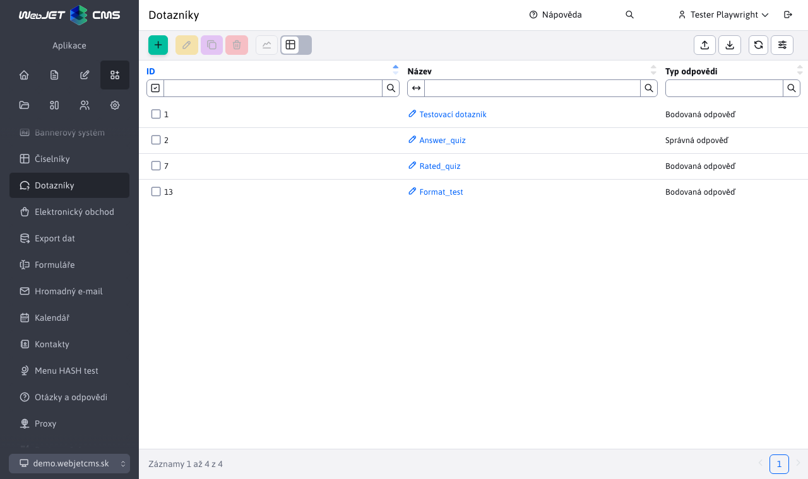
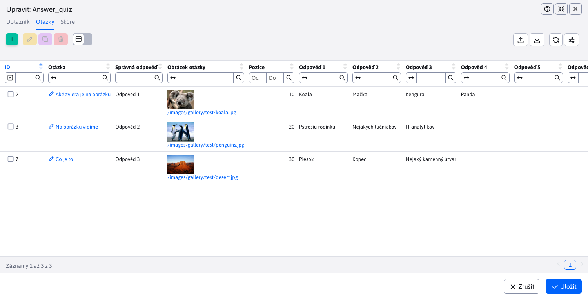
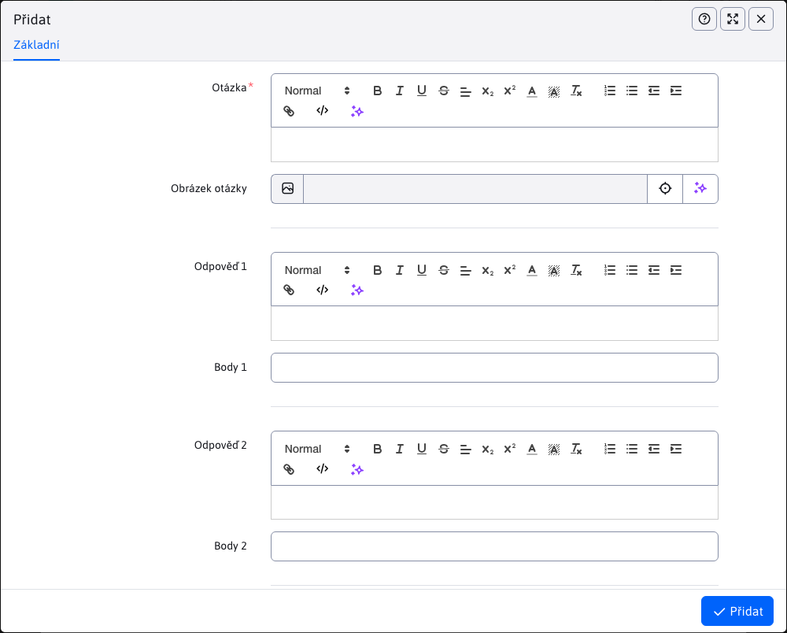

# Dotazníky

Aplikace Dotazníky slouží k přípravě a správě dotazníků. Kromě správy samotných dotazníků umožňuje také spravovat otázky a odpovědi pro dotazník. K dispozici je také statistická část, kde lze nalézt přehled výsledků jednotlivých dotazníků.

K jeho vytvoření jsou zapotřebí 2 parametry:
- Název
- Typ odpovědi

Parametr Typ odpovědi má velký vliv na konečný vzhled a nastavení dotazníku. Podporuje 2 typy:
- Správná odpověď - správná je vždy pouze jedna odpověď z několika a tato správná odpověď má hodnotu 1 bodu.
- Bodová odpověď - může existovat více než jedna správná odpověď a každá správná odpověď může mít jinou bodovou hodnotu.

## Otázky

Správa dotazů se provádí pomocí vnořené datové tabulky přímo na kartě **Otázky** editor dotazníku. Vzhled této tabulky a samotného editoru je ovlivněn zvoleným parametrem dotazníku. **Typ odpovědi**.

Na následujícím obrázku vidíme vnořenou datovou tabulku na kartě dotazu pro možnost **Správná odpověď**. Sloupec Správná odpověď nám také napovídá, protože tyto typy otázek mohou mít pouze jednu správnou odpověď.

Na následujícím obrázku vidíme vnořenou datovou tabulku na kartě dotazu pro možnost **Bodová odpověď**. Oproti předchozí verzi vidíme, že v této tabulce není sloupec Správná odpověď, protože správných odpovědí může být více. Přidali jsme však sloupec Body, který představuje počet bodů získaných za danou odpověď. Odpověď je považována za **správně** pouze v případě, že je udělena **více než 0 bodů**.

### Vytváření otázek a odpovědí

Při vytváření otázky se VŽDY zobrazí možnost zadat 1-6 odpovědí. Pokud odpověď nevyplníme, v dotazníku se nezobrazí. Je vyžadována pouze otázka a alespoň jedna odpověď. Odpovědi i samotnou otázku lze graficky upravovat v editoru, takže mohou obsahovat i složitější texty. Můžete také zadat obrázek, který se v dotazníku zobrazí nad otázkou.

Na následujícím obrázku vidíme editor otázek pro možnost **Správná odpověď**. Po vyplnění libovolného počtu odpovědí musíte vybrat Správnou odpověď.

Na následujícím obrázku vidíme editor otázek pro možnost **Bodová odpověď**. Stejně jako u tabulky s daty neexistuje správná odpověď, ale místo toho můžete každé odpovědi přiřadit body. Při definování odpovědí na otázku můžete jako bodovou hodnotu nastavit také 0, v takovém případě se odpověď považuje za nesprávnou (pokud bodovou hodnotu nevyplníte, bude automaticky nastavena na 0). Všechny zadané číselné bodové hodnoty musí být kladné (včetně nuly).

## Bodování

Správa vyhodnocení se provádí prostřednictvím vnořené datové tabulky přímo na kartě **Bodování** editor dotazníku. V tabulce můžete definovat hodnocení, které se uživateli zobrazí po dokončení testu. Může to být například stupnice ke známce.

Zadejte nové hodnocení vyplněním hodnot od-do (kladné bodové hodnoty) a textu zprávy.

## Nastavení pořadí

Pořadí, v jakém se otázky/hodnocení zobrazí, je určeno hodnotou parametru pořadí. Tento parametr je při vytváření otázky/hodnocení skrytý a při úpravách je již viditelný. Při vytváření je na pozadí nastaven jako největší existující hodnota pořadí v databázi (pro konkrétní dotazník) + 10. Pokud v databázi žádná hodnota neexistuje, je přednastavena na 10. Při editaci tedy můžete hodnotu změnit a určit tak pořadí (hodnota nesmí být záporná). Otázky/hodnocení s nejmenší hodnotou parametru pořadí budou první.

## Vytváření otázek/hodnocení před samotným dotazníkem

Aplikace Dotazníky umožňuje vytvářet a spravovat otázky/hodnocení ještě před vytvořením samotného dotazníku. To je možné díky tomu, že karty **Otázky** a **Bodování** jsou také viditelné při vytváření dotazníku.

Takto vytvořené otázky/hodnocení, které byly vytvořeny před vlastním dotazníkem, nejsou dočasně svázány s žádným dotazníkem (nejsou svázány), dokud není uložen nový dotazník. Jakmile je nový dotazník uložen, budou s ním svázány. Pokud se uživatel rozhodne dotazník neuložit, již vytvořené záznamy se nesmažou a zůstanou k dispozici v záložkách při vytváření dotazníku (např. pokud uživatel znovu otevře okno vytváření). Nevázané otázky/ratingy nejsou viditelné pro ostatní uživatele (je to na uživatele), ani nejsou viditelné při editaci jiných dotazníků. Pokud se rozhodnete nevytvářet nový dotazník a nechcete, aby i již vytvořené otázky/ratingy čekaly na svázání, můžete je libovolně mazat nebo upravovat prostřednictvím okna pro vytvoření dotazníku (přímo v záložkách).

## Možné chyby

Možné chyby, na které je třeba si dát pozor:
- Pokud nevyplníte žádnou odpověď, otázka se neuloží a budete vyzváni k vyplnění alespoň jedné odpovědi.
- Jak se vybírá správná odpověď (pro typ dotazníku **Správná odpověď**) záleží pouze na vás. Pokud jako správnou odpověď zvolíte neurčitou (prázdnou) odpověď, otázka se uloží, ale nikdy na ni nebudete moci správně odpovědět, protože prázdná odpověď se nezobrazí.
- Pokud při definování odpovědí pro dotazník typu **Bodová odpověď** zapomenete těmto odpovědím přiřadit body, budou automaticky nastaveny na 0. To znamená, že výběrem takové odpovědi nezískáte žádné body a odpověď je považována za nesprávnou.

## Statistiky dotazníku

Dotazníková aplikace nabízí také statistickou část. Po výběru záznamu dotazníku v tabulce stiskněte tlačítko pro přesměrování do statistické části. . Stejně jako tabulka otázek se statistická část liší v závislosti na typu odpovědi na dotazník. Některé prvky jsou však společné.

Společné je záhlaví stránky s rozšířeným filtrem pro filtrování dat v určitém rozsahu dat. Filtr funguje na principu:
- pokud není zadán žádný rozsah, automaticky se vrátí data za poslední měsíc (+- 30 dní).
- pokud je rozsah nastaven pouze na OD, filtr vrátí data v rozsahu od nastaveného OD do aktuálního data.
- pokud je rozsah nastaven pouze na DO, filtr vrátí data v měsíčním rozsahu končícím v zadaném DO.

PRVNÍ 2 grafy a datová tabulka jsou společné pro oba typy odpovědí (složení sloupců tabulky se také mění v závislosti na typu dotazníkové odpovědi, aby údaje logičtěji zapadaly). Společné jsou tyto grafy:
- Procento správných odpovědí na každou otázku za zvolené období (zaokrouhlené) je znázorněno sloupcovým grafem, který představuje procento správných odpovědí (ze všech) v daném časovém rozmezí. Hodnoty v % jsou zaokrouhleny na celá čísla. Z grafu lze snadno zjistit, které otázky byly zodpovězeny s nejvyšší nebo nejnižší úspěšností.
- Počet správných a nesprávných odpovědí za zvolené období - u všech otázek pomocí spojnicového grafu, který znázorňuje, kolik bylo v daný den správných a nesprávných odpovědí (v celých číslech). Počítají se odpovědi všech uživatelů u všech otázek dohromady. Z grafu tak lze snadno zjistit, ve kterém dni byl poměr správných a nesprávných odpovědí na otázky lepší nebo horší. Součástí grafu je také přímka znázorňující počet všech odpovědí (pro lepší představu poměru správných/špatných odpovědí na všechny otázky).

**Správná odpověď**

Statistiky dotazníku s typem odpovědi **Správná odpověď** obsahuje 2 další grafy:
- Počet správných odpovědí za zvolené období - pro každou otázku je k dispozici spojnicový graf znázorňující počet správných odpovědí na každou otázku v daný den. Poskytuje přehled o tom, na které otázky konkrétně v ten který den bylo nejvíce/nejméně SPRÁVNÝCH odpovědí. Od všech uživatelů dohromady.
- Počet nesprávných odpovědí za zvolené období - pro každou otázku je k dispozici spojnicový graf znázorňující počet nesprávných odpovědí na jednotlivé otázky v daném dni. Poskytuje přehled o tom, na které otázky konkrétně v který den bylo nejvíce/nejméně nesprávných odpovědí. Od všech uživatelů dohromady.

**Bodová odpověď**

Statistiky dotazníku s typem odpovědi **Bodová odpověď** obsahuje 1 další graf:
- Počet bodů získaných za zvolené období - pro každou otázku je k dispozici spojnicový graf znázorňující počet bodů získaných za každou otázku v daný den. Protože otázka může mít v tomto případě více správných odpovědí, graf procentuální úspěšnosti není dostačující. Tento graf jasně ukáže, které otázky byly v daný den bodově nejvýhodnější/nejméně výhodné. Otázka s nižší úspěšností tedy může být přesto bodově úspěšnější (například pokud jsou její odpovědi výše hodnocené nebo uživatelé hlasovali pro výše hodnocené odpovědi na danou otázku).
