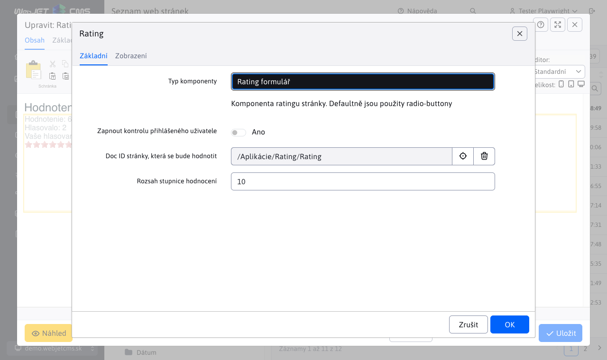
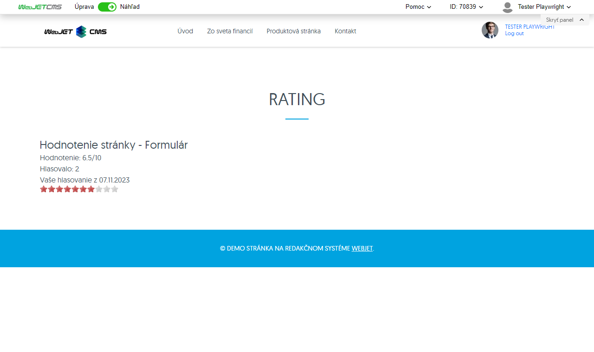
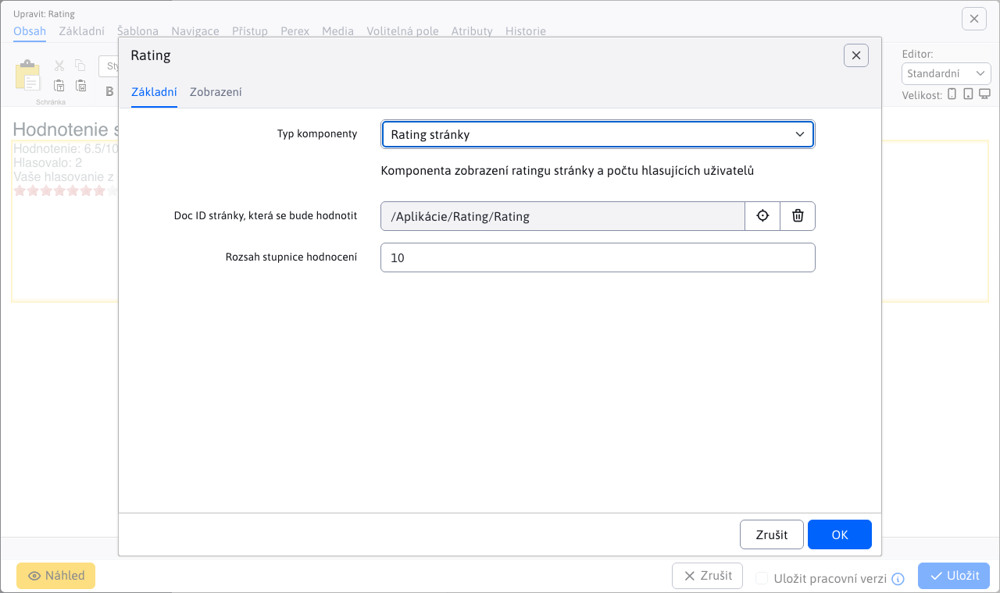
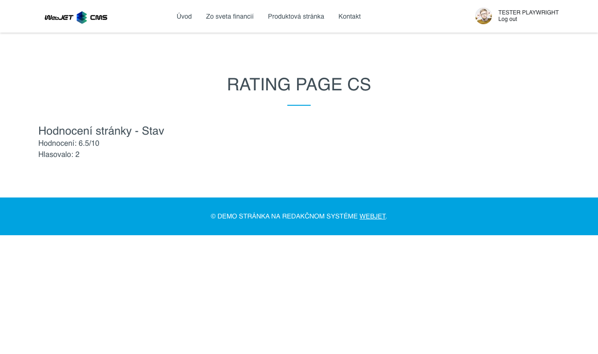
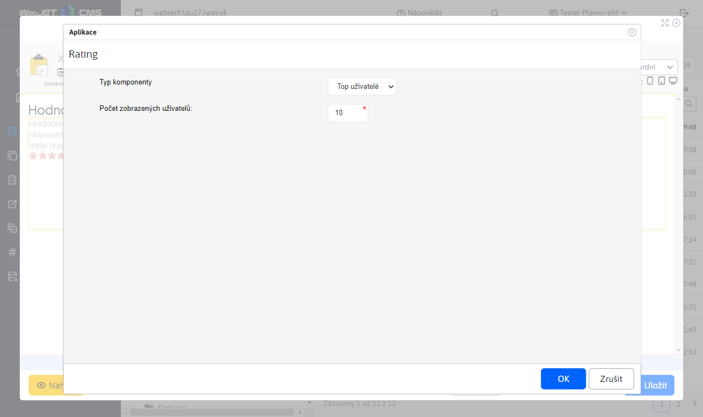
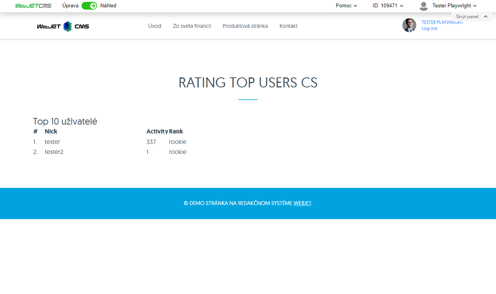
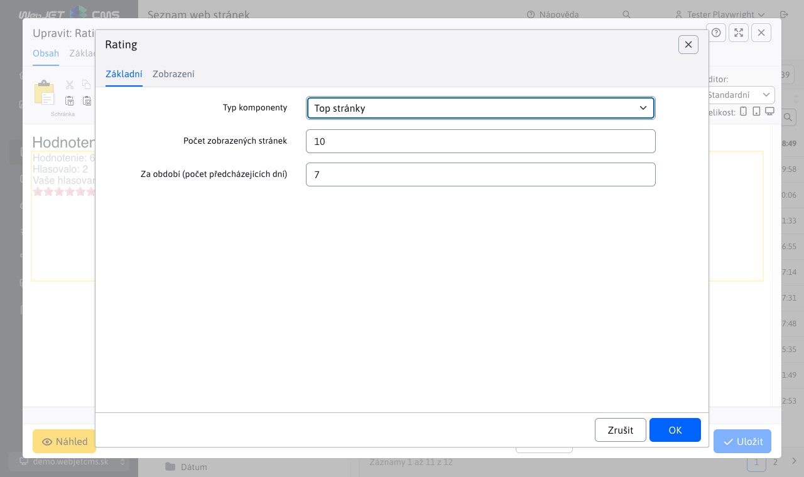
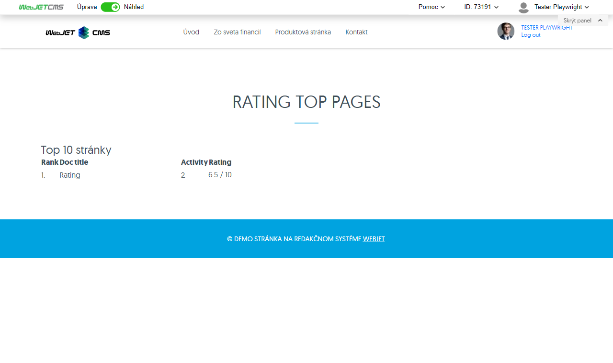

# Hodnocení/Rating

Aplikace Ohodnocení umožňuje hodnotit stránku (její kvalitu). Následně nabízí zobrazení hodnocení na stránce, statistické údaje o počtu hlasujících, seznam nejčastěji hlasujících uživatelů, jakož i seznam stránek s nejvyšším hodnocením.

Formulář pro vložení aplikace do stránky, je dostupný v editoru stránek. Poskytuje možnost výběru typu hodnocení:
- Rating formulář
- Rating stránky
- Top uživatelé
- Top stránky

## Rating formulář

Formulář pro hodnocení stránky můžete přidat jako aplikaci nebo přímo pomocí kódu `!INCLUDE(/components/rating/rating_form.jsp, checkLogon=false, ratingDocId=70839, range=10)!`.

Formulář obsahuje parametry:
- `checkLogon` - Zapnout kontrolu přihlášeného uživatele, pokud je možnost zvolena, hodnotit stránku mohou pouze přihlášený uživatelé.
- `ratingDocId` - Doc ID stránky, která se bude hodnotit, pokud je zadaná hodnota menší než 1, použije se automaticky ID aktuálně zobrazené web stránky.
- `range` - Rozsah stupnice hodnocení.

Samotný vygenerovaný formulář ve stránky funguje pomocí kliknutí na hvězdičky. Rozsah hvězdiček je dán parametrem `Rozsah stupnice hodnotenia`. Po kliknutí na konkrétní hvězdičku se stránka ohodnotí a její opětovné hodnocení již není možné.

## Rating stránky

Rating stránky (nebo sta hodnocení stránky) můžete přidat jako aplikaci nebo přímo pomocí kódu `!INCLUDE(/components/rating/rating_page.jsp, ratingDocId=70839, range=10)!`. Zobrazuje hodnocení web stránky bez formuláře.

Obsahuje parametry:
- `ratingDocId` - Doc ID stránky, která se bude hodnotit.
- `range` - Rozsah stupnice hodnocení.

Zobrazuje statistiku aktuálního hodnocení stránky.

## Top uživatelé

Top uživatelé (který hodnotili) lze přidat jako aplikace nebo přímo pomocí kódu `!INCLUDE(/components/rating/rating_top_users.jsp, usersLength=10)!`.

Obsahuje parametr:
- `usersLength` - Počet zobrazených uživatelů.

Zobrazuje uživatele s největším počtem hodnocení.

## Top stránky

Top stránky lze přidat jako aplikace nebo přímo pomocí kódu `!INCLUDE(/components/rating/rating_top_pages.jsp, range=10, docsLength=10, period=7)!`.

Obsahuje parametr:
- `range` - Rozsah stupnice hodnocení.
- `docsLength` - Počet zobrazených stránek.
- `period` - Za období (počet předchozích dnů).

Zobrazuje stránky s nejlepším hodnocením.

