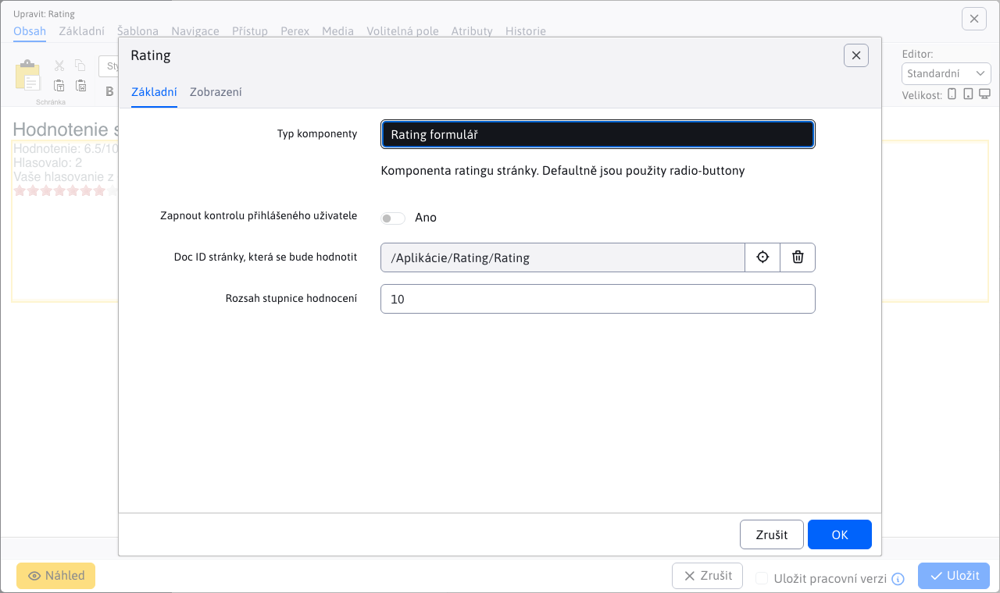
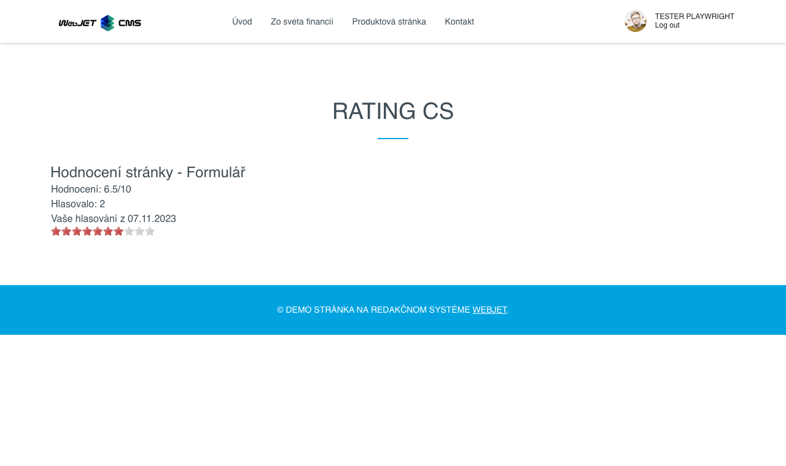
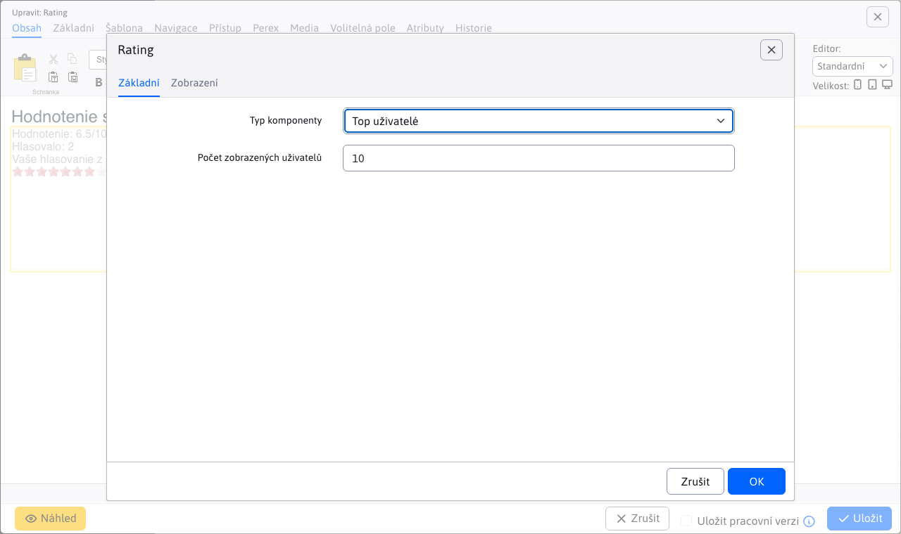
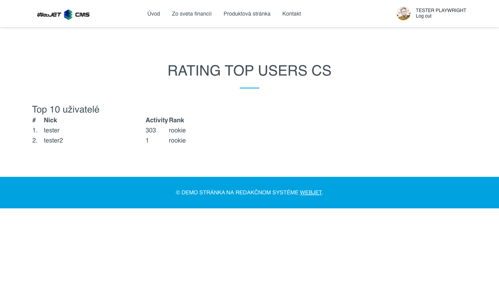
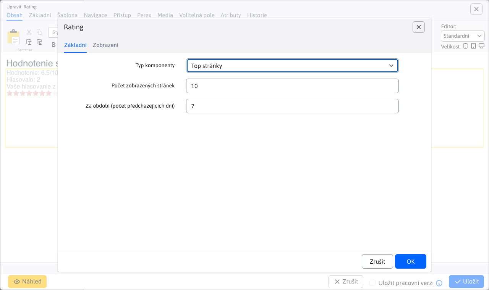
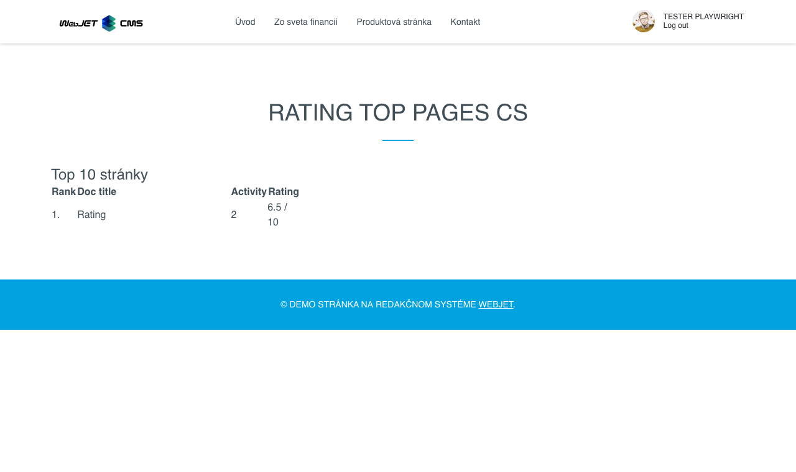

# Hodnocení/hodnocení

Aplikace Hodnocení umožňuje hodnotit stránku (její kvalitu). Následně nabízí zobrazení hodnocení stránky, statistiku počtu hlasujících, seznam nejčastěji hlasujících uživatelů a také seznam stránek s nejvyšším hodnocením.

Formulář pro vložení aplikace do stránky je k dispozici v editoru stránky. Nabízí možnost výběru typu hodnocení:
- Hodnotící formulář
- Hodnocení webu
- Nejlepší uživatelé
- Horní stránky

## Hodnotící formulář

Formulář pro hodnocení stránky můžete přidat jako aplikaci nebo přímo pomocí kódu. `!INCLUDE(/components/rating/rating_form.jsp, checkLogon=false, ratingDocId=70839, range=10)!`.

Formulář obsahuje parametry:
- `checkLogon` - Zaškrtněte políčko Povolit přihlášené uživatele, pokud je zaškrtnuto, mohou stránku hodnotit pouze přihlášení uživatelé.
- `ratingDocId` - ID stránky, která se má vyhodnotit, pokud je zadaná hodnota menší než 1, použije se automaticky ID aktuálně zobrazené webové stránky.
- `range` - Rozsah hodnotící škály.

Vygenerovaný formulář na stránce funguje po kliknutí na hvězdičky. Rozsah hvězdiček je dán parametrem `Rozsah stupnice hodnotenia`. Po kliknutí na určitou hvězdičku je stránka ohodnocena a nelze ji hodnotit znovu.

## Hodnocení webu

Stránku s hodnocením (nebo stránku s hodnocením sta) můžete přidat jako aplikaci nebo přímo pomocí kódu. `!INCLUDE(/components/rating/rating_page.jsp, ratingDocId=70839, range=10)!`. Zobrazí hodnocení webové stránky bez formuláře.

Obsahuje parametry:
- `ratingDocId` - ID dokumentu stránky, která má být vyhodnocena.
- `range` - Rozsah hodnotící škály.

Zobrazí statistiky aktuálního hodnocení stránky.

## Nejlepší uživatelé

Nejlepší uživatele (kteří hodnotili) lze přidat jako aplikaci nebo přímo pomocí kódu. `!INCLUDE(/components/rating/rating_top_users.jsp, usersLength=10)!`.

Obsahuje parametr:
- `usersLength` - Počet zobrazených uživatelů.

Zobrazí uživatele s největším počtem hodnocení.

## Horní stránky

Nejlepší stránky lze přidat jako aplikaci nebo přímo pomocí kódu. `!INCLUDE(/components/rating/rating_top_pages.jsp, range=10, docsLength=10, period=7)!`.

Obsahuje parametr:
- `range` - Rozsah hodnotící škály.
- `docsLength` - Počet zobrazených stránek.
- `period` - Za období (počet předchozích dnů).

Zobrazí stránky s nejlepším hodnocením.

