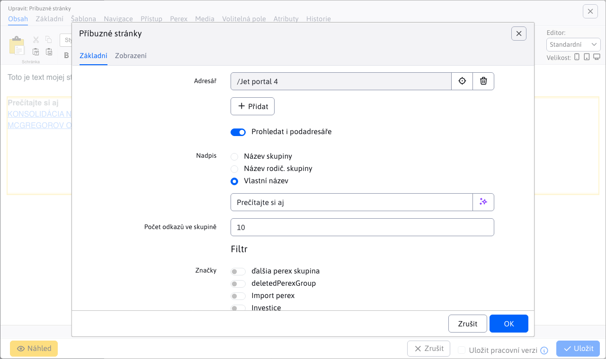

# Příbuzné stránky

Vloží do stránky aplikaci, která bude zobrazovat odkazy na příbuzné stránky. Ty se vyhledají automaticky podle přiřazených značek (perex skupin) k aktuální stránce (vyhledají se jiné stránky obsahující stejné značky).

## Nastavení aplikace

V této části lze nastavit:
- Adresář - kořenová složka, ve které se hledají příbuzné stránky
- Prohledat také podadresáře
- Nadpis
  - Název skupiny - název složky aktuální stránky
  - Název rodič. skupiny - název rodičovské složky aktuální stránky
  - Vlastní název
- Perex skupiny - je-li zadáno zobrazí se nejnovější stránky podle zadaných značek, je-li prázdné zobrazí se podle značek aktuálně zobrazené web stránky
- Počet odkazů ve skupině - maximální počet zobrazených stránek

## Zobrazení aplikace

