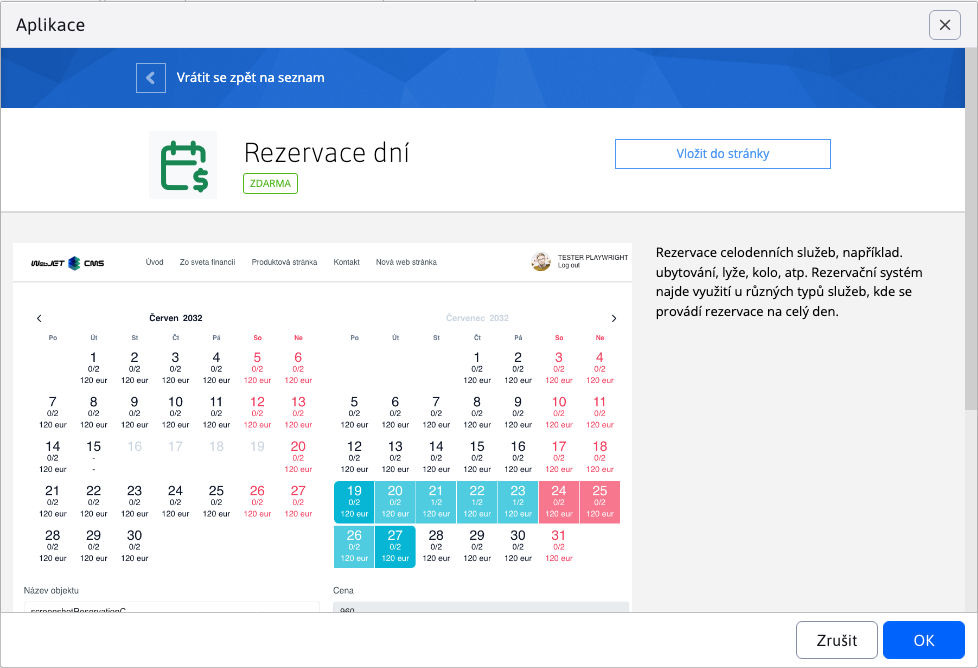
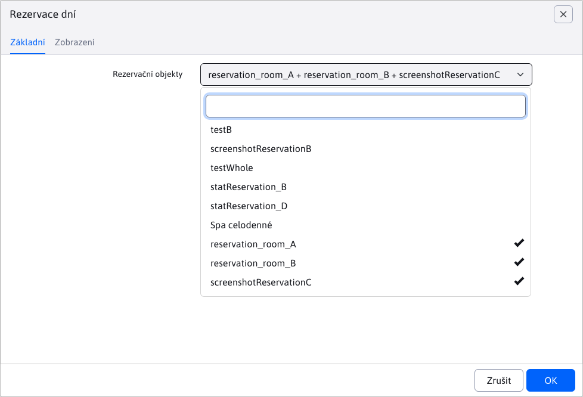
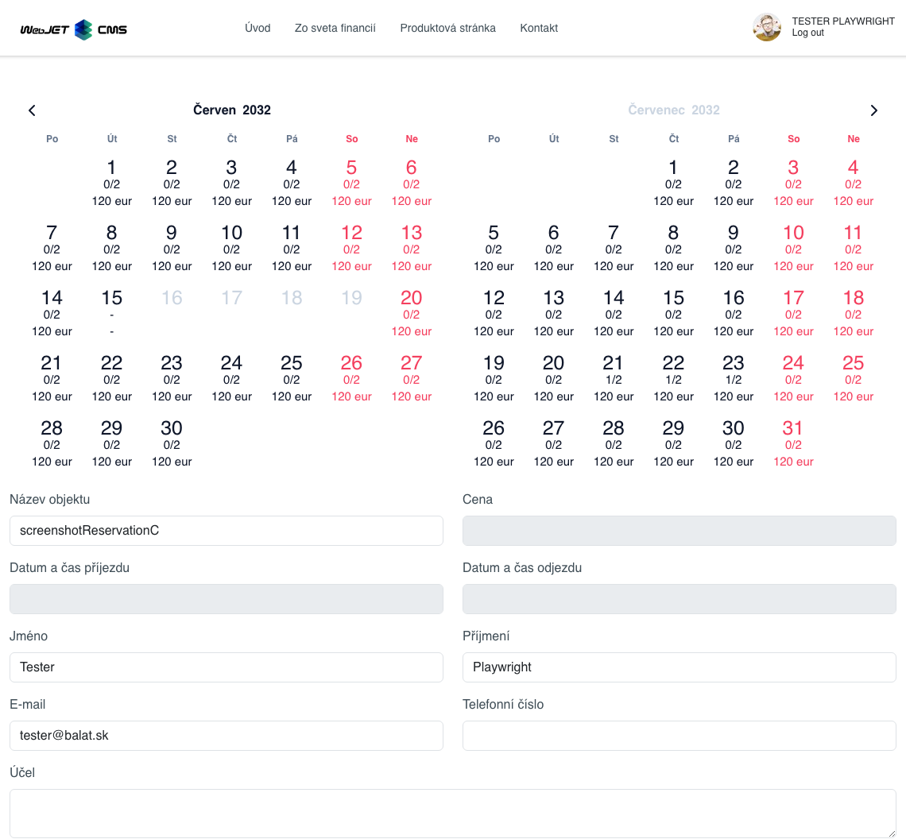
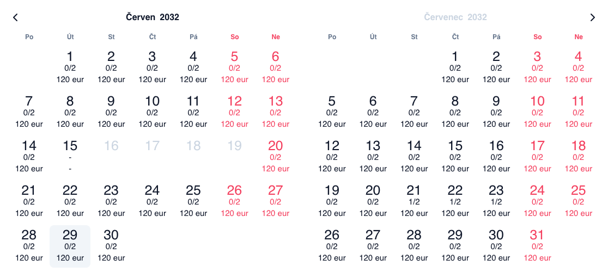
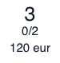
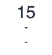
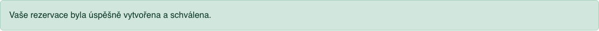
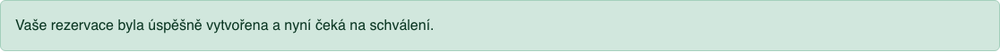

# Aplikace Rezervace dní

Aplikace **Rezervace dní** umožňuje rezervaci vybraných rezervačních objektů na jeden nebo více dní, pomocí výběru požadovaných dní v kalendáři.

## Použití aplikace

Aplikaci můžete do své stránky přidat přes obchod s aplikacemi



nebo přímo jako kód do stránky

```html
!INCLUDE(sk.iway.iwcm.components.reservation.DayBookApp, reservationObjectIds=&quot;3683+3684+3962&quot;, device=&quot;&quot;, cacheMinutes=&quot;&quot;)!
```

V kódu si můžete všimnout parametru `reservationObjectIds`. Jedná se o seznam **vynucených** rezervačních objektů, které se budou v aplikaci dát rezervovat. Nastavit je můžete při editaci aplikace pomocí vícenásobného výběrového pole, nebo je přidat přímo do parametru `reservationObjectIds`. Pokud se tento seznam (parametr) nenastaví, v aplikaci se zobrazí všechny (celodenní) dostupné rezervační objekty.



!>**Upozornění**: podporovány jsou pouze rezervační objekty, které **jsou nastaveny jako rezervace na celý den**. Protože tyto objekty lze rezervovat pouze na základě data. Nevyhovující rezervační objekty se v multi výběrovém poli nezobrazují.

!>**Upozornění**: manuální přidání ID nevyhovujícího rezervačního objektu do parametru `reservationObjectIds`, nebo změna stavu "rezervace na celý den" již použitého rezervačního objektu v aplikaci **způsobí chybné chování aplikace**.

## Stavba aplikace

Aplikace se skládá ze 2 hlavních částí:
- kalendář dostupnosti a cen
- formulář rezervace



## Kalendář dostupnosti a cen

Kalendář slouží k výběru datového rozsahu, ve kterém si chcete rezervovat objekt. Při zobrazení se automatický nastaví aktuální měsíc (vpravo) a následující měsíc (vlevo).

### Volba data

Chcete-li změnit aktuálně zobrazené datum, umíte tak učinit kliknutím na měsíc/rok v hlavičce dřívějšího měsíce (vlevo). Kalendář **neumožňuje zobrazení historie, resp. rezervaci v historii**.

**Výběr měsíce**

Při kliknutí na název měsíce v hlavičce kalendáře se vám zobrazí nabídka s výběrem všech měsíců. Jedná se o výběr měsíců pro konkrétně zvolený rok. Pokud se nějaký měsíc pro daný rok nachází již v minulosti, bude zašedlý a nebudete ho umět zvolit.


**Výběr roku**

Podobně jako při volbě měsíce, při kliknutí na rok v hlavičce kalendáře se vám zobrazí dostupné roky ke zvolení. Léta v minulosti jsou zašedlá a nebudou se dát zvolit.


### Prvky kalendáře

Jak si můžete všimnout, kalendář má různé graficky odlišné prvky, které mají různý význam.



**Zvolitelný den**

Nejběžnější prvek kalendáře je den, který si umíte zvolit k rezervaci. Každý prvek obsahuje informace:
- den v měsíci
- informace o obsazenosti, tedy kolik rezervací již je na tento den vytvořen a z jakého maximálního počtu. Příklad `0/1, 2/5, ...`.
- cena rezervace za daný den pro daný objekt is měnou. Příklad `120 eur, 15 czk, ..`.

!>**Upozornění**: tato cena rezervace na daný den je vypočtena již se slevou uživatele. Tato procentuální sleva je nastavena pro specifické [skupiny uživatelů](../../../../admin/users/user-groups.md). Pokud uživatel patří do více **skupin uživatelů** které mají nastavenou procentuální slevu, použije se z nich ta největší. Pokud sleva má hodnotu `0%`, částka rezervace se nemění. Pokud sleva má hodnotu `100%`, rezervace je zdarma.

Víkendové dny jsou pro lepší přehled zvýrazněny červeně.

|      Běžný den | Běžný den (již s jinou rezervací) |    Víkendový den |
| :-----------------: | :-------------------------------: | :------------------: |
|  |     |  |

**Nezvolitelný den**

Další běžný prvek kalendáře je den, který nelze zvolit. Jedná se o dny, které jsou již v minulosti, nebo jsou již plně rezervovány. Takové prvky jsou zašedlé, nedají se zvolit a nezobrazují ani informace o dostupnosti/ceně.


**Speciální `Check-out ONLY` den**

Tento speciální prvek kalendáře zobrazuje den, který lze zvolit, ale ne rezervovat. Příklad: při rezervaci pokoje jde o den, který si rezervoval už někdo jiný (jeho rezervace v daný den začíná) ale vy jej můžete využít v rezervaci k odchodu z pokoje. Odtud také pochází název `Check-out ONLY`, který se také zobrazí jako popis prvku.



### Logika volby rozsahu

Volba rozsahu v kalendáři funguje na jednoduchém principu zvolení počátečního a konečného dne k rezervaci (nebo naopak, nemá to žádný vliv). Zvolit můžete pouze **zvolitelné dny** s výjimkou `Check-out ONLY` dní. Pokud vám zvolený den nevyhovuje, stačí na něj opět kliknout (tím se vypne jeho označení).

!>**Upozornění**: můžete zvolit najednou pouze jeden rozsah, který musí být platný v celém trvání, takže nemůže být přerušen dnem v minulosti nebo plně obsazeným (rezervovaným) dnem.

Kalendář má již v sobě zabudované kontroly, aby se tato podmínka dodržela. Proto nedovolí kliknout na **nezvolitelné dny**, ale navíc zablokuje ty dny, které s právě zvoleným počátečním dnem nedokázaly vytvořit souvislý interval. **Příklad:** na následujících obrázcích můžete vidět, jak se po výběru dne `19.07` zablokují všechny dny od `01.06` do `16.06`. Zablokují se, protože nelze zvolit v jednom rozsahu. Tento rozsah by byl přerušen několika plně obsazenými (rezervovanými) dny a takový rozsah není platný.

|     Před zvolením |     Po zvolení |
| :--------------------: | :-----------------: |
|  |  |

Po zvolení prvního dne (počátečního) stačí zvolit druhý povolený den (konečného). Při přechodu nad jednotlivými dny se vám bude rozsah předoznačovat abyste měli přehled a po výběru konečného dne se již plně označí.

|    Před zvolením |     Po zvolení |
| :-----------------: | :-----------------: |
|  |  |

Všimněte si, že po zvolení se nám opět zpřístupnily dočasně zablokované dny od `01.06` do `16.06`. Samozřejmě tento výběr můžeme změnit. Stačí vybrat klepnutím nový počáteční den.

Také si můžete všimnout, že kalendář nám dovolil zvolit dny od `21.07` do `23.07`, které jsou pouze částečně rezervovány.

!>**Upozornění**: rozsah musí mít alespoň 2 dny, jelikož poslední den rezervace je určen k opuštění rezervovaného objektu a za tento poslední den **se neplatí**.

### Formulář rezervací

Jedná se o jednoduchý formulář se základními informacemi k rezervaci objektu.

Výběrové pole **Název objektu** vám umožňuje změnit rezervační objekt, který chcete rezervovat.

Tato povinná pole se automaticky před-vyplní pokud jste přihlášen uživatel, ale samozřejmě dají se změnit. Pokud přistupujete jako nepřihlášený uživatel, musíte je povinně zadat:
- Jméno
- Příjmení
- E-mail

Pole **Datum a čas příjezdu** a **Datum a čas odjezdu** se nedají změnit a slouží pouze k informačním účelům. Automatický změní hodnotu podle zvoleného rozsahu v kalendáři.

!>**Upozornění**: hodnoty pro **čas příjezdu** a **čas odjezdu** se získávají z konfiguračních proměnných `reservationAllDayStartTime` a `reservationAllDayEndTime`.

!>**Upozornění:** tlačítko pro přidání rezervace se zobrazí pouze pokud je zvolen rozsah v kalendáři.


## Přidání rezervace

Po zvolení rozsahu v kalendáři a vyplnění informací ve formuláři (pokud jsou potřeba) jste připraveni požádat o přidání vaší rezervace. V levém dolním rohu se zobrazí tisklo **Přidat rezervaci**


Pokud se rezervace úspěšně vytvořila obdržíte hlášení o úspěšném vytvoření rezervace a na Vámi zadaný email přijde i potvrzení.

Pokud rezervační objekt **nepotřebuje schválení**, rezervace se automaticky schválí a vy obdržíte následující hlášení. Následně se upraví dostupnost objektu pro jednotlivé dny.



Pokud rezervační objekt **potřebuje schválení**, rezervace bude ve stavu čekání. Dostupnost objektu pro jednotlivé dny v kalendáři se nezmění, nakolik se počítají POUZE schválené rezervace. Schvalovatel může vaši rezervaci schválit nebo zamítnout, o čemž budete informováni emailem.


