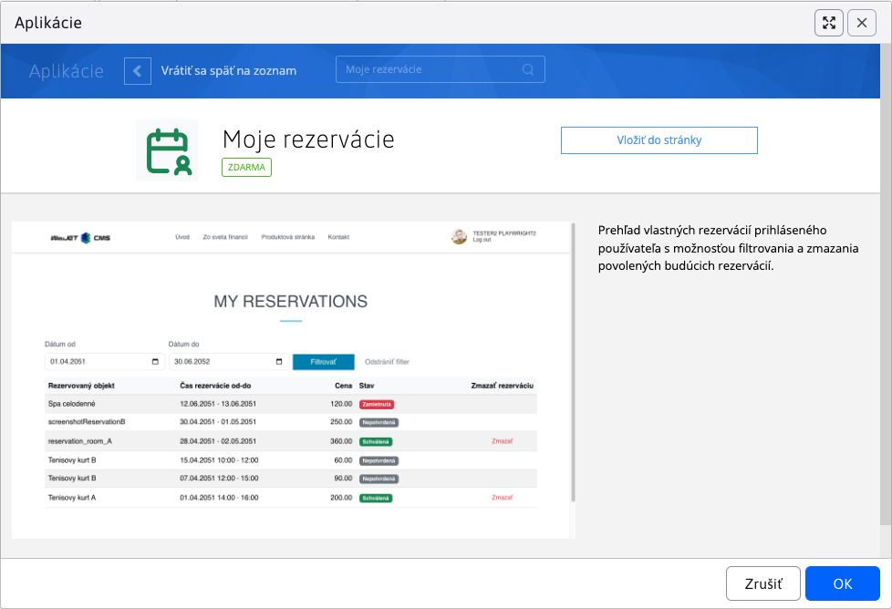
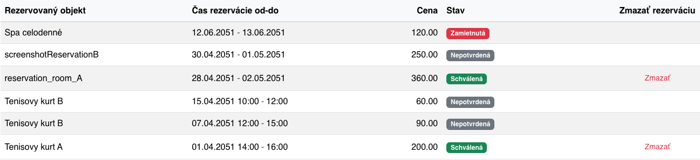

# Aplikace Moje rezervace

Aplikace **Moje rezervace** zobrazí přihlášenému uživateli přehled jeho vlastních rezervací. Uživatel si umí rezervace filtrovat podle data, zkontrolovat jejich stav a smazat ty rezervace, u kterých to ještě povolují pravidla rezervačního objektu.


## Použití aplikace

Aplikaci můžete do své stránky přidat přes obchod s aplikacemi výběrem aplikace **Moje rezervace**.



Přidat ji můžete také přímo jako kód do stránky:

```html
!INCLUDE(sk.iway.iwcm.components.reservation.MyReservationsApp, device=&quot;&quot;, cacheMinutes=&quot;&quot;)!
```

V aplikaci lze nastavit rezervační objekt. Je-li zvolen, zobrazí se rezervace pouze pro tento rezervační objekt a nezobrazí se sloupec Rezervovaný objekt. Pokud je výběrové pole prázdné zobrazí se rezervace ze všech rezervačních objektů.

Zobrazená data se určují podle aktuálně přihlášeného uživatele a aktuální domény.

!>**Upozornění:** aplikace je určena pro přihlášené uživatele. Nepřihlášenému návštěvníkovi se nezobrazí žádné rezervace.

## Stavba aplikace

Aplikace se skládá ze 2 hlavních částí:

- filtr podle data rezervace,
- tabulka vlastních rezervací.

## Filtrování rezervací

V horní části aplikace se nacházejí pole **Datum od** a **Datum do**. Pomocí nich můžete omezit seznam rezervací na zvolený datumový interval.


Pokud není nastaven žádný filtr, aplikace automaticky zobrazí rezervace za poslední 2 měsíce, včetně budoucích rezervací.

Při filtrování se zobrazí rezervace, které se překrývají se zadaným intervalem:

- **Datum od** zobrazí rezervace, které končí v tento den nebo později,
- **Datum do** zobrazí rezervace, které začínají v tento den nebo dříve.

Tlačítko **Filtrovat** použije zadaný interval. Tlačítko **Zrušit filtr** odstraní zadaná data a vrátí aplikaci do výchozího zobrazení.

## Tabulka rezervací

Tabulka obsahuje seznam rezervací aktuálně přihlášeného uživatele seřazený od nejnovější rezervace podle data začátku.



V tabulce se zobrazují tyto údaje:

- **Rezervační objekt** - název objektu, kterého se rezervace týká.
- **Rozsah rezervace** - datum nebo datum s časem začátku a konce rezervace. Při celodenních rezervacích se zobrazují pouze data, při časových rezervacích i časy.
- **Cena** - vypočítaná cena rezervace.
- **Stav** - aktuální stav rezervace.
- **Smazat rezervaci** - tlačítko pro smazání rezervace, pokud je smazání povoleno.

Rezervace může mít tyto stavy:

- **Nepotvrzená** - rezervace čeká na schválení.
- **Schválená** - rezervace je potvrzena.
- **Zamítnuta** - rezervace byla zamítnuta.

## Smazání rezervace

Tlačítko pro smazání se zobrazí pouze při rezervacích, které lze smazat. Rezervaci lze smazat jen tehdy, když:

- rezervace je schválena,
- začátek rezervace je ještě v budoucnosti,
- nebyl překročen povolený čas na zrušení rezervace nastavený u rezervačního objektu.

Při celodenní rezervaci musí být datum rezervace pozdější než aktuální den. Při časové rezervaci musí být začátek rezervace pozdější než aktuální čas.

Pokud má rezervační objekt nastaveno heslo pro smazání rezervace, aplikace si jej před smazáním vyžádá. Bez zadání hesla nebude rezervace smazána.

Po úspěšném smazání se zobrazí potvrzení a rezervace zmizí ze seznamu. Pokud byla tabulka před smazáním filtrována, zvolený filtr zůstane zachován.

Pokud rezervaci nelze smazat, aplikace zobrazí chybové hlášení s důvodem neúspěchu.

## Související aplikace

Rezervace zobrazené v této aplikaci mohou vzniknout například přes aplikace:

- [Rezervace času](../time-book-app/README.md),
- [Rezervace dnů](../day-book-app/README.md).
