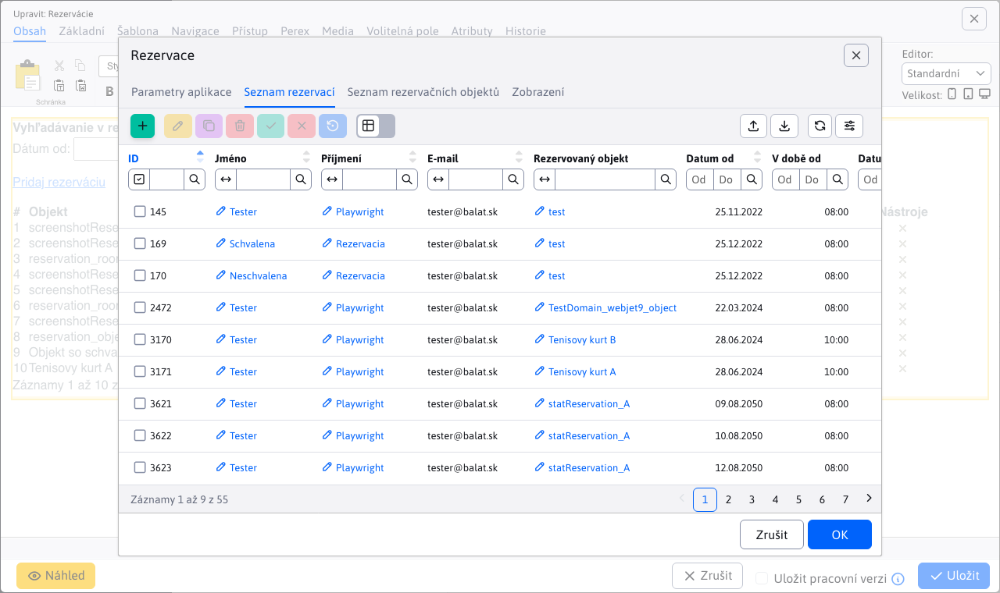
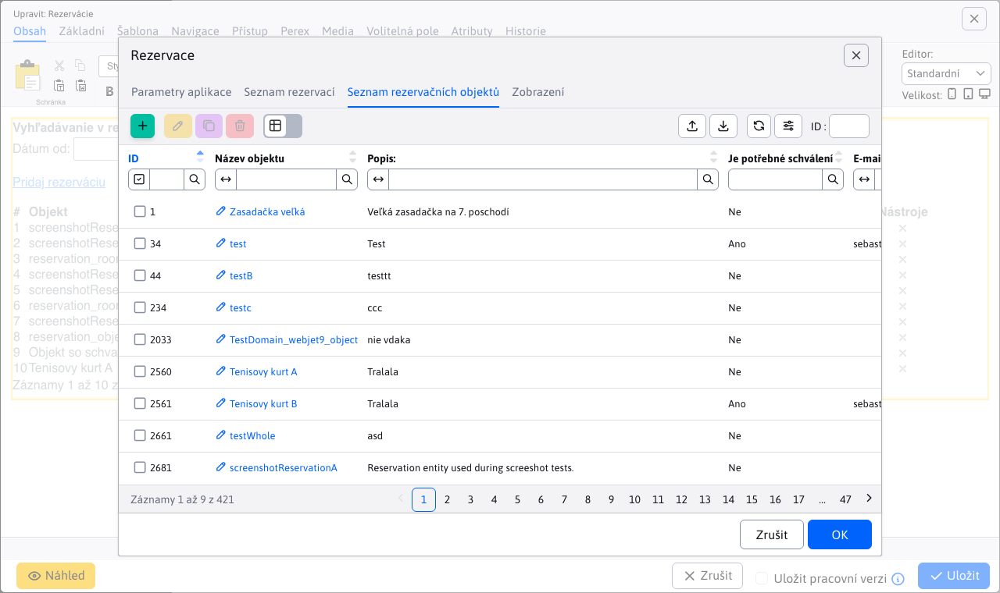
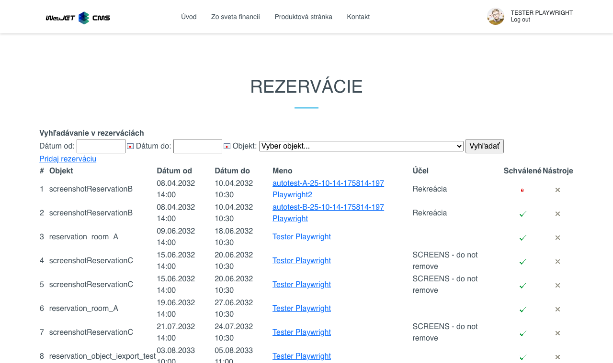

# Aplikace Rezervace

Pomocí této aplikace lze spravovat systém rezervací. Je třeba přidat na stránku tuto aplikaci a následně je možno pomocí formuláře vybírat z rezervačních objektů (např. pokoj, chata, tenisový kurt) a požádat o rezervaci. Administrátor může schvalovat jednotlivé žádosti.

## Nastavení aplikace

V editoru lze zvolit typ zobrazení:
- **Seznam rezervací**
- **Seznam rezervačních objektů**

Na základě výběru se změní obsah, který bude uživateli zobrazen.

### Seznam rezervací

V této kartě lze prohlížet, vytvářet a upravovat rezervace.

[Přejít na Seznam rezervací](../reservations/README.md)

### Seznam rezervačních objektů

V této kartě lze upravovat a spravovat objekty, které lze rezervovat.

[Přejít na Seznam rezervačních objektů](../reservation-objects/README.md)

## Zobrazení aplikace

Takto vypadá aplikace po přidání na stránku:

