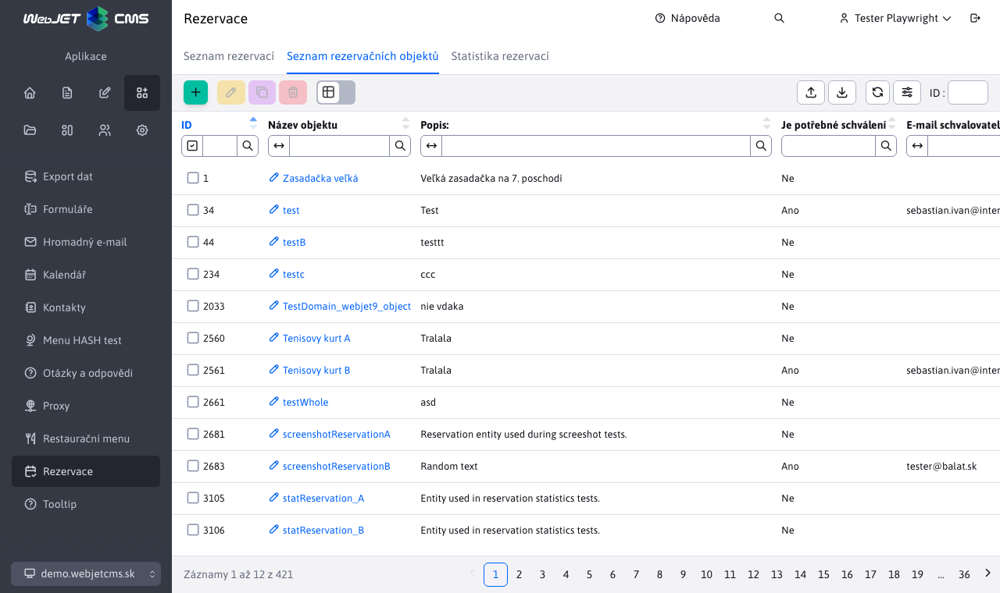
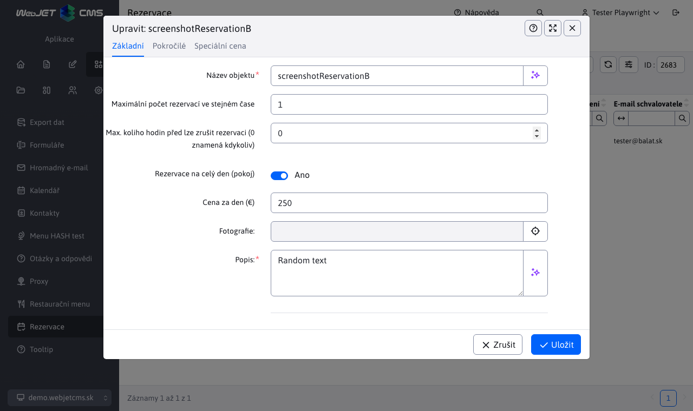

# Rezervační objekty

## Seznam rezervačních objektů

Aplikace Seznam rezervačních objektů umožňuje vytváření/úpravu/mazání rezervačních objektů, jakož i jejich import z Excel souboru a export do Excel/CSV souboru (případně i možnost okamžitého tisku při exportu).

Editor rezervačního objektu obsahuje 4 karty:

## Základní

Karta **Základní** jak již napovídá název, obsahuje základní informace ohledně rezervačního objektu. Je povinné zadat název rezervačního objektu i jeho popis, zbývající parametry jsou volitelné. Spodní část karty obsahuje časový výběr pro zadání rezervačního intervalu pro daný objekt. To znamená, že tento objekt bude možné rezervovat pouze v zadaném intervalu.

Parametr **Maximální počet rezervací ve stejnou dobu** je velmi důležitý parametr při validaci nových rezervací - [více o validaci](../reservations/readme.md#validace-rezervací). Tento parametr udává kolik rezervací se může vytvořit nad rezervačním objektem ve stejnou dobu. Pokud tento parametr bude nastaven na hodnotu například 3, znamená to, že ve stejnou dobu můžete mít maximálně 3 rezervace nad tímto objektem, ale nemluví o tom kolik rezervací během celého intervalu se může přidat.

Další důležitý parametr je přepínač pro rezervování pokoje na celý den.

- Pokud je tato možnost vypnuta, můžete zadat minimální délku rezervace v minutách a cenu za danou zvolenou jednotku času. Cena může být samozřejmě nulová a v tom případě bude rezervace tohoto objektu bezplatná. Minimální délka rezervace musí být kladné nenulové číslo, takže alespoň 1 minuta. Tento objekt bude možné rezervovat minimálně na zadanou časovou hodnotu a maximálně do období, které se nachází ve zvoleném rezervačním intervalu.
- Pokud je tato možnost zapnuta, nebude možné nastavit minimální délku rezervace ani cenu za danou jednotku času. Zadat budete moci jen cenu za den. To v praxi znamená, že si nemůžete rezervovat pouze část z celého intervalu, ale rezervujete celý interval (celý den).

!>**Upozornění:** kromě toho, že některé parametry se skryjí v závislosti na stavu přepínače rezervování na celý den, skrývá/odkrývá se i celá karta [Časy podle dnů](#časy-podle-dnů).

## Pokročilé

Karta **Pokročilé** obsahuje pouze 2 možnosti.

Pokud zapnete možnost **Je třeba schválení**, můžete zadat email schvalovatele rezervačního objektu. Takže vytvořená rezervace nad tímto rezervačním objektem bude muset být nejprve schválena a na zadaný email bude odeslána zpráva (více o tomto se dozvíte v sekci [seznam rezervací](../reservations/readme.md#seznam-rezervací)).

Pokud zapnete možnost **Zadat nebo změnit heslo** a zadáte 2x shodující se heslo, při pokusu o vymazání rezervace nad rezervačním objektem bude uživatel vyzván k zadání tohoto hesla. Pokud je heslo již zadáno, tak se vymění za nové, více se dozvíte v části [Mazání rezervací](../reservations/readme.md#mazání-rezervací).

## Časy podle dnů

Karta **Časy podle dnů** rozšiřuje možnost zadání rezervačního intervalu pro objekt. Umožňuje zadat jedinečný (nebo i stejný) interval pro jednotlivé dny v týdnu. V praxi víkendové dny jako sobota a neděle mohou mít jiný rezervační interval než pracovní dny, nebo každý den můžete mít jiný interval. Pokud pro nějaký den v týdnu nezadáte specifický rezervační interval, použije se ten základní, který je nastaven v kartě [Základní](#základní). Pole pro časový výběr intervalu se pro jednotlivé dny zobrazí až po zapnutí možnosti s názvem daného dne v týdnu.

Karta není dostupná pokud je zapnuta možnost rezervování na celý den (z karty Základní).

## Speciální cena

Karta **Speciální cena** se zobrazí pouze při editaci rezervačního objektu. V této kartě se nachází vnořená tabulka pro speciální ceny v konkrétní datové intervaly. Například, pokud je rezervační objekt nastaven na rezervaci na celý den s cenou 15 eur na den, tak si můžete zvolit, ve které dny v roce bude tato cena jiná (větší nebo menší, např. během svátků).

Záznamy v této vnořené tabulce umíte vytvářet/upravovat/mazat nebo importovat a exportovat. Při vytváření nové speciální ceny pro zadané období se `id` rezervačního objektu nastaví automaticky (bez možnosti změny) a zbývající pole jsou povinná k vyplnění. Zadáte cenu a interval ve dnech od a do kdy má tato cena platit.

