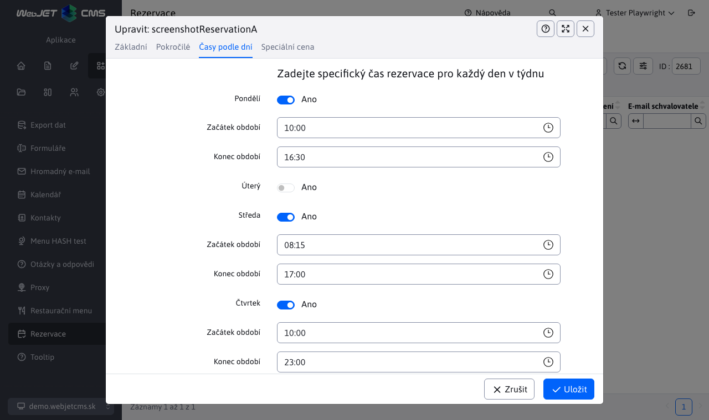
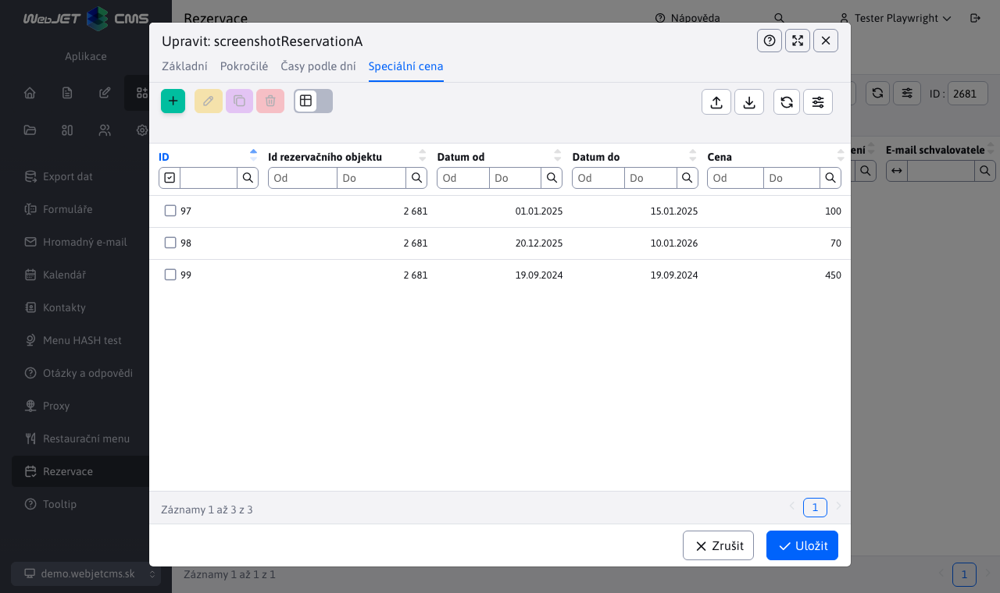

# Rezervační objekty

## Seznam objektů rezervace

Aplikace Seznam objektů rezervací umožňuje vytvářet/upravovat/mazat objekty rezervací a také je importovat ze souboru Excel a exportovat do souboru Excel/CSV (nebo je dokonce při exportu ihned vytisknout).

Editor objektu rezervace obsahuje 4 karty:

## Základní

Karta **Základní** jak název napovídá, obsahuje základní informace o objektu rezervace. Je povinné zadat název objektu rezervace a jeho popis, ostatní parametry jsou nepovinné. Spodní část karty obsahuje výběr času pro zadání intervalu rezervace pro daný objekt. To znamená, že tento objekt lze rezervovat pouze v zadaném intervalu.

Parametr **Maximální počet rezervací najednou** je velmi důležitým parametrem při ověřování nových rezervací - [více o ověřování](../reservations/readme.md#potvrzení-platnosti-rezervací). Tento parametr určuje, kolik rezervací lze nad objektem rezervace vytvořit současně. Pokud je tento parametr nastaven například na hodnotu 3, znamená to, že nad tímto objektem mohou být současně maximálně 3 rezervace, ale neříká, kolik rezervací lze přidat během celého intervalu.

Dalším důležitým parametrem je možnost rezervace pokoje na celý den.

- Pokud je tato možnost vypnutá, můžete zadat minimální délku rezervace v minutách a cenu za zvolenou časovou jednotku. Cena může být samozřejmě nulová, v takovém případě bude rezervace tohoto objektu bezplatná. Minimální délka rezervace musí být kladné nenulové číslo, tedy alespoň 1 minuta. Tento objekt bude možné rezervovat minimálně na zadanou časovou hodnotu a maximálně na dobu, která je v rámci zvoleného rezervačního intervalu.
- Pokud je tato možnost povolena, nebude možné nastavit minimální délku rezervace ani cenu za jednotku času. Budete moci zadat pouze cenu za den. V praxi to znamená, že nemůžete rezervovat pouze část celého intervalu, ale rezervujete celý interval (celý den).

!>**Varování:** kromě toho, že se některé parametry skrývají v závislosti na stavu přepínače rezervací pro celý den, je skryta/odkryta i celá karta. [Časy podle dnů](#časy-podle-dnů).

## Pokročilé

Karta **Pokročilé** obsahuje pouze 2 možnosti.

Pokud zapnete možnost **Je vyžadováno schválení**, můžete zadat e-mail schvalovatele objektu rezervace. Rezervace vytvořená přes tento objekt rezervace tedy bude muset být nejprve schválena a na zadaný e-mail bude odeslána zpráva (více o tom v části [seznam rezervací](../reservations/readme.md#seznam-rezervací)).

Pokud zapnete možnost **Zadejte nebo změňte své heslo** a zadáte 2x shodné heslo, bude uživatel při pokusu o odstranění rezervace přes objekt rezervace vyzván k zadání tohoto hesla. Pokud je heslo již zadáno, bude nahrazeno novým, viz. [Odstranění rezervací](../reservations/readme.md#vymazání-výhrad).

## Časy podle dnů

Karta **Časy podle dnů** rozšiřuje možnost zadat interval rezervace pro objekt. Umožňuje zadat jedinečný (nebo dokonce stejný) interval pro každý den v týdnu. V praxi mohou mít víkendové dny, například sobota a neděle, jiný interval rezervace než všední dny, nebo můžete mít každý den jiný interval. Pokud pro některý den v týdnu nezadáte konkrétní rezervační interval, použije se základní interval nastavený na kartě [Základní](#Základní). Pole pro výběr časového intervalu pro každý den se zobrazí pouze tehdy, když je povolena možnost s názvem dne v týdnu.

Karta není k dispozici, pokud je povolena možnost rezervace na celý den (ze základní karty).

## Speciální cena

Karta **Speciální cena** se zobrazí pouze při úpravě objektu rezervace. Na této kartě je vnořená tabulka pro speciální ceny v určitých datových rozmezích. Pokud je například u objektu rezervace nastavena celodenní rezervace s cenou 15 eur za den, můžete si vybrat, ve kterých dnech v roce bude tato cena jiná (vyšší nebo nižší, např. během prázdnin).

V této vnořené tabulce můžete vytvářet/upravovat/mazat nebo importovat a exportovat záznamy. Při vytváření nové speciální ceny pro zadané období se zobrazí položka `id` objektu rezervace se nastaví automaticky (bez možnosti změny) a zbývající pole je nutné vyplnit. Zadáváte cenu a interval ve dnech od a do kdy má tato cena platit.

