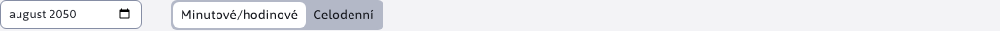
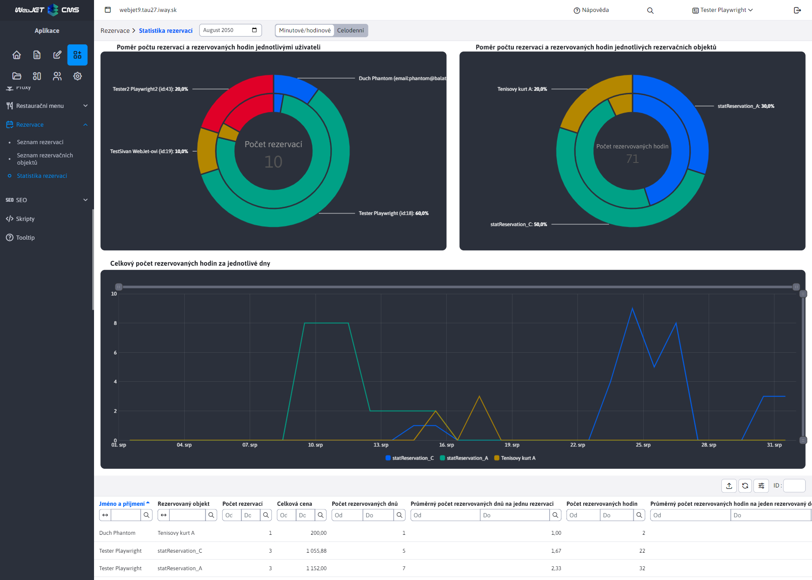
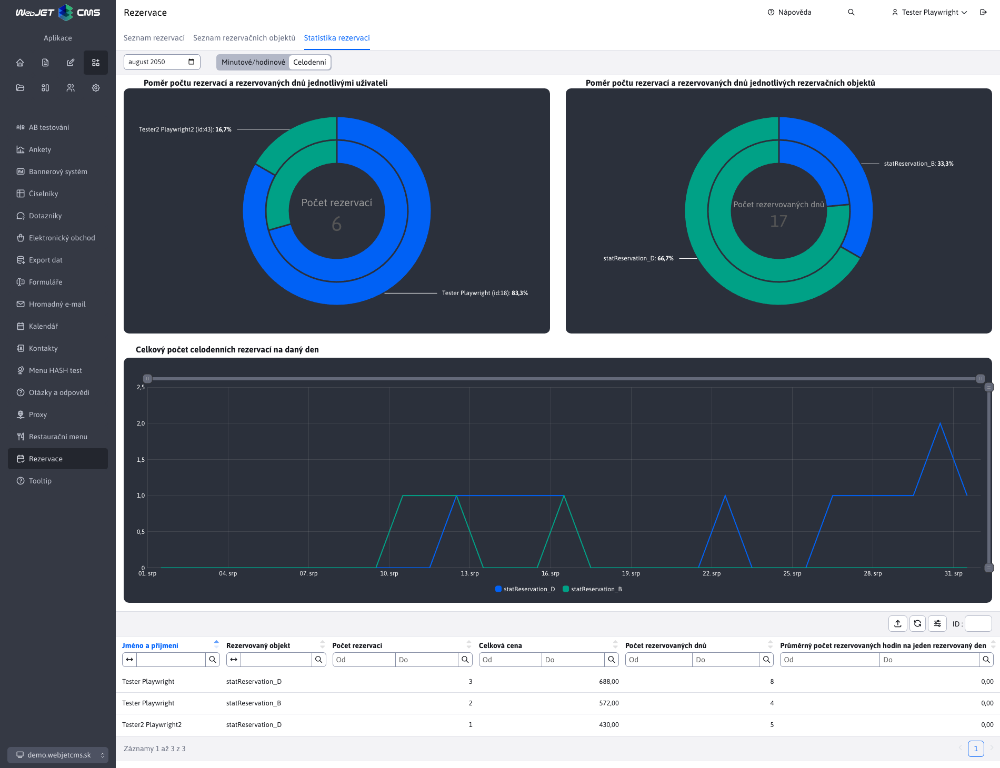

# Statistiky rezervací

Sekce **Statistiky rezervací** nabízí rychlý a přehledný pohled na nejdůležitější statistiky týkající se vytvořených [rezervace](../reservations/README.md). Pouze rezervace, které jsou **Schváleno**. Další informace o stavu rezervace najdete v .

Statistika zpracovává údaje o rezervacích v **v měsíčních intervalech**, tj. vždy od začátku do konce zvoleného měsíce. Chcete-li vybrat měsíc/rok, pro který chcete zobrazit statistiku, použijte filtr data vedle názvu oddílu.

Výhrady můžeme logicky rozdělit do 2 skupin, a to na **Minutově/hodinově** rezervace (ty, které rezervují objekt na určitou dobu) a **Celý den** rezervace (rezervace na celé dny). Typ rezervace se určuje podle [objekt rezervace](../reservation-objects/README.md) které si rezervace vyhrazuje.

Z tohoto hlediska jsme také museli rozdělit statistiky podle typu rezervace, aby byly údaje od sebe odděleny. Proto je vedle filtru data umístěn přepínač, kterým můžete změnit, zda chcete zobrazit statistiky typu rezervace **Minutově/hodinově** nebo **Celý den**.

## Minutově/hodinově

Statistiky pro typ rezervace **Minutově/hodinově** nabízí 3 grafy a tabulku dat. Údaje zdůrazňují počet rezervovaných hodin. Protože tyto rezervace lze rezervovat i po minutách, jsou hodnoty převedeny na hodiny s přesností na 2 desetinná místa.

### Tabulka

Každý záznam (řádek) v tabulce představuje kombinaci statistik uživatele a rezervace nad jedinečným objektem. To znamená, že jeden uživatel se může v tabulce objevit vícekrát, pokud provedl rezervace pro různé rezervační objekty. Každý takový řádek poskytuje přehled o tom, kolik rezervací uživatel pro daný objekt vytvořil, kolik průměrně rezervoval hodin nebo kolik to celkem stálo.

**Pozor**pokud rezervaci provedl nepřihlášený uživatel (což je možné například u aplikace [Rezervace času](../time-book-app/README.md)), jsou data mapována podle zadané e-mailové adresy. Pokud různí nepřihlášení uživatelé zadají stejnou e-mailovou adresu, jejich údaje se ve statistikách sloučí.

### Grafy

Jak vidíte na obrázku výše, jsou k dispozici 3 grafy, které si probereme dále.

**Graf - Poměr počtu rezervací a rezervovaných hodin podle jednotlivých uživatelů**

Tento dvojitý koláčový graf znázorňuje poměr rezervací a rezervovaných hodin pro každého uživatele. Snadno tak zjistíte, kteří uživatelé vytvořili nejvíce rezervací a rezervovali nejvíce hodin.

- Vnější vrstva ukazuje, kolik **celkový počet rezervací** vytvořené jednotlivými uživateli (nad všemi objekty dohromady).
- Vnitřní vrstva ukazuje, kolik **hodin celkem** bylo rezervováno jednotlivými uživateli (nad všemi objekty dohromady).
- Uprostřed grafu je zobrazen souhrn **Počet rezervací**, tedy počet všech vytvořených rezervací.

**Pozor**, můžete si všimnout, že někteří uživatelé v grafu nemají **id** ale stojí za to **e-mail**. Jedná se o výše uvedené neregistrované uživatele.

**Graf - Poměr počtu rezervací a rezervovaných hodin pro každý objekt rezervace**

Tento dvojitý koláčový graf znázorňuje poměr rezervací a rezervovaných hodin v jednotlivých objektech. Můžete tak snadno určit, který objekt byl nejvíce rezervovaný a měl nejvíce rezervovaných hodin.

- Vnější vrstva v ukazuje, kolik **celkový počet rezervací** byl vytvořen nad objektem (všemi uživateli dohromady).
- Vnitřní vrstva ukazuje, kolik **hodin celkem** bylo nad objektem rezervováno (všemi uživateli dohromady).
- Uprostřed grafu je zobrazen souhrn **Počet rezervovaných hodin**, tedy počet všech rezervovaných hodin ve všech objektech.

**Graf - Celkový počet rezervovaných hodin za den**

Tento sloupcový graf ukazuje, kolik hodin bylo v jednotlivých dnech celkem rezervováno pro všechny objekty. Graf tak poskytuje přehled o tom, které dny byly pro rezervace nejoblíbenější.

## Celý den

Statistiky pro typ rezervace **Celý den** nabízí 3 grafy a tabulku dat. Údaje zdůrazňují počet rezervovaných dní, protože se jedná o plné dny.

### Tabulka

Každý záznam (řádek) v tabulce představuje kombinaci statistik uživatele a rezervace nad jedinečným objektem. To znamená, že jeden uživatel se může v tabulce objevit vícekrát, pokud provedl rezervace pro různé rezervační objekty. Každý takový řádek poskytuje přehled o tom, kolik rezervací pro daný objekt uživatel vytvořil, kolik průměrně rezervoval dní nebo kolik to celkem stálo.

**Pozor**pokud rezervaci provedl nepřihlášený uživatel (což je možné například u aplikace [Rezervace času](../time-book-app/README.md)), jsou data mapována podle zadané e-mailové adresy. Pokud různí nepřihlášení uživatelé zadají stejnou e-mailovou adresu, jejich údaje se ve statistikách sloučí.

### Grafy

Jak vidíte na obrázku výše, jsou k dispozici 3 grafy, které si probereme dále.

**Graf - Poměr počtu rezervací a dnů rezervovaných jednotlivými uživateli**

Tento dvojitý koláčový graf znázorňuje poměr rezervací a rezervovaných dnů pro každého uživatele. Můžete tak snadno zjistit, kteří uživatelé vytvořili nejvíce rezervací a rezervovali nejvíce dní.

- Vnější vrstva ukazuje, kolik **celkový počet rezervací** vytvořené jednotlivými uživateli (nad všemi objekty dohromady).
- Vnitřní vrstva ukazuje, kolik **dnů celkem** bylo rezervováno jednotlivými uživateli (nad všemi objekty dohromady).
- Uprostřed grafu je zobrazen souhrn **Počet rezervací**, tedy počet všech vytvořených rezervací.

**Graf - Poměr počtu rezervací a rezervovaných dnů pro každý objekt rezervace**

Tento dvojitý koláčový graf znázorňuje poměr rezervací a rezervovaných dnů v jednotlivých objektech. Můžete tak snadno zjistit, která nemovitost byla nejvíce rezervovaná a měla nejvíce rezervovaných dnů.

- Vnější vrstva v ukazuje, kolik **celkový počet rezervací** byl vytvořen nad objektem (všemi uživateli dohromady).
- Vnitřní vrstva ukazuje, kolik **dnů celkem** bylo nad objektem rezervováno (všemi uživateli dohromady).
- Uprostřed grafu je zobrazen souhrn **Počet rezervovaných dnů**, tedy počet všech rezervovaných dnů ve všech objektech.

**Graf - Celkový počet celodenních rezervací na den**

Tento sloupcový graf ukazuje, kolik bylo v jednotlivých dnech celkem rezervací ve všech objektech. Graf tak poskytuje přehled o tom, které dny byly pro rezervace nejoblíbenější.
