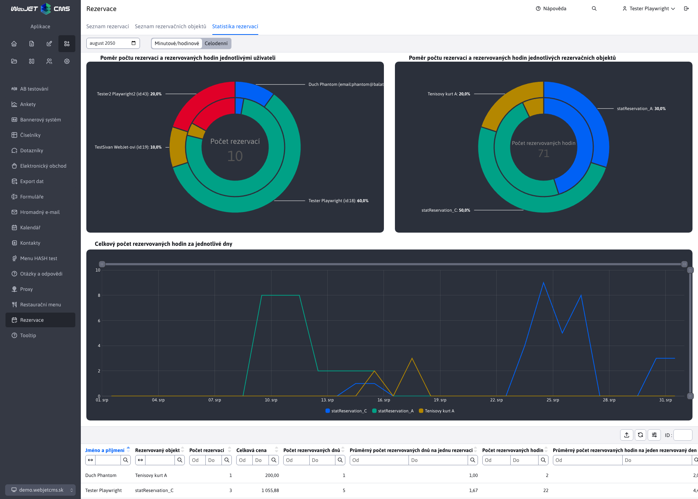

# Statistika rezervací

Sekce **Statistika rezervací** nabízí rychlé a přehledné vyobrazení těch nejdůležitějších statistik, týkajících se vytvořených [rezervací](../reservations/README.md). V úvahu se berou pouze takové rezervace, které jsou **schváleno**. Více o stavu rezervace se dočtete v části .

Statistika zpracovává data rezervací v **měsíčních intervalech**, tedy vždy od začátku po konec zvoleného měsíce. K volbě měsíce/roku za který chceme statistiku zobrazit slouží datový filtr vedle názvu sekce.

Rezervace umíme logiky rozdělit do 2 skupin a to **Minutové/hodinové** rezervace (ty které rezervují objekt na nějaký čas) a **Celodenní** rezervace (ty které rezervují objekt na celé dny). Typ rezervace je dán [rezervačním objektem](../reservation-objects/README.md), který rezervace rezervuje.

Z tohoto hlediska jsme museli i statistiku rozdělit podle typu rezervace, tedy data jsou od sebe oddělena. Proto vedle datového filtru je přepínač, kterým umíte změnit či si přejete vidět statistiku rezervací typu **Minutové/hodinové** nebo **Celodenní**.

## Minutové/hodinové

Statistika pro rezervace typu **Minutové/hodinové** nabízí 3 grafy a také tabulku s údaji. Data kladou důraz na počet rezervovaných hodin. Jelikož tyto rezervace lze rezervovat i na minuty, tak jsou hodnoty přepočteny na hodiny s přesností na 2 desetinná místa.

### Tabulka

Každý záznam (řádek) v tabulce představuje kombinaci uživatele a statistiky rezervací nad jedinečným objektem. To znamená, že jeden uživatel se může v tabulce vyskytnout i několikanásobně, pokud si vytvořil rezervaci na různé rezervační objekty. Každý takový řádek nabízí přehled o tom, kolik rezervací na daný objekt uživatel vytvořil, kolik průměrně hodin rezervoval nebo kolik to celkově stálo.

**Pozor**, pokud rezervaci vytvářel nepřihlášený uživatel (jak je to možné například u aplikace [Rezervace času](../time-book-app/README.md)), tak data se mapují podle zadané email adresy. Pokud různí nepřihlášení uživatelé zadají stejnou email adresu, ve statistice se jejich data spojí.

### Grafy

Jak je vidět z obrázku výše, k dispozici jsou 3 grafy, které si následně probereme.

**Graf - Poměr počtu rezervací a rezervovaných hodin jednotlivými uživateli**

Tento dvojitý koláčový graf reprezentuje poměr rezervací a rezervovaných hodin pro jednotlivé uživatele. Takto snadno určíte, který uživatelé vytvořili nejvíce rezervací a rezervovali nejvíc hodin.

- Vnější vrstva ukazuje, kolik **rezervací celkově** vytvořili jednotliví uživatelé (nad všemi objekty dohromady).
- Vnitřní vrstva ukazuje kolik **hodin celkově** bylo rezervováno jednotlivými uživateli (nad všemi objekty dohromady).
- Střed grafu zobrazuje sumář **Počet rezervací**, takže počet všech vytvořených rezervací.

**Pozor**, můžete si všimnout, že některý uživatelé v grafu nemají **id** ale mají hodnotu **email**. Jedná se právě o zmiňované nepřihlášené uživatele.

**Graf - Poměr počtu rezervací a rezervovaných hodin jednotlivých rezervačních objektů**

Tento dvojitý koláčový graf reprezentuje poměr rezervací a rezervovaných hodin nad jednotlivými objekty. Tak snadno určíte, který objekt byl nejvíce rezervován a měl nejvíce rezervovaných hodin.

- Vnější v vrstva ukazuje, kolik **rezervací celkově** bylo vytvořeno nad daným objektem (všemi uživateli dohromady).
- Vnitřní vrstva ukazuje kolik **hodin celkově** bylo rezervováno nad daným objektem (všemi uživateli dohromady).
- Střed grafu zobrazuje sumář **Počet rezervovaných hodin**, takže počet všech rezervovaných hodin nad všemi objekty.

**Graf - Celkový počet rezervovaných hodin za jednotlivé dny**

Tento čárový graf zobrazuje kolik rezervovaných hodin bylo spolu nad všemi objekty v jednotlivé dny. Graf takto poskytuje přehled, které dny byly nejvíce oblíbené pro rezervování.

## Celodenní

Statistika pro rezervace typu **Celodenní** nabízí 3 grafy a také tabulku s údaji. Data kladou důraz na počet rezervovaných dnů, jelikož tyto rezervace jsou celodenní.

### Tabulka

Každý záznam (řádek) v tabulce představuje kombinaci uživatele a statistiky rezervací nad jedinečným objektem. To znamená, že jeden uživatel se může v tabulce vyskytnout i několikanásobně, pokud si vytvořil rezervaci na různé rezervační objekty. Každý takový řádek nabízí přehled o tom, kolik rezervací na daný objekt uživatel vytvořil, kolik průměrně dní rezervoval nebo kolik to celkově stálo.

**Pozor**, pokud rezervaci vytvářel nepřihlášený uživatel (jak je to možné například u aplikace [Rezervace času](../time-book-app/README.md)), tak data se mapují podle zadané email adresy. Pokud různí nepřihlášení uživatelé zadají stejnou email adresu, ve statistice se jejich data spojí.

### Grafy

Jak je vidět z obrázku výše, k dispozici jsou 3 grafy, které si následně probereme.

**Graf - Poměr počtu rezervací a rezervovaných dnů jednotlivými uživateli**

Tento dvojitý koláčový graf reprezentuje poměr rezervací a rezervovaných dnů pro jednotlivé uživatele. Takto snadno určíte, který uživatelé vytvořili nejvíce rezervací a rezervovali nejvíc dní.

- Vnější vrstva ukazuje, kolik **rezervací celkově** vytvořili jednotliví uživatelé (nad všemi objekty dohromady).
- Vnitřní vrstva ukazuje kolik **dnů celkově** bylo rezervováno jednotlivými uživateli (nad všemi objekty dohromady).
- Střed grafu zobrazuje sumář **Počet rezervací**, takže počet všech vytvořených rezervací.

**Graf - Poměr počtu rezervací a rezervovaných dnů jednotlivých rezervačních objektů**

Tento dvojitý koláčový graf reprezentuje poměr rezervací a rezervovaných dní nad jednotlivými objekty. Takto snadno určíte, který objekt byl nejvíce rezervován a měl nejvíce rezervovaných dní.

- Vnější v vrstva ukazuje, kolik **rezervací celkově** bylo vytvořeno nad daným objektem (všemi uživateli dohromady).
- Vnitřní vrstva ukazuje kolik **dnů celkově** bylo rezervováno nad daným objektem (všemi uživateli dohromady).
- Střed grafu zobrazuje sumář **Počet rezervovaných dnů**, takže počet všech rezervovaných dnů nad všemi objekty.

**Graf - Celkový počet celodenních rezervací na daný den**

Tento čárový graf zobrazuje kolik rezervací bylo spolu nad všemi objekty v jednotlivé dny. Graf takto poskytuje přehled, které dny byly nejvíce oblíbené pro rezervování.
