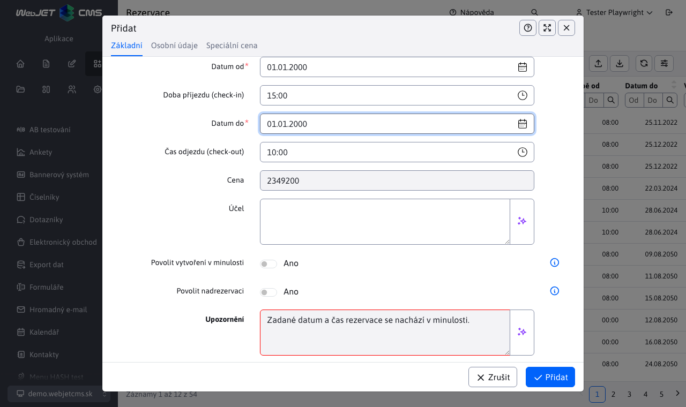
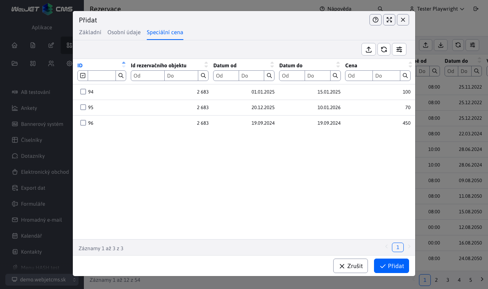

# Seznam rezervací

Aplikace **Seznam rezervací** umožňuje vytváření/úpravu/mazání rezervací, jakož i jejich import z Excel souboru a export do Excel/CSV souboru (případně i možnost okamžitého tisku při exportu).

Seznam obsahuje také 3 tlačítka pro schvalování/zamítnutí/resetování rezervace, viz. sekce [Schvalování rezervací](#schvalování-rezervací). V levém menu můžete přejít i do [Statistiky rezervací](../reservations-stat/README.md).

Editor rezervací obsahuje 4 karty, jejichž funkce jsou v následujícím popisu.

## Základní

Karta **Základní** jak již napovídá název, obsahuje základní informace ohledně rezervace. Důležitý je seznam s výběrem rezervačního objektu, ke kterému se rezervace vztahuje.

|           Hodinové rezervace |          Celodenní rezervace |
| :-------------------------------------: | :-------------------------------------: |
|  |  |

Kompozice karty se bude lišit podle toho, zda zvolený rezervační objekt je celodenní nebo ne. Více informací se dozvíte v části [Seznam rezervačních objektů](../reservation-objects/README.md).

**Celodenní rezervace**

V tomto režimu se rezervuje objekt na celý den. Nejlepším příkladem je rezervace hotelového pokoje. Potřebujete zadat datumový rozsah rezervace a čas příjezdu/odjezdu.

!>**Upozornění:** dá-li se rezervační objekt rezervovat pouze na celý den, poslední den v datovém rozsahu se nepočítá, neboť v ten den zákazník odchází. Proto rezervační rozsah při celodenních rezervacích musí být minimálně 2 dny.

**Hodinové rezervace**

U tohoto typu rezervace je třeba si uvědomit jednu podstatnou věc. Pokud si zvolíte dny od 01.01.2022 do 03.01.2022 v době od 08:00 do 16:00, neznamená to, že rezervace začíná 01.01.2022 v 08:00 a trvá do 03.01.2022 16:00 a vše. Ale tak tomu není. U těchto zvolených hodnot to v praxi znamená, že jsi tento **rezervační objekt rezervujete v době od 08:00 do 16:00 pro každý den zvlášť**. Důvod je prostý, tímto způsobem si umíte rezervovat objekt v určitém čase pro více dní bez potřeby rezervování celého intervalu. Pokud je rezervační interval pro daný objekt nastaven od 05:00 do 20:00 tak pro jednotlivé dny se rezervuje pouze zadaný časový interval a zbytek intervalu rezervován není, i když rezervace trvá například 3 dny.

Ve spodní části karty si můžete všimnout přehledu s rezervačními intervaly objektu pro jednotlivé dny v týdnu. Tyto časy se nastaví podle aktuálně zvoleného rezervačního objektu. Je to pomůcka při vytváření/úpravě rezervace, pokud si přesně nepamatujete kdy lze konkrétní rezervační objekt rezervovat pro konkrétní den v týdnu. Tento přehled se zobrazuje **pouze pro hodinové rezervace**.

Pole **Upozornění** zobrazuje informace o platnosti vytvářené rezervace. To znamená, zda se rezervace pro zvolený objekt dá v daném rozsahu vytvořit nebo ne. Bližší informace o možných stavech v tomto poli jsou vysvětleny v sekci [Validace rezervací](#validace-rezervací). Pokud je rezervace platná ohraničení textového pole změní barvu na zelenou a není-li rezervace platná, změní barvu na červenou.

**Cena rezervace** zobrazuje aktuální cenu vytvářené rezervace. Cena se odvíjí o zvoleného rezervačního objektu, rezervačního intervalu a od nastavených speciálních cen k danému rezervačnímu objektu.

!>**Upozornění:** na tuto cenu rezervace se následně automaticky aplikuje sleva uživatele. Tato procentuální sleva je nastavena pro specifické [skupiny uživatelů](../../../../admin/users/user-groups.md). Pokud uživatel patří do více **skupin uživatelů** které mají nastavenou procentuální slevu, použije se z nich ta největší. Pokud sleva má hodnotu `0%`, částka rezervace se nemění. Pokud sleva má hodnotu `100%`, rezervace je zdarma.

!>**Upozornění:** platí právě aktuální ceny a slevy, tedy cena která byla vypočtena při vytváření rezervace. To znamená, že pokud máte naplánovanou rezervaci například. o měsíc a za tu dobu se zvedne cena rezervačního objektu, nebo se změní uživatelova sleva, cena rezervace **se nezmění**. **Nicméně**, pokud svou vytvořenou rezervaci upravíte, použijí se aktuální ceny a slevy, což může změnit původní cenu, ke které se již zpětně nedostanete.

Stav rezervace i cena rezervace se obnovují vždy po změně data, času nebo rezervačního objektu.

## Osobní údaje

V kartě **Osobní údaje** lze nastavit údaje žadatele o rezervaci. Většina dat se automaticky nastaví z profilu přihlášené osoby, ale tyto hodnoty lze také změnit nebo vůbec nezadat.

## Speciální cena

Karta **Speciální cena** obsahuje vnořenou tabulku s údaji o speciální ceně rezervačního objektu pro konkrétní období. Záznamy v tabulce se nastaví podle aktuálně zvoleného rezervačního objektu z karty [Základní](../reservations/README.md#základní) a lze je pouze exportovat, ale nelze je přidávat, upravovat nebo odstranit (slouží pouze pro informační účely).

## Schvalování

Karta **Schvalování** slouží ke změně stavu rezervace. Tato karta se zobrazuje pouze za specifických podmínek.

Podmínky pro zobrazení karty:
- editace záznamu, karta se zobrazí pouze při editace záznamu rezervace
- potřeba schválení, rezervační objekt, který se rezervace snaží rezervovat musí mít parametr **Je třeba schválení** a musí mít zadaný email schvalovatele
- schvalovatel, karta se může zobrazit pouze osobě, která má povolení danou rezervaci schválit. To znamená, že pokud email přihlášeného uživatele se shoduje s emailem schvalovatele zadaným v rezervačním systému a předchozí body byly splněny, karta se uživateli zobrazí

Po zobrazení, karta obsahuje 3 tlačítka pro změnu stavu rezervace. Tyto akce budou lépe vysvětleny v sekci **Schvalování rezervací**.

## Validace rezervací

Validační logika rezervací je důležitá část aplikace **Seznam rezervací**, která kontroluje zda vytvářená nebo upravovaná rezervace splňuje všechna pravidla a podmínky. Validace se automaticky spustí při pokusu o uložení nové rezervace nebo úpravě již existující. Pokud je rezervace platná (splňuje vše potřebné) akce vytvoření/úpravy bude úspěšná, v opačném případě nastane chyba a uživatel bude obeznámen buď konkrétním nebo obecným chybovým hlášením.

Rezervace nebude možné uložit/upravit dokud nebude splňovat všechna pravidla validace.

### Datový rozsah

Datum od musí být menší roven datu do (pokud jsou data stejná tak rezervuje pouze ten jeden den).

!>**Upozornění:** v případě **celodenních rezervací**, musí být rozsah **alespoň 2 dny**, protože poslední den rozsahu je den odjezdu, a do rezervace jako takové se nepočítá.

### Časový rozsah

Validace časového rozsahu se liší podle typu rezervace.

**Celodenní rezervace**

Při celodenních rezervacích se časová složka nevaliduje, protože **Čas příjezdu** / **Čas odjezdu** nejsou ve stejný den a je to jen na vašem rozhodnutí.

!>**Upozornění:** silně doporučujeme, aby **Čas příjezdu** byl větší než **Čas odjezdu**, jinak se pokoj v den odjezdu starého zákazníka nebude dát rezervovat novým zákazníkům.

**Hodinové rezervace**

**Čas od** musí být ostře menší než **Čas do**, protože musíte rezervovat minimálně 1 minutu. Současně se kontroluje zda tento časový rozsah je větší nebo alespoň roven jako zadaná hodnota "Minimální délka rezervace (v minutách)" nastavená pro daný rezervační objekt.

### Rozsah v minulosti

Nemůžete rezervovat den/dny v minulosti. Pokud se snažíte provádět rezervaci na dnešní den tak časový interval nemůže být v minulosti.

!>**Upozornění:** na vlastní riziko máte možnost uložit rezervaci iv případě, že zvolený rozsah se nachází v minulosti. Stačí v kartě **základní** zvolit možnost **Povolit vytvoření v minulosti**.

### Platný rezervační rozsah

Tato kontrola se provádí pouze pro **hodinové rezervace**. Kontroluje se, zda zadaný časový rozsah je uvnitř rezervačního intervalu objektu. Tato kontrola se provede pro každý rezervovaný den zvlášť. Například, pokud se snažíte rezervovat objekt v době od 08:00-09:00 na nejbližší 3 dny, a byť jen jeden z těchto dny má jiný rezervační interval, tak rezervace není platná. Samozřejmě v úvahu se berou i speciální rezervační intervaly pro jednotlivé dny v týdnu, více informací v sekcích [časy podle dnů](../reservation-objects/README.md#časy-podle-dnů).

### Maximální počet rezervací ve stejnou dobu

V tomto případě se kontroluje čí se po přidání rezervace nebude protínat více rezervací ve stejnou dobu jako je povoleno parametrem. **Maximální počet rezervací ve stejnou dobu** daného objektu. Rezervace se považují na prolínající, pokud se jejich časové intervaly prolínají alespoň v jedné minutě (intervaly se neprolínají, pokud začátek jednoho je konec druhého ve stejnou minutu).

**Celodenní rezervace**

Při těchto rezervacích jsme doporučili, aby **Čas příjezdu** byl ostře větší než doba odjezdu. Např. pokud čas příjezdu je vždy 14:00 a čas odjezdu je vždy 10:00, tak po odchodu starého zákazníka v 10:00 je stále čas pokoj uklidit (nebo jinak připravit) pro nového zákazníka, který se v tomto pokoji ubytuje ve 14:00. Takové rezervace se neprotínají a lze pokoj rezervovat v den kdy jiný zákazník z něj odchází. V realitě to vypadá, že rezervace se protínají, ale není tomu tak (protože starý zákazník odejde před příchodem nového).

**Hodinové rezervace**

Například pokud máte 4 rezervace, a jejich časové intervaly jsou `08:00-11:00 / 08:00-09:00 / 09:00-10:00 / 10:00-11:00` tak vidíme, že rezervace v čase `08:00-11:00` se prolíná se 3 různými rezervacemi, ale současně se jich nikdy neprolíná více než 2, protože ostatní 3 rezervace se neprolínají mezi sebou navzájem.

Při kontrole se vezmou všechny rezervace nad objektem ve stejný den a testuje se zda po přidání naší rezervace se tento limit nepřekročí. Testuje se to pro každý den samostatně a pokud i jen jeden den přesáhne maximální počet rezervací ve stejnou dobu, rezervace bude označena za neplatnou.

!>**Upozornění:** při kontrole protínání se využívají **pouze schváleno** rezervace nad daným rezervačním objektem.

!>**Upozornění:** na vlastní riziko máte možnost uložit rezervaci i v případě nadměrné rezervace, kdy se překročí maximální počet rezervací. Stačí v kartě **základní** zvolit možnost **Povolit překročení kapacity**.

## Schvalování rezervací

Změna stavu rezervace je možná buď pomocí editoru a to přesněji v kartě [Schvalování](../reservations/README.md#schvalování), která se zobrazuje pouze za určitých specifických podmínek, nebo pomocí tlačítek pro změnu stavu rezervace.

Stejně jako v kartě **Schvalování** i tlačítka nabízejí 3 různé stavy a to :
- , **Schválení** rezervace (Rezervace byla schválena)
- , **Zamítnutí** rezervace (Rezervace byla zamítnuta)
- , **Resetovat stav** rezervace (Rezervace čeká na schválení)

### Nutné schválení

Rezervaci je třeba schválit v případě, že rezervační objekt má nastaveného schvalovatele a osoba co vytváří/upravuje rezervaci není schvalovatel. Přihlášená osoba NENÍ schvalovatel, pokud se jeho email neshoduje s nastaveným emailem schvalovatele v rezervačním objektu.

V takovém případě se odešle na email schvalovatele žádost o schválení rezervace. Taková žádost obsahuje základní informace o rezervaci, jakož i přímý odkaz na tuto rezervaci.

### Automatické schválení

Rezervaci není třeba schvalovat, pokud rezervační objekt nemá nastaveného schvalovatele, nebo když rezervační objekt má nastaveného schvalovatele a jím je právě přihlášená osoba. Přihlášená osoba je schvalovatel, pokud se jeho email shoduje s nastaveným emailem schvalovatele v rezervačním objektu.

### Vytváření rezervace

Při pokusu o vytvoření rezervace se nám na pozadí spustí validace. Pokud byla úspěšná, rezervace se uloží a nastaví se její stav podle situace:
- pokud rezervaci NENÍ NUTNÉ schvalovat, taková rezervace se schválí automaticky a získá status **Rezervace byla schválena**.
- pokud rezervaci JE NUTNÉ schvalovat, uloží se automaticky se statusem **Rezervace čeká na schválení** a na email schvalovatele se odešle žádost o schválení. Schvalovatel se může rozhodnout, zda rezervaci schválí, zamítne nebo neprovede žádnou změnu. Pokud se však stav rezervace změní, odešle se zpráva na email žadatele o rezervaci s informací o změně stavu (tento email žadatele se automatický přednastavil při vytváření rezervace v kartě [Osobní údaje](../reservations/README.md#osobní-údaje)).

### Úprava rezervace

Při pokusu o úpravu rezervace se nám na pozadí spustí validace. Pokud byla úspěšná, rezervace se uloží a nastaví se její stav podle situace:
- pokud rezervaci NENÍ NUTNÉ schvalovat, taková upravená rezervace se uloží a automaticky schválí, čímž získá status **Rezervace byla schválena**.
- pokud rezervaci JE NUTNÉ schvalovat, tak se její předchozí status vynuluje na hodnotu **Rezervace čeká na schválení** (nezáleželo na tom zda byla schválena nebo zamítnuta) a opět se odesílá zpráva na email schvalovatele s prosbou o schválení. Schvalovatel se opět může rozhodnout zda rezervaci schválí, zamítne nebo neprovede žádnou změnu. Pokud se však stav rezervace změní, opět se odešle zpráva na email žadatele o rezervaci s informací o změně stavu.

### Změna stavu rezervace

Jak je zmíněno výše, stav rezervace může zkusit změnit pomocí karty nebo tlačítek. V případě karty je to ošetřeno tak, že ji vidí pouze osoba, která má na to právo. V případě tlačítek je to tak, že je vidí každý.

Při každém pokusu o změnu rezervace se zobrazí potvrzení akce.

Pokud se rozhodnete akci zrušit, nic se nestane. Rozhodnete-li se akci přesto spustit, na pozadí se ověří naše právo nad touto rezervací. Pokud nastane případ, že právo nemáme, bude zobrazena chybová zpráva a stav rezervace se nezmění.

Pokud právo na změnu máme, dále to bude záležet na tom, jaký stav se snažíte nastavit:

**SCHVÁLENÍ REZERVACE**, nezáleží na původním stavu rezervace, na pozadí se spustí validace která rozhodne co se stane s rezervací

- pokud byla validace úspěšná, rezervace se schválí, zobrazí se potvrzující zpráva a odešle se email žadateli
- pokud byla validace neúspěšná, rezervace se automaticky zamítne, zobrazí se chybová zpráva s důvodem zamítnutí a odešle se email žadateli

**ZAMÍTNUTÍ REZERVACE**, nezáleží na původním stavu rezervace, rezervace bude prostě zamítnuta, vrátí se potvrzující hláška a odešle se email žadateli.

**RESETOVÁNÍ STAVU REZERVACE**, nezáleží na původním stavu rezervace, stav rezervace bude prostě resetován, vrátí se potvrzující hláška a odešle se zpráva žadateli.

Odeslané emaily žadateli při změně stavu rezervace obsahují základní informace o rezervaci, její nový stav a také jméno schvalovatele, který tento změnil stav této rezervace.

## Mazání rezervací

Mazání rezervací je závislé na tom, nad jakým rezervačním objektem byla tato rezervace vytvořena. Rezervační objekt může mít nastavené heslo, které změní průběh mazání rezervace - heslo se nastavovalo v kartě [Pokročilé](../reservation-objects/README.md#pokročilé).

Pokud heslo NENÍ nastaveno, tak rezervace nad tímto rezervačním objektem se budou dát vymazat.

Pokud heslo je nastaveno, budete vyzváni k zadání tohoto hesla.

- V případě, že vymazáváte více rezervací nad stejným objektem (který má heslo), tak budete vyzváni pouze jednou k zadání tohoto hesla (nemusíte jej duplicitně zadávat pro každou rezervaci zvlášť).
- V případě, že vymazáváte více rezervací, které jsou nad více objekty s nastaveným heslem, tak můžete být vyzváni k zadání několika hesel (zase bez duplicit).

V zobrazené žádosti o zadání hesla budete informováni, pro který rezervační objekt musíte heslo zadat. Pokud zadáváte více hesel a jedno nebo více z nich se rozhodnete nezadat (zrušíte akci zadávání hesla), celková akce vymazávání rezervací tím však nebude ovlivněna. Nezadané heslo je automaticky považováno za špatné a proto se neodstraní rezervace and objektem s tímto heslem.

Po zadání všech potřebných hesel se zobrazí výzva k vymazání rezervací. Pomocí zobrazeného okna můžete celou akci přerušit, nebo potvrdit rozhodnutí.

Pokud bylo jedno nebo více hesel nesprávných, vrátí se hláška pro každou rezervaci, kterou nebylo možné kvůli tomu vymazat. Hláška obsahuje informaci o tom, které heslo rezervačního objektu nebylo zadáno správně a která rezervace kvůli tomu nemohla být vymazána.

