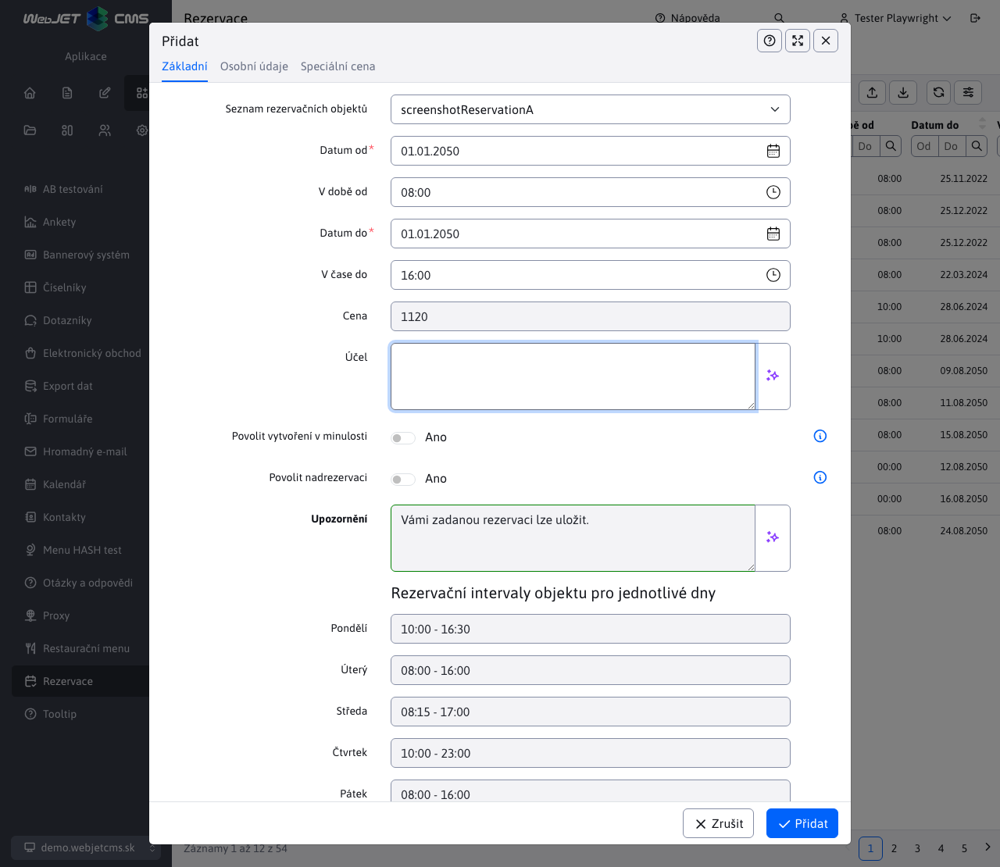
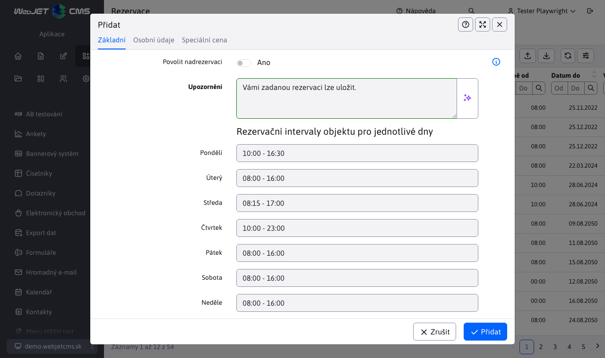
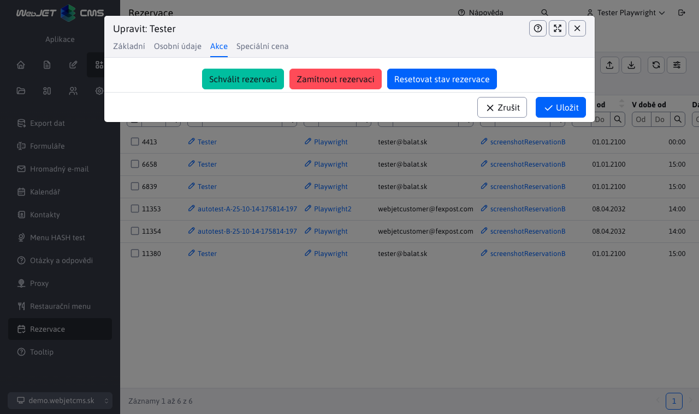
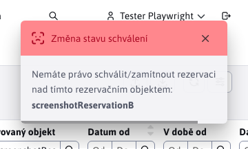
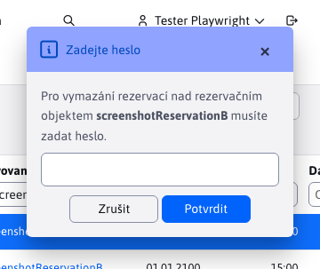
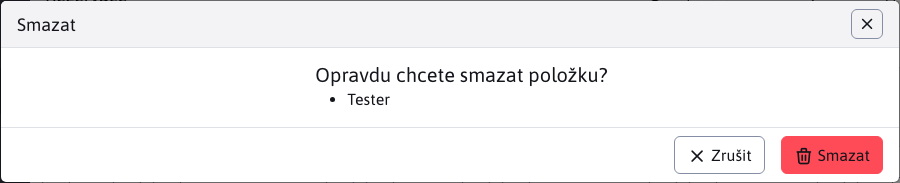

# Seznam rezervací

Aplikace **Seznam rezervací** umožňuje vytvářet/upravovat/mazat rezervace a také je importovat ze souboru Excel a exportovat do souboru Excel/CSV (nebo je dokonce při exportu ihned vytisknout).

Seznam obsahuje také 3 tlačítka pro schválení/odmítnutí/obnovení rezervace, viz. sekce . [Schválení výhrad](#schválení-výhrad). V levém menu můžete také přejít na [Statistiky rezervací](../reservations-stat/README.md).

Editor rezervací obsahuje 4 karty, jejichž funkce jsou popsány v následujícím popisu.

## Základní

Karta **Základní** jak název napovídá, obsahuje základní informace o rezervaci. Důležitý je seznam s výběrem objektu rezervace, ke kterému se rezervace vztahuje.

Karta obsahuje také výběr data od/do a výběr času od/do. U tohoto výběru je třeba upozornit na jednu důležitou věc. Pokud vyberete dny od 01.01.2022 do 03.01.2022 mezi 08:00 a 16:00, neznamená to, že rezervace začíná 01.01.2022 v 08:00 a trvá do 03.01.2022 v 16:00 a vše v tomto rozsahu je rezervováno. NE. Při takto zvolených hodnotách to v praxi znamená, že tento objekt rezervace rezervujete od 08:00 do 16:00 pro každý den zvlášť. Důvod je jednoduchý, tímto způsobem můžete rezervovat objekt v určitém čase na více dní, aniž byste museli rezervovat celý interval. Pokud je pro objekt nastaven interval rezervace od 05:00 do 20:00, rezervuje se pro každý den pouze uvedený časový interval a zbytek intervalu se nerezervuje, i když rezervace trvá například 3 dny.

!>**Varování:** pokud lze objekt rezervace rezervovat [POUZE na celý den](../reservation-objects/README.md) budou následující možnosti skryté a nedostupné:
- výběr času
- přehled intervalů rezervací zařízení pro jednotlivé dny.

Přepínač **Zobrazit platnost vytvářené rezervace ?** Po výběru se zobrazí textové pole s informací o platnosti rezervace. To znamená, zda lze v daném rozsahu vytvořit rezervaci pro vybraný objekt. Více informací o možných stavech v tomto poli je vysvětleno v části [Ověřování rezervací](#potvrzení-platnosti-rezervací). Pokud je rezervace platná, rámeček textového pole se zbarví zeleně, a pokud rezervace není platná, zbarví se červeně.

**Cena rezervace** zobrazí aktuální cenu vytvářené rezervace. Cena závisí na vybraném objektu rezervace, intervalu rezervace a speciálních cenách nastavených pro daný objekt rezervace.

!>**Varování:** sleva uživatele se pak automaticky uplatní na tuto cenu rezervace. Tato procentuální sleva je nastavena pro konkrétní [skupiny uživatelů](../../../../admin/users/user-groups.md). Pokud uživatel patří k více **skupiny uživatelů** které mají stanovenou procentní slevu, bude použita největší z nich. Pokud má sleva hodnotu `0%`, částka rezervace se nemění. Pokud má sleva hodnotu `100%`, rezervace je zdarma.

!>**Varování:** platí aktuální ceny a slevy, tj. cena, která byla vypočtena v okamžiku provedení rezervace. To znamená, že pokud máte rezervaci naplánovanou např. na měsíc a cena objektu rezervace se v této době zvýší nebo se změní sleva uživatele, cena rezervace se **se nezmění**. **Nicméně** Pokud rezervaci změníte, budou použity aktuální ceny a slevy, což může vést ke změně původní ceny, kterou již nebude možné vrátit zpět.

Stav rezervace a cena rezervace se aktualizují vždy, když se změní datum, čas nebo objekt rezervace.

V dolní části karty se zobrazuje přehled s intervaly rezervací pro jednotlivé dny v týdnu. Tyto časy jsou nastaveny podle aktuálně vybraného objektu rezervace. To je pomůcka při vytváření/úpravě rezervace, pokud si přesně nepamatujete, kdy je možné daný objekt rezervace rezervovat pro konkrétní den v týdnu.

## Osobní údaje

V kartách **Osobní údaje** lze nastavit údaje žadatele o rezervaci. Většina údajů je automaticky nastavena z profilu přihlášené osoby, ale tyto hodnoty lze také změnit nebo je vůbec nezadávat.

## Speciální cena

Karta **Speciální cena** obsahuje vnořenou tabulku s informacemi o speciální ceně objektu rezervace pro určité období. Položky v tabulce jsou nastaveny podle aktuálně vybraného objektu rezervace ze záložky [Základní](../reservations/README.md#Základní) a lze je pouze exportovat, ale nelze je přidávat, upravovat ani mazat (slouží pouze pro informační účely).

## Schválení

Karta **Schválení** slouží ke změně stavu rezervace. Tato karta se zobrazuje pouze za určitých podmínek.

Podmínky pro zobrazení karty:
- editace záznamu, karta se zobrazí pouze při editaci záznamu o rezervaci.
- musí mít objekt rezervace, který se snaží rezervovat, parametr **Je vyžadováno schválení** a musí být zadán e-mail schvalovatele.
- schvalovatel, kartu lze ukázat pouze osobě, která má oprávnění rezervaci schválit. To znamená, že pokud se e-mail přihlášeného uživatele shoduje s e-mailem schvalovatele zadaným v rezervačním systému a byly splněny předchozí body, karta se uživateli zobrazí.

Po zobrazení obsahuje karta přepínač mezi třemi stavy, do kterých může rezervace vstoupit. Při přechodu z jednoho stavu do druhého se spustí akce změny stavu rezervace, jako by se použila tlačítka pro změnu stavu. Tyto akce budou lépe vysvětleny v části **Schválení výhrad**.

## Ověřování rezervací

Logika ověřování rezervací je důležitou součástí aplikace. **Seznam rezervací**, který kontroluje, zda vytvářená nebo upravovaná rezervace splňuje všechna pravidla a podmínky. Ověřování se automaticky spustí při pokusu o uložení nové rezervace nebo o úpravu stávající rezervace. Pokud je rezervace platná (splňuje všechny potřebné požadavky), bude akce vytvoření/úpravy úspěšná, v opačném případě dojde k chybě a uživatel bude upozorněn buď konkrétní, nebo obecnou chybovou zprávou.

Rezervace nebude uložena/upravena, dokud nebude splňovat všechna pravidla validace.

### Rozsah dat

Datum od musí být kratší než datum do (pokud jsou data stejná, je vyhrazen pouze jeden den).

### Časový rozsah

Čas od musí být výrazně kratší než čas do, protože si musíte vyhradit alespoň 1 minutu. Současně se kontroluje, zda je tento časový rozsah větší nebo alespoň roven hodnotě "Minimální délka rezervace (v minutách)" nastavené pro objekt rezervace.

### Rozsah v minulosti

Den(y) nelze rezervovat v minulosti. Pokud se pokoušíte rezervovat na dnešek, časový úsek nemůže být v minulosti.

### Platný rozsah rezervací,

Zkontroluje, zda je zadaný časový rozsah v intervalu rezervace objektu. Tato kontrola se provádí pro každý rezervovaný den zvlášť. Pokud se například pokoušíte rezervovat objekt mezi 08:00 a 09:00 na následující 3 dny a i jeden z těchto dnů má jiný rezervační interval, rezervace není platná. V úvahu se samozřejmě berou i speciální rezervační intervaly pro jednotlivé dny v týdnu, více informací naleznete na stránce [časy podle dnů](../reservation-objects/README.md#časy-podle-dnů).

### Maximální počet rezervací najednou

V tomto případě se kontroluje, zda po přidání rezervace nedojde k překročení více rezervací najednou, jak umožňuje parametr **Maximální počet rezervací najednou** objektu. Rezervace se považují za překrývající se, pokud se jejich časové intervaly překrývají alespoň v jedné minutě (intervaly se nepřekrývají, pokud je začátek jednoho z nich koncem druhého v téže minutě). Například pokud máte 4 rezervace a jejich časové intervaly jsou `08:00-11:00 / 08:00-09:00 / 09:00-10:00 / 10:00-11:00` takže vidíme, že rezervace v době `08:00-11:00` protíná 3 různé rezervy, ale nikdy ne více než 2 současně, protože ostatní 3 rezervy se navzájem neprotínají.

Kontrola bere všechny rezervace (ale pouze ty, které byly schváleny) nad objektem ve stejný den a testuje, zda bude tento limit překročen po přidání naší rezervace. Testuje se pro každý den zvlášť, a pokud i jeden den překročí maximální počet rezervací ve stejném čase, bude rezervace označena jako neplatná.

## Schválení výhrad

Změnit stav rezervace je možné buď pomocí editoru, přesněji na kartě [Schválení](../reservations/README.md#Schválení), která se zobrazuje pouze za určitých specifických podmínek, nebo pomocí tlačítek pro změnu stavu rezervace.

Stejně jako na kartě **Schválení** také tlačítka nabízejí 3 různé stavy, a to :
- , **Schválení** Rezervace (Rezervace schváleny)
- , **Odmítnout** Rezervace (Rezervace zamítnuty)
- , **Obnovení stavu** Rezervace (Rezervace čekají na schválení)

### Vyžaduje se schválení

Rezervaci je třeba schválit, pokud je u objektu rezervace nastaven schvalovatel a osoba, která rezervaci vytváří/upravuje, není schvalovatelem. Přihlášená osoba NENÍ schvalovatelem, pokud se její e-mail neshoduje s e-mailem nastaveného schvalovatele v objektu rezervace.

V takovém případě bude na e-mail schvalovatele odeslána žádost o schválení rezervace. Tato žádost obsahuje základní informace o rezervaci a také přímý odkaz na rezervaci.

### Automatické schválení

Rezervaci nemusíte schvalovat, pokud objekt rezervace nemá nastaveného schvalovatele nebo pokud objekt rezervace má nastaveného schvalovatele a schvalovatelem je osoba, která je právě přihlášena. Přihlášená osoba JE schvalovatelem, pokud se její e-mail shoduje s nastaveným e-mailem schvalovatele v objektu rezervace.

### Provedení rezervace

Při pokusu o vytvoření rezervace se na pozadí spustí ověřování. Pokud proběhne úspěšně, rezervace se uloží a její stav se nastaví podle situace:
- pokud rezervaci NENÍ třeba schválit, je automaticky schválena a má status **Rezervace byla schválena**.
- pokud rezervace MUSÍ být schválena, bude automaticky uložena se stavem **Rezervace čeká na schválení** a na e-mail schvalovatele je odeslána žádost o schválení. Schvalovatel se může rozhodnout, zda rezervaci schválí, zamítne nebo v ní neprovede žádnou změnu. Pokud se však změní stav rezervace, je na e-mail žadatele o rezervaci odeslána zpráva informující o změně stavu (tento e-mail žadatele byl automaticky přednastaven při vytvoření rezervace v aplikaci [Osobní údaje](../reservations/README.md#osobní-údaje)).

### Úprava rezervace

Při pokusu o změnu rezervace se na pozadí spustí ověřování. Pokud proběhne úspěšně, rezervace se uloží a její stav se nastaví podle situace:
- pokud rezervaci NENÍ třeba schválit, upravená rezervace se uloží a automaticky schválí, čímž získá status. **Rezervace byla schválena**.
- pokud je rezervace MUSÍ být schválena, její předchozí stav se resetuje na hodnotu **Rezervace čeká na schválení** (bez ohledu na to, zda byla schválena nebo zamítnuta) a na e-mail schvalovatele je opět odeslána zpráva s žádostí o schválení. Schvalovatel se opět může rozhodnout, zda rezervaci schválí, zamítne nebo v ní neprovede žádné změny. Pokud se však stav rezervace změní, je na e-mail žadatele o rezervaci opět zaslána zpráva informující o změně stavu.

### Změna stavu rezervace

Jak bylo uvedeno výše, můžete se pokusit změnit stav rezervace pomocí karty nebo tlačítek. V případě karty je to řešeno tak, že ji vidí pouze osoba, která k tomu má právo. V případě tlačítek je to ošetřeno tak, že je může vidět každý.

Při každém pokusu o změnu rezervace se zobrazí potvrzení této akce.

Pokud se rozhodnete službu zrušit, nic se nestane. Pokud se přesto rozhodnete akci spustit, bude na pozadí zkontrolováno naše právo na tuto rezervaci. Pokud se ukáže, že toto právo nemáme, zobrazí se chybové hlášení a stav rezervace se nezmění.

Pokud máme právo na změnu, bude záležet na tom, jaký stát se snažíte nastavit:

**SCHVÁLENÍ REZERVACE**, bez ohledu na původní stav rezervace se na pozadí spustí validace, která rozhodne, co se s rezervací stane.

- pokud je ověření úspěšné, rezervace je schválena, zobrazí se potvrzovací zpráva a žadateli je zaslán e-mail.
- pokud ověření nebylo úspěšné, rezervace je automaticky zamítnuta, zobrazí se chybové hlášení s důvodem zamítnutí a žadateli je zaslán e-mail.

**ODMÍTNUTÍ REZERVACE**, bez ohledu na původní stav rezervace bude rezervace jednoduše odmítnuta, bude vrácena potvrzovací zpráva a žadateli bude zaslán e-mail.

**RESETOVÁNÍ STAVU REZERVACE**, bez ohledu na původní stav rezervace, bude stav rezervace jednoduše vynulován, bude vrácena potvrzovací zpráva a žadateli bude zaslána zpráva.

E-maily zaslané žadateli při změně stavu rezervace obsahují základní informace o rezervaci, její nový stav a také jméno schvalovatele, který stav této rezervace změnil.

## Odstranění rezervací

Odstranění rezervace závisí na objektu rezervace, nad kterým byla rezervace vytvořena. Objekt rezervace může mít nastaveno heslo, které mění proces mazání - heslo bylo nastaveno na kartě [Pokročilé](../reservation-objects/README.md#Pokročilé).

Pokud heslo NENÍ nastaveno, budou rezervace nad tímto objektem rezervace smazány.

Pokud je nastaveno heslo, budete vyzváni k jeho zadání.

- Pokud mažete více rezervací nad stejným objektem (který má heslo), budete vyzváni k zadání tohoto hesla pouze jednou (nemusíte ho zadávat dvakrát pro každou rezervaci zvlášť).
- Pokud odstraňujete více rezervací, které se týkají více objektů s nastaveným heslem, můžete být vyzváni k zadání více hesel (opět bez duplicit).

Zobrazená žádost o zadání hesla vás bude informovat o tom, pro který objekt rezervace je třeba zadat heslo. Pokud zadáte více hesel a rozhodnete se jedno nebo více z nich nezadávat (zrušíte akci zadání hesla), celková akce vymazání rezervace nebude ovlivněna. Nezadané heslo se automaticky považuje za špatné, a proto se rezervace a objekty s tímto heslem nevymažou.

Po zadání všech potřebných hesel budete vyzváni k odstranění rezervací. Pomocí zobrazeného okna můžete celou akci přerušit nebo rozhodnutí potvrdit.

Pokud bylo jedno nebo více hesel nesprávných, bude vrácena zpráva pro každou rezervaci, kterou z tohoto důvodu nebylo možné vymazat. Zpráva obsahuje informace o tom, které heslo objektu rezervace nebylo zadáno správně a kterou rezervaci nebylo možné z tohoto důvodu vymazat.

