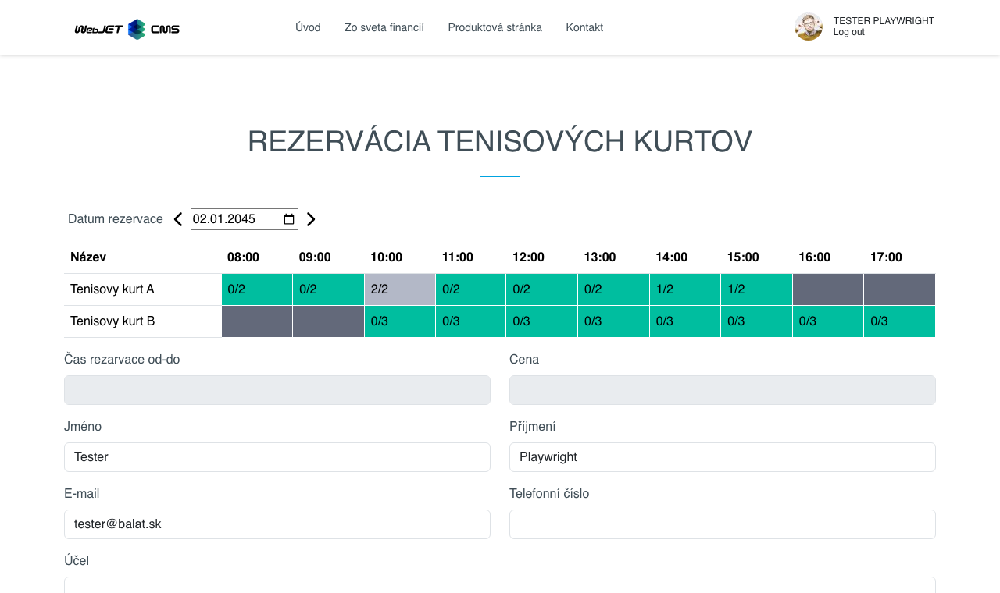
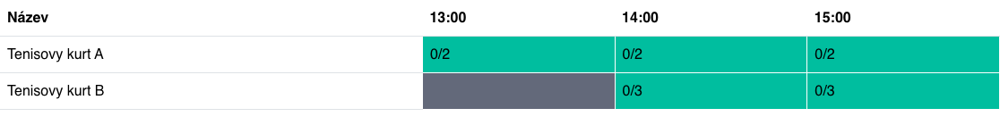
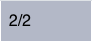

# Aplikace Rezervace času

Aplikace **Rezervace času** umožňuje rezervovat vybrané objekty rezervace na určitý časový interval.

## Používání aplikace

Aplikaci můžete přidat na své stránky prostřednictvím obchodu s aplikacemi.


nebo přímo jako kód na stránce

```html
!INCLUDE(sk.iway.iwcm.components.reservation.TimeBookApp, reservationObjectIds=&quot;2560+2561&quot;, device=&quot;&quot;, cacheMinutes=&quot;&quot;)!
```

V kódu si můžete všimnout parametru `reservationObjectIds`. Jedná se o seznam povolených objektů rezervací, které bude možné v aplikaci rezervovat. Můžete je nastavit při úpravách aplikace pomocí pole pro výběr více položek nebo je přidat přímo do parametru `reservationObjectIds`.


!>**Oznámení**: pouze objekty rezervace, které **NEJSOU nastaveny jako rezervace na celý den**. Tyto objekty totiž nelze rezervovat na základě času, ale pouze na základě data. Nevyhovující rezervační objekty se v poli pro více výběrů nezobrazují.

!>**Oznámení**: ruční přidání ID nevyhovujícího objektu rezervace do parametru `reservationObjectIds`, nebo změnit stav již použitého objektu rezervace v aplikaci na "rezervace na celý den", **způsobuje nesprávné chování aplikace**.

## Konstrukce aplikace

Aplikace se skládá ze 3 hlavních částí:
- výběr data rezervace
- tabulka objektů a časů rezervací
- rezervační formulář



### Výběr data

Výběrem data určíte den, kdy chcete rezervaci provést. Při prvním spuštění je přednastaven aktuální den, který můžete změnit pomocí filtru data. Šipky vedle filtru data umožňují posunout se o den zpět nebo dopředu.


### Tabulka objektů rezervace

Každý řádek tabulky představuje jeden objekt rezervace. Jednotlivé buňky tabulky představují dostupnost v jednotlivých hodinách dne.


Struktura tabulky se může výrazně lišit v závislosti na zvoleném dni v týdnu. Protože každý objekt rezervace může mít pro každý den v týdnu nastaven jiný časový interval rezervace [více informací](../reservation-objects/README.md#časy-podle-dnů).



Jednotlivé buňky v tabulce mají specifický stav.

**Nedostupné** buňka znamená, že rezervace objektu pro tuto hodinu a den v týdnu je mimo povolený rozsah.


**Úplný** buňka znamená, že bylo dosaženo maximálního počtu rezervací pro tento objekt rezervace a hodinu v daném dni. Jak vidíme, buňka může obsahovat text typu "2/2", což znamená, že z celkového počtu 2 rezervací jsou již 2.

!>**Varování:** může se stát, že tato buňka bude mít stav např. "1/2" nebo "0/2". Tato situace nastane, když je určitá hodina nebo celý den již minulostí. Takže i když nebylo dosaženo maximálního počtu rezervací, není možné přidat novou.



**Zdarma** buňka v podstatě znamená, že v tuto hodinu (a v tento den) je možné požádat o rezervaci objektu.


Tato buňka znamená, že je vybrána. buňka je vybrána kliknutím na ni (pokud na ni kliknete znovu, výběr se zruší). !>**Varování:** lze vybrat pouze dostupné buňky, ergo ty, které jsou **Dostupné na**.

### Rezervační formulář

Jedná se o jednoduchý formulář se základními informacemi pro rezervaci ubytování.

Tato povinná pole jsou automaticky předvyplněna, pokud jste přihlášeným uživatelem, ale samozřejmě je lze změnit. Pokud přistupujete jako nepřihlášený uživatel, musíte je zadat jako povinná:
- Název
- Příjmení
- E-mail

Pole **Doba rezervace od-do** a **Cena rezervace** nelze měnit a mají pouze informativní charakter. Automaticky mění hodnotu podle vybraných buněk v tabulce (podle vybraného rozsahu rezervace pro objekt rezervace). Pokud není vybrána žádná buňka, budou pole prázdná.

**Pozor**, sleva uživatele se pak automaticky uplatní na tuto cenu rezervace. Tato procentuální sleva je nastavena pro konkrétní [skupiny uživatelů](../../../../admin/users/user-groups.md). Pokud uživatel patří k více **skupiny uživatelů** které mají stanovenou procentní slevu, bude použita největší z nich. Pokud má sleva hodnotu `0%`, částka rezervace se nemění. Pokud má sleva hodnotu `100%`, rezervace je zdarma.

!>**Varování:** tlačítko pro přidání rezervace se zobrazí pouze v případě, že je vybrána buňka v tabulce.


## Přidání rezervace

Chcete-li přidat rezervaci, musíte nejprve v tabulce vybrat časový rozsah. Přidání rezervace má však následující pravidla:
- **Najednou můžete rezervovat pouze 1 objekt rezervace**. Pokud tedy v řádku pro objektA vyberete rozsah od 13:00 do 15:00 a pokusíte se vybrat rozsah pro rezervaci objektuB, výběr původně vybraného rozsahu se automaticky celý zruší.
- **Můžete vybrat pouze 1 souvislý rozsah**. Nelze vybrat rozsah 13:00-15:00 a 16:00-17:00 současně, i když se jedná o stejný objekt. Pokud se o to pokusíte, první vybraný rozsah se automaticky zruší.
- **Zvolený rozsah nelze přerušit nedostupným časem**. Pokud se pokusíte vybrat rozsah 13:00-17:00, ale rozsah 15:00-16:00 je již plně obsazen, vybraný rozsah se automaticky zruší.
- **Povinná pole**. Pro přidání rezervace je nutné vyplnit pole Jméno/jméno/e-mail.

Pokud jste splnili výše uvedené podmínky, vybrali správný rozsah a vyplnili požadovaná pole, můžete požádat o přidání rezervace.


Pokud byla rezervace úspěšně vytvořena, obdržíte zprávu, že rezervace byla úspěšně vytvořena, a na zadanou e-mailovou adresu vám bude zasláno potvrzení.

Pokud objekt rezervace **nepotřebuje schválení**, bude rezervace automaticky schválena a zobrazí se následující zpráva. Dostupnost jednotlivých časových slotů v tabulce se poté upraví.


Pokud objekt rezervace **potřebuje schválení**, bude rezervace ve stavu čekající na vyřízení. Dostupnost jednotlivých časových slotů v tabulce se nezmění, protože se započítávají POUZE schválené rezervace. Schvalovatel může vaši rezervaci schválit nebo zamítnout, o čemž budete informováni e-mailem.


