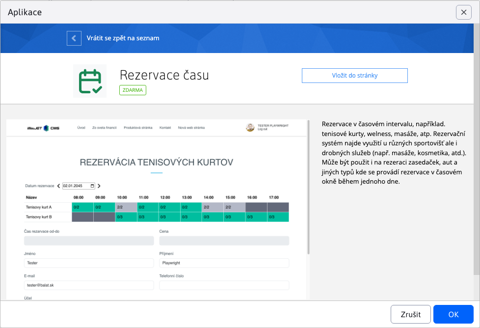
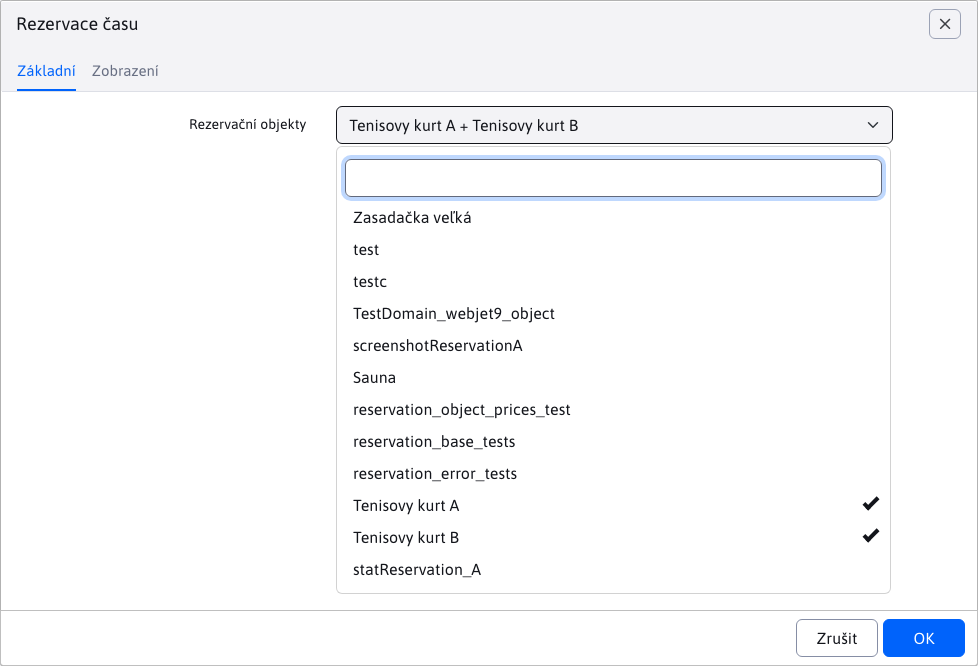
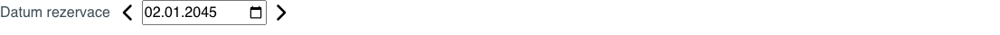
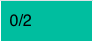

# Aplikace Rezervace času

Aplikace **Rezervace času** umožňuje rezervaci vybraných rezervačních objektů na určitý časový interval.

## Použití aplikace

Aplikaci můžete do své stránky přidat přes obchod s aplikacemi



nebo přímo jako kód do stránky

```html
!INCLUDE(sk.iway.iwcm.components.reservation.TimeBookApp, reservationObjectIds=&quot;2560+2561&quot;, device=&quot;&quot;, cacheMinutes=&quot;&quot;)!
```

V kódu si můžete všimnout parametru `reservationObjectIds`. Jedná se o seznam povolených rezervačních objektů, které se budou v aplikaci dát rezervovat. Nastavit je můžete při editaci aplikace pomocí vícenásobného výběrového pole, nebo je přidat přímo do parametru `reservationObjectIds`.



!>**Upozornění**: podporovány jsou pouze rezervační objekty, které **NEJSOU nastaveny jako rezervace na celý den**. Protože tyto objekty nelze rezervovat na základě času, ale pouze data. Nevyhovující rezervační objekty se v multi výběrovém poli nezobrazují.

!>**Upozornění**: manuální přidání ID nevyhovujícího rezervačního objektu do parametru `reservationObjectIds`, nebo změna stavu již použitého rezervačního objektu v aplikaci na "rezervace na celý den", **způsobí chybné chování aplikace**.

## Stavba aplikace

Aplikace se skládá ze 3 hlavních částí:
- výběr data rezervace
- tabulka rezervačních objektů a časů
- formulář rezervace


### Datový výběr

Zvolením data určujete, na který den chcete rezervaci provést. Při prvním spuštění je přednastaven aktuální den, který můžete změnit datovým filtrem. Šipky vedle datového filtru vám umožňují přecházet o den dozadu nebo dopředu.



### Tabulka rezervačních objektů

Každý řádek v tabulce přestavuje jeden rezervační objekt. Jednotlivé buňky tabulky představují dostupnost v jednotlivých hodinách daného dne.


Struktura tabulky se může značně lišit podle zvoleného dne v týdnu. Protože každý rezervační objekt může mít nastavený jiný rezervační časový interval na každý den v týdnu [bližší informace](../reservation-objects/README.md#časy-podle-dnů).


Jednotlivé buňky v tabulce mají znamenají specifický status.

**Nedostupná** buňka znamená, že rezervace objektu pro tuto hodinu a den v týdnu je mimo povolený rozsah.


**Plná** buňka znamená, že bylo dosaženo maximálního počtu rezervací pro tento rezervační objekt a hodinu ve dni. Jak vidíme, buňka může obsahovat text jako "2/2", což znamená, že již existují 2 rezervace ze 2.

!>**Upozornění:** může nastat situace, že tato buňka bude mít status např. "1/2" nebo "0/2". Taková situace nastává když konkrétní hodina nebo celý den je již v minulosti. Takže i když nebylo dosaženo maximálního počtu rezervací, nelze přidat novou.


**Volná** buňka v podstatě znamená, že je možné požádat o rezervaci objektu v tuto hodinu (a tento den).



Tato buňka znamená, že je vybrána. výběr buňky se provede kliknutím na ni (pokud na ni opět kliknete tak se výběr zruší). !>**Upozornění:** vybrat lze pouze dostupné buňky ergo ty, které jsou **volné**.

### Formulář rezervace

Jedná se o jednoduchý formulář se základními informacemi k rezervaci objektu.

Tato povinná pole se automaticky před-vyplní pokud jste přihlášen uživatel, ale samozřejmě dají se změnit. Pokud přistupujete jako nepřihlášený uživatel, musíte je povinně zadat:
- Jméno
- Příjmení
- E-mail

Pole **Doba rezervace od-do** a **Cena rezervace** se nedají změnit a slouží pouze k informačním účelům. Automatický změní hodnotu podle vybraných buněk v tabulce (dle zvoleného rezervačního rozsahu pro rezervační objekt). Pokud žádná buňka není vybrána, pole budou prázdná.

**Pozor**, na tuto cenu rezervace se následně automaticky aplikuje sleva uživatele. Tato procentuální sleva je nastavena pro specifické [skupiny uživatelů](../../../../admin/users/user-groups.md). Pokud uživatel patří do více **skupin uživatelů** které mají nastavenou procentuální slevu, použije se z nich ta největší. Pokud sleva má hodnotu `0%`, částka rezervace se nemění. Pokud sleva má hodnotu `100%`, rezervace je zdarma.

!>**Upozornění:** tlačítko pro přidání rezervace se zobrazí pouze pokud je zvolena nějaká buňka v tabulce.


## Přidání rezervace

Pro přidání rezervace musíte nejprve zvolit nějaký časový rozsah v tabulce. Přidávání rezervace má však následující pravidla:
- **Rezervovat si můžete najednou pouze 1 rezervační objekt**. Takže pokud v řádku pro objektA zvolíte rozsah od 13:00 do 15:00 a tak se pokusíte zvolit rozsah pro rezervační objektB, výběr původního zvoleného rozsah se automaticky celý zruší.
- **Zvolit můžete pouze 1 souvislý rozsah**. Nemůžete najednou zvolit rozsah 13:00-15:00 a současně 16:00-17:00 i kdyby šlo o tentýž objekt. Pokusíte-li se o to první zvolený rozsah, se automaticky zruší.
- **Zvolený rozsah nemůže být přerušen nedostupným časem**. Pokusíte-li se zvolit rozsah 13:00-17:00 ale rozsah 15:00-16:00 daného objektu je již plně rezervován, zvolený rozsah se automatický zruší.
- **Povinná pole**. Pole Jméno/Příjmení/Email jsou povinná pro přidání rezervace.

Pokud jste splnili zmíněné podmínky, máte zvolen korektní rozsah a vyplněna povinná pole, tak můžete požádat o přidání rezervace.


Pokud se rezervace úspěšně vytvořila obdržíte hlášku o úspěšném vytvoření rezervace a na Vámi zadaný email přijde i potvrzení.

Pokud rezervační objekt **nepotřebuje schválení**, rezervace se automatický schválí a vy dostanete následující hlášku. Následně se upraví dostupnost jednotlivých časových intervalů v tabulce.


Pokud rezervační objekt **potřebuje schválení**, rezervace bude ve stavu čekání. Dostupnost jednotlivých časových intervalů v tabulce se nezmění, nakolik se počítají POUZE schválené rezervace. Schvalovatel může vaši rezervaci schválit nebo zamítnout, o čemž budete informováni emailem.


