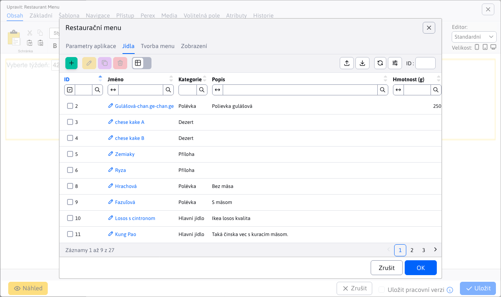

# Restaurační menu

Aplikace Restaurační menu umožňuje zadefinování jídel, vytvoření menu pomocí jídel a následně zobrazení menu v různých stylech. Do web stránky můžete aplikaci Restaurační menu přidat přes výběr aplikací nebo přímo kódem do těla web stránky. Příklad: `!INCLUDE(/components/restaurant_menu/menu.jsp, style=02, mena=&euro;)!`

Dialogové okno aplikace se skládá z karet:
- Nastavení
- Jídla
- Tvorba menu

## Nastavení

V kartě Nastavení si můžete vybrat styl, jakým se vytvořené restaurační menu zobrazí ve web stránky. Jak je vidět na předchozím obrázku, k dispozici jsou 4 rozdílné typy zobrazení. Typ 01, 02 a 03 zobrazují celé menu (celý týden). Typ 04 zobrazuje pouze menu na konkrétní aktuální den.

Pro příklad si uveďme, jak vypadá vygenerované restaurační menu typu 02 ve webové stránce.

## Jídla

Karta Jídla nabízí vnořenou datatabulku pro správu seznamu podporovaných jídel. Celou dokumentaci k té tabulce naleznete zde [Jídla](./meals.md).

## Tvorba menu

Karta Tvorba menu nabízí vnořenou datatabulku pro vytváření a správu menu, na konkrétní den/týden. Celou dokumentaci k té tabulce naleznete zde [Tvorba menu](./menu.md).

