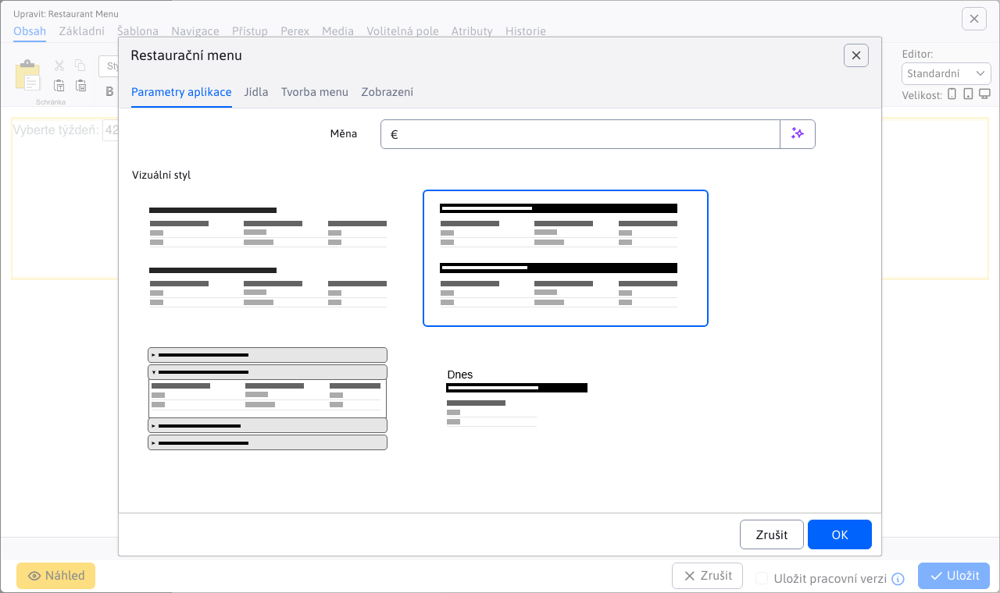
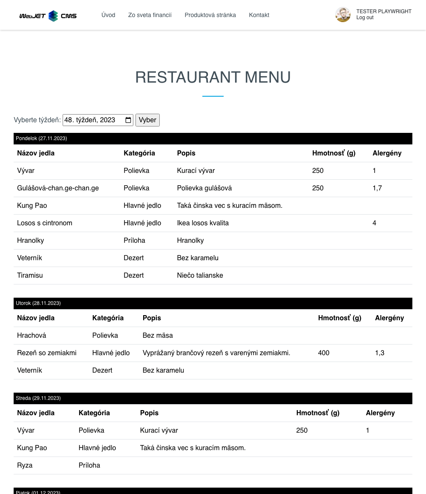

# Reštaurační menu

Aplikace Jídelní lístek restaurace umožňuje definovat pokrmy, vytvářet z nich jídelní lístky a poté je zobrazovat v různých stylech. Aplikaci Restaurant Menu můžete přidat na webovou stránku pomocí voliče aplikací nebo přidáním kódu přímo do těla webové stránky. Příklad: `!INCLUDE(/components/restaurant_menu/menu.jsp, style=02, mena=&euro;)!`

Dialogové okno aplikace se skládá z karet:
- Nastavení
- Jídla
- Vytváření nabídek

## Nastavení

Na kartě Nastavení můžete zvolit styl, ve kterém se bude vytvořené menu restaurace zobrazovat na webové stránce. Jak vidíte na předchozím obrázku, k dispozici jsou 4 různé typy zobrazení. Typy 01, 02 a 03 zobrazují celý jídelní lístek (celý týden). Typ 04 zobrazuje pouze jídelní lístek pro konkrétní aktuální den.

Jako příklad se podívejme, jak vypadá vygenerované menu restaurace typu 02 na webové stránce.

## Jídla

Karta Jídla nabízí vnořenou tabulku s daty pro správu seznamu podporovaných jídel. Úplnou dokumentaci k této tabulce naleznete zde [Jídla](./meals.md).

## Vytváření nabídek

Karta Vytvoření nabídky nabízí vnořenou tabulku s daty pro vytváření a správu nabídek pro konkrétní den/týden. Úplnou dokumentaci k této tabulce naleznete zde [Vytváření nabídek](./menu.md).

