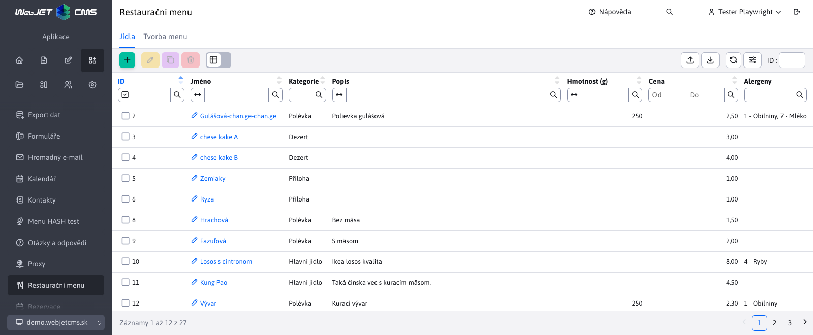

# Jídla

Část **Jídla** spadá pod sekci Restaurační menu. Umožňuje zadefinování jídel, která se využívají při vytváření restauračního menu. Možné je přidávání/upravování/duplikování/mazání jídla i jejich importování a exportování.

Při vytváření nového jídla jsou v editoru tyto parametry:
- Jméno - jméno nového jídla (jediný povinný parametr)
- Kategorie - kategorie jídla s výběrem možností Polévka / Hlavní jídlo / Příloha / Dezert
- Popis
- Hmotnost (g)
- Cena
- Alergeny - alergeny obsažené v tomto jídle. Tento parametr je typu MULTISELECT, což znamená, že si můžete vybrat více nebo žádnou hodnotu (na výběr je několik hodnot).

Alergeny vybíráte z výběrového menu, ve kterém lze označit více možností. Alergenů je 14 (počet lze nastavit v konfigurační proměnné `restaurantMenu.alergensCount`) a definují se v překladových klíčích s prefixem `components.restaurant_menu.alergen`:

