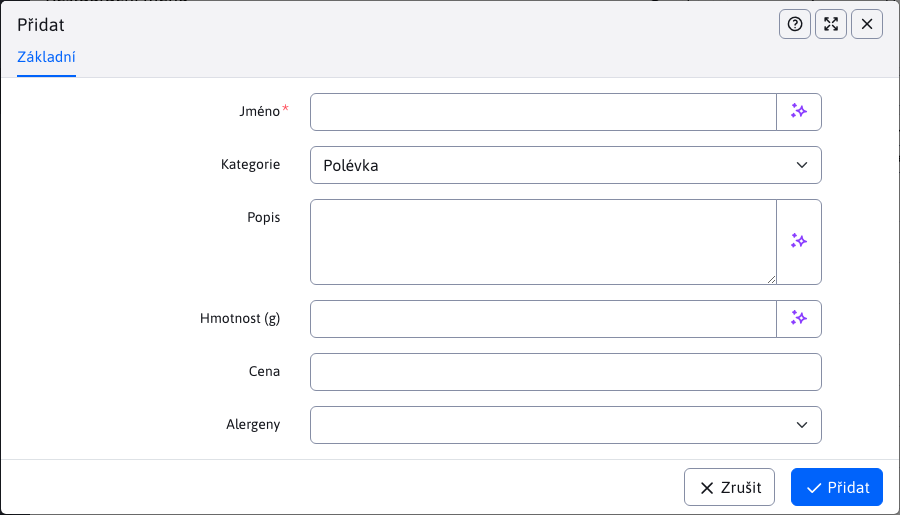

# Jídla

Část **Jídla** spadá do sekce Menu restaurace. Umožňuje definovat pokrmy, které se používají při vytváření jídelního lístku restaurace. Je možné přidávat/upravovat/duplikovat/odstraňovat pokrmy a také je importovat a exportovat.

Při vytváření nového pokrmu jsou v editoru k dispozici následující parametry:
- Název - název nového pokrmu (jediný povinný parametr)
- Kategorie - kategorie jídel s výběrem možností Polévka / Hlavní jídlo / Příloha / Dezert
- Popis
- Hmotnost (g)
- Cena
- Alergeny - alergeny obsažené v této potravině. Tento parametr je typu MULTISELECT, což znamená, že můžete vybrat více hodnot nebo žádnou hodnotu (na výběr je několik hodnot).

Alergeny se vybírají z výběrové nabídky, ve které lze zvolit několik možností. K dispozici je 14 alergenů (jejich počet lze nastavit v konfigurační proměnné `restaurantMenu.alergensCount`) a jsou definovány v překladových klíčích s předponou `components.restaurant_menu.alergen`:

