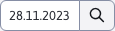

# Vytváření nabídek

Část **Vytváření nabídek** spadá do sekce Menu restaurace. Umožňuje vydávat jídelní lístky přiřazením jídel ke konkrétním dnům. Samozřejmě poskytuje možnost přidávat/upravovat/duplikovat/mazat tato přiřazení a také je importovat a exportovat.

Jídlo je ve výchozím nastavení reprezentováno sloupci Kategorie a Název jídla. Zbývající sloupce reprezentující jídlo lze přidat v nastavení datové tabulky. Hodnota ve sloupci Název jídla je sama o sobě odkazem, který vás po kliknutí přesměruje do tabulky Jídla a automaticky otevře editor vybraného jídla ([Jídla](./meals.md)).

Záznamy v této tabulce jsou přísně filtrovány:
- podle data (den v týdnu)
- podle zvolené kategorie (1-polévka, 2-hlavní jídlo, 3-přílohy a 4-dezerty).
- pak podle zvolené pozice

Tento systém třídění je dobře vidět na obrázku v části [Režim zobrazení](../restaurant-menu/menu.md#režim-zobrazení), přičemž se zobrazí záznamy z celého týdne.

## Vytvoření nového záznamu

Parametry:
- Kategorie, seznam pro výběr kategorie potravin (přednastavená kategorie Polévky).
- Název potraviny, seznam, který se dynamicky doplňuje podle aktuálně vybrané kategorie potravin. Seznam obsahuje všechna definovaná jídla v rámci vybrané kategorie (automaticky se vybere první jídlo ve vráceném seznamu).
- Datum, ke kterému je potravina přiřazena, se automaticky vyplní podle hodnoty filtru data ( [Filtr data](../restaurant-menu/menu.md#filtr-data) ) a nelze je změnit
- Pozice, při vytváření nového záznamu (pouze při vytváření) je jeho hodnota přednastavena jako nejvyšší priorita pro kombinaci daného dne a vybrané kategorie potravin + 10. To znamená, že pokud je například pro den 23.11.2023 a kategorii potravin Polévky nejvyšší priorita 20, nastaví se hodnota 30. Při změně kategorie jídla se hodnota automaticky znovu přednastaví.

## Ovládací prvky

Tabulka obsahuje speciální ovládací prvky, které umožňují snadnější práci s daty a režimem zobrazení:

### Filtr data

Filtr data  se používá k omezení zobrazených záznamů pouze na určitý den. Automaticky je nastaveno na aktuální den (**Varování:** jeho poslední aktuální hodnota se při opuštění stránky neuloží).

### Režim zobrazení

Režim zobrazení  umožňuje změnit rozsah, ve kterém se záznamy zobrazují. Umožňuje volbu zobrazení po dnech a týdnech.

Předvolba je **zobrazení podle dnů**, což jste mohli vidět již na úvodním obrázku tabulky výše. V tomto zobrazení jsou záznamy filtrovány pouze pro jeden konkrétní den.

Pokud se rozhodnete **zobrazení podle týdnů**, budou filtrovány záznamy za celý týden (7 dní). Týden je vždy brán jako rozsah od pondělí do neděle.

Změna týdne změnou hodnoty **Filtr data**. Filtr automaticky odvodí celý týden od vybraného data a zobrazí všechny hodnoty v tomto časovém období.

Příklad: Pokud vyberete datum 28.11.2023 (úterý), pak se v režimu Týdny automaticky nastaví rozsah od pondělí 27.11.2023 (včetně) do neděle 03.12.2023 (včetně). Bez ohledu na to, který den v tomto rozsahu vyberete, budou filtrované záznamy vždy stejné, pokud tato data spadají do stejného týdne. Samotný týden můžete změnit pouze výběrem data, které spadá do jiného týdne (např. 04.12.2023).

Samozřejmě nezáleží na tom, čí týden projde dalším měsícem nebo rokem. Jak vidíme z následujícího obrázku, zobrazí se nám záznamy z celého týdne a automaticky se zobrazí sloupec **Den v týdnu** aby bylo možné lépe určit, do kterého dne záznamy patří. Při přechodu z jednoho dne na druhý jsou záznamy také barevně odlišeny.

Původně nastavené datum ve filtru se nezmění (samozřejmě ho můžete změnit) a při přepnutí do režimu **zobrazení podle dnů** zobrazí záznamy dne, jehož datum je aktuálně nastaveno.

### Stav data

Stav data slouží především k zobrazení aktuálně vybraného dne v týdnu.

V módě **zobrazení podle dnů** zobrazí, který den v týdnu je aktuálně vybrán a který týden v roce.

V módě **zobrazení podle týdnů** zobrazuje, který týden v roce je a který rok.

Na předchozích obrázcích vidíte, že tento stav data zahrnuje také šipky vpravo a vlevo. Tyto šipky slouží ke snadnému procházení kalendáře:
- šipka vlevo znamená posun do minulosti.
- šipka vpravo znamená posun do budoucnosti.

V módě **zobrazení podle dnů** se posouváte pouze o jeden den, v módě **zobrazení podle týdnů** se posunete o celý týden (7 dní). Při tomto posunu se automaticky nastaví filtr data, abyste viděli, který den/týden je aktuálně nastaven.
