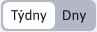

# Tvorba menu

Část **Tvorba menu** spadá pod sekci Restaurační menu. Umožňuje vystavení jídelníčku a to přiřazením jídel ke konkrétním dnům. Samozřejmě poskytuje možnost přidávání/upravování/duplikování/mazání těchto přiřazení i jejich importování a exportování.

Jídlo je ve výchozím nastavení reprezentováno sloupci Kategorie a Název jídla. Zbývající sloupce reprezentující jídlo lze přidat v nastavení datatabulky. Samotná hodnota ve sloupci Název jídla je odkaz, která Vás po kliknutí na ni přesměruje do tabulky Jídla a automaticky otevře editor zvoleného jídla ([Jídla](./meals.md)).

Záznamy v této tabulce jsou striktně filtrovány:
- dle data (dne v týdnu)
- dle zvolené kategorie (1-Polévky, 2-Hlavní jídla, 3-Přílohy a 4-Dezerty)
- následně podle zvolené pozice

Tento systém řazení je dobré vidět na obrázku v sekci [Režim zobrazení](../restaurant-menu/menu.md#režim-zobrazení), při zobrazení záznamů z celého týdne.

## Vytváření nového záznamu

Parametry:
- Kategorie, seznam na výběr kategorie jídla (přednastavená kategorie Polévky)
- Název jídla, seznam, který se dynamicky naplní podle aktuálně zvolené kategorie jídla. Seznam obsahuje všechna definovaná jídla pod danou zvolenou kategorií (automaticky se zvolí první jídlo ve vráceném seznamu)
- Datum, ke kterému se jídlo přiřadí se automaticky naplní podle hodnoty datového filtru ( [Datový filtr](../restaurant-menu/menu.md#datový-filtr) ) a nedá se změnit
- Pozice, při pořizování nového záznam (pouze při pořizování) se jeho hodnota před-nastaví jako největší priorita pro kombinaci daného dne a zvolené kategorie jídla + 10. To znamená, že například. pokud pro den 23.11.2023 a kategorii jídla Polévky je nejvyšší priorita 20, tak nastaví hodnotu 30. Při změně kategorie jídla se hodnota automatický opět před-nastaví.

## Ovládací prvky

Tabulka obsahuje speciální ovládací prvky, umožňující snazší práci s daty a režimem zobrazení:

### Datový filtr

Datový filtr  slouží k omezení zobrazených záznamů pouze na konkrétní den. Automatický se nastaví na aktuální den (**Upozornění:** jeho poslední aktuální hodnota se při odchodu ze stránky neuloží).

### Režim zobrazení

Režim zobrazení  umožňuje změnit rozsah, ve kterém se záznamy zobrazují. Poskytuje na výběr zobrazení podle dní a týdnů.

Přednastaveno je **zobrazení podle dnů**, které jste mohli vidět již na úvodním obrázku tabulky výše. Při tomto zobrazení se filtrují záznamy pouze pro jeden specifický den.

Pokud zvolíte **zobrazení podle týdnů**, budou se filtrovat záznamy pro celý týden (7 dní). Jako týden je brán vždy rozsah od Pondělí po Neděli.

Změnu týdne dosáhnete změnou hodnoty **Datumového filtru**. Filtr si automaticky od zvoleného data odvodí celý týden a všechny hodnoty v tomto časovém úseku budou zobrazeny.

Příklad: pokud zvolíte datum 28.11.2023 (Úterý) tak v módu Týdny se rozsah nastaví automaticky od Pondělí 27.11.2023 (včetně) do Neděle 03.12.2023 (včetně). Nezáleží, který den v tomto rozsahu zvolíte, vždy budou filtrované záznamy stejné, pokud jsou tato data ve stejném týdnu. Samotný týden můžete změnit až zvolením data, které spadá do jiného týdne (např. 04.12.2023).

Samozřejmě, nezáleží čí týden přechází přes jiný měsíc nebo rok. Jak můžeme z následujícího obrázku vidět, zobrazí se nám záznamy z celého týdne a automaticky se zobrazí sloupec **Den v týdnu**, pro lepší určení, pod který den záznamy patří. Také záznamy jsou barevné odlišeny při přechodu z jednoho dne na jiný.

Původně nastavené datum ve filtru se nemění (samozřejmě jej změnit můžete) a při přepnutí do módu **zobrazení podle dnů** se zobrazí záznamy dne, jehož datum je aktuálně nastaveno.

### Datový status

Datový status slouží primárně k zobrazení aktuálně zvoleného dne týdne.

V módě **zobrazení podle dnů** zobrazuje informaci jaký den v týdnu je aktuálně zvolen a jaký týden v roce to je

V módě **zobrazení podle týdnů** zobrazuje informaci o jaký týden v roce jde a o jaký rok

Na předchozích obrázcích můžete vidět, že tento datový status obsahuje i šipky vpravo a vlevo. Tyto šipky slouží k jednoduchému posuvu v kalendáři:
- šipka vlevo je posun do minulosti
- šipka vpravo je posun do budoucnosti

V módě **zobrazení podle dnů** se posouváte pouze o jeden den, v módě **zobrazení podle týdnů** se posouváte o celý týden (7 dní). S tímto posunem se automaticky nastaví také datový filtr, abyste měli přehled, který den/týden je aktuálně nastaven.
