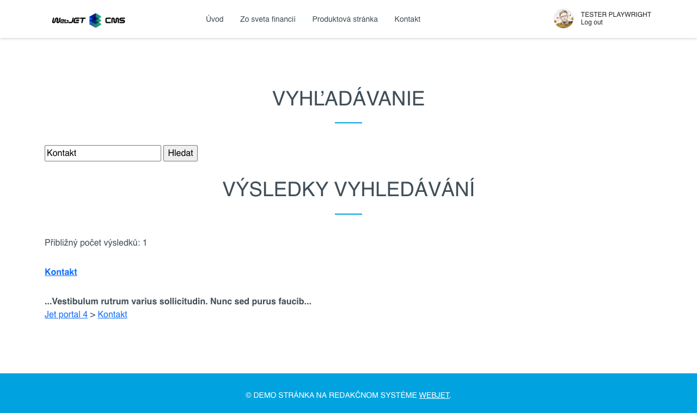

# Vyhledávání

Nabídněte návštěvníkům možnost rychlého a přesného vyhledávání přímo na vaší stránce. Vložte vyhledávací formulář a zobrazení výsledků vyhledávání, které umožňuje nastavení adresáře, počtu záznamů na stránku a způsobu uspořádání. Využijte sílu vyhledávání v databázi nebo pomocí Lucene/Elastic Search pro vyhledávání i se skloňováním. Podporovány jsou také vyhledávání v textu souborů typu `doc(x), xls(x), ppt(x), pdf, xml a txt`.

## Nastavení aplikace

V nastaveních lze nastavit:
- Adresář - ID složek web stránek pro vyhledávání, hledá se iv podsložkách
- Počet odkazů na stránku - počet záznamů na jednu stranu vyhledávání
- Kontrolovat duplicitu - pokud se web stránka nachází ve více složkách, zapne se kontrola duplicit. Zvyšuje zátěž na server.
- Uspořádat podle - Priority, Názvu, Data změny
- Vložit - formulář, výsledky, spolu - nastavuje typ vložené části, chcete-li mít oddělené vyhledávací pole například. v hlavičce vložte samostatně formulář a samostatně výsledky vyhledávání. Při nastavení hodnoty Formulář je třeba zadat ID stránky s výsledky vyhledávání.

### Nastavení hledání v souborech

Chcete-li vyhledávat i v souborech, je třeba [nastavit indexování souborů](../../files/fbrowser/folder-settings/README.md#indexování) v části Průzkumník a na dané složce se soubory a spustit prvotní indexování.

### Nastavení používání Lucene

Standardně se používá vyhledávání pomocí databázového serveru. Je možné aktivovat vyhledávání pomocí knihovny [Lucene](https://lucene.apache.org/), která se používá také v `Elastic Search` jako vyhledávací systém. Nastavte konf. proměnnou `luceneAsDefaultSearch` na hodnotu `true` a spusťte prvotní indexování přes `/components/search/lucene_console.jsp`.

## Zobrazení aplikace

