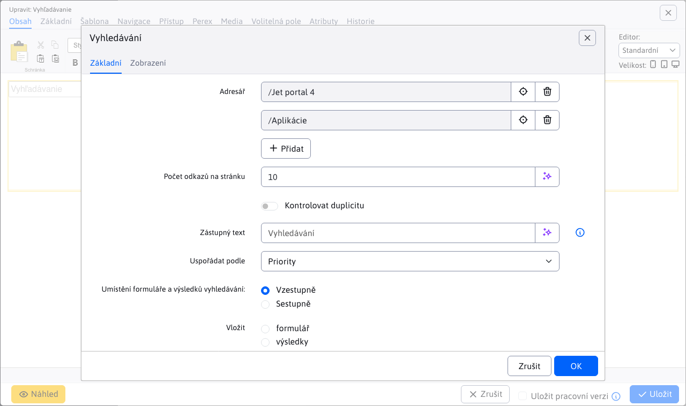
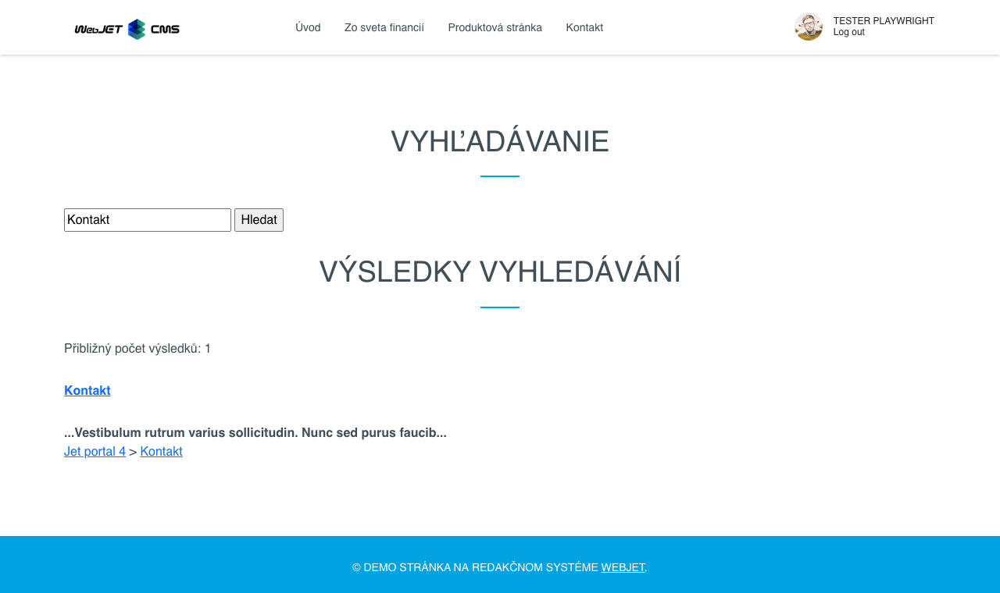

# Vyhledávání

Nabídněte návštěvníkům možnost rychlého a přesného vyhledávání přímo na vaší stránce. Vložte vyhledávací formulář a zobrazení výsledků vyhledávání, které umožňuje nastavení adresáře, počtu záznamů na stránku a způsobu uspořádání. Využijte sílu vyhledávání v databázi nebo pomocí Lucene/Elastic Search pro vyhledávání i se skloňováním. Podporovány jsou také vyhledávání v textu souborů typu `doc(x), xls(x), ppt(x), pdf, xml a txt`.

## Nastavení aplikace

V nastaveních lze nastavit:

- Adresář - ID složek web stránek pro vyhledávání, hledá se iv podsložkách
- Počet odkazů na stránku - počet záznamů na jednu stranu vyhledávání
- Kontrolovat duplicitu - pokud se web stránka nachází ve více složkách, zapne se kontrola duplicit. Zvyšuje zátěž na server.
- Uspořádat podle - Priority, Názvu, Data změny
- Vložit - formulář, výsledky, spolu - nastavuje typ vložené části, chcete-li mít oddělené vyhledávací pole například. v hlavičce vložte samostatně formulář a samostatně výsledky vyhledávání. Při nastavení hodnoty Formulář je třeba zadat ID stránky s výsledky vyhledávání.

### Nastavení hledání v souborech

Chcete-li vyhledávat i v souborech, je třeba [nastavit indexování souborů](../../files/fbrowser/folder-settings/README.md#indexování) v části Průzkumník a na dané složce se soubory a spustit prvotní indexování.

### Nastavení typu vyhledávání

Systém podporuje následující typy vyhledávání:

- **Databázové vyhledávání** – standardní typ vyhledávání pomocí databázového serveru.
  - Používá se ve výchozím nastavení, pokud není nastaven jiný typ. Lze jej explicitně nastavit konfigurační proměnnou `searchType` na hodnotu `db`.
- **Lucene** – vyhledávání pomocí knihovny [Lucene](https://lucene.apache.org/), která tvoří základ i systému Elastic Search.
  - Nastavte konfigurační proměnnou `luceneAsDefaultSearch` na hodnotu `true`, nebo proměnnou `searchType` na hodnotu `lucene`.
  - Spusťte prvotní indexování přes `/components/search/lucene_console.jsp`.
- **Sémantické vyhledávání** – vyhledávání pomocí pgvector.
  - Nastavte proměnnou `searchType` na hodnotu `semantic`, povolte sémantické vyhledávání nastavením proměnné `ragSemanticSearchEnabled` na `true`.
  - Více se dočtete v části [Sémantické vyhledávání](../semantic-search/README.md).

!>**Upozornění:** Konfigurační proměnná `luceneAsDefaultSearch` má vyšší prioritu než proměnná `searchType`. Pokud je tedy `luceneAsDefaultSearch=true`, bude se používat Lucene bez ohledu na nastavenou hodnotu proměnné `searchType`.

### Porovnání typů vyhledávání

| | Databázové (`db`) | Lucene | Sémantické (`semantic`) |
| --- | --- | --- | --- |
| Technologie | SQL LIKE / FULLTEXT | `Apache Lucene` | `OpenAI embeddings` + `pgvector` |
| Shoda | Klíčová slova | Klíčová slova + skloňování | Sémantický význam |
| Výsledky bez shody slov | Ne | Částečně | Ano |
| Požadavky | Primární DB | Lucene index | `PostgreSQL` + `pgvector` + `OpenAI` |
| Cena | Zdarma | Zdarma | OpenAI API (placené) |

## Zobrazení aplikace

