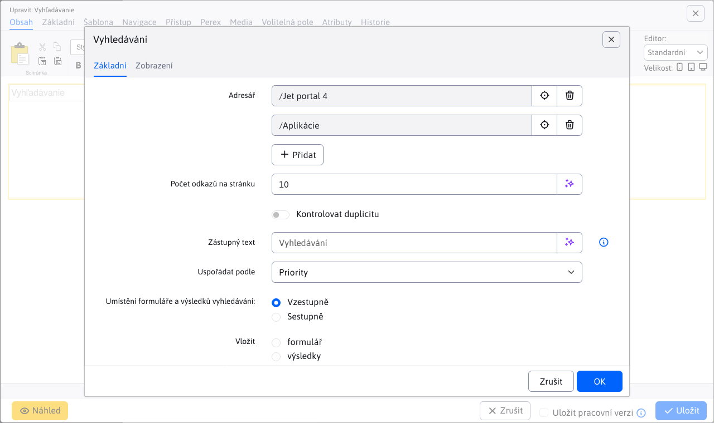

# Vyhledávání

Nabídněte svým návštěvníkům možnost rychlého a přesného vyhledávání přímo na svých stránkách. Zahrňte vyhledávací formulář a zobrazení výsledků vyhledávání, které vám umožní nastavit adresář, počet záznamů na stránce a jejich uspořádání. Využijte sílu databázového vyhledávání nebo použijte Lucene/Elastic Search pro vyhledávání i s inflexí. Podporováno je také vyhledávání v textových souborech `doc(x), xls(x), ppt(x), pdf, xml a txt`.

## Nastavení aplikace

V nastavení můžete nastavit:
- Adresář - ID složek webových stránek pro vyhledávání, vyhledává také v podsložkách.
- Počet odkazů na stránku - počet záznamů na vyhledávací stránku
- Kontrola duplicity - pokud je webová stránka ve více složkách, je povolena kontrola duplicity. Zvyšuje zatížení serveru.
- Uspořádat podle - priority, názvu, data změny
- Vložit - formulář, výsledky, celkem - nastavuje typ vkládané části, pokud chcete mít oddělená vyhledávací pole, např. v záhlaví vložit zvlášť formulář a zvlášť výsledky vyhledávání. Při nastavení hodnoty Formulář je třeba zadat ID stránky s výsledky vyhledávání.

### Nastavení vyhledávání souborů

Pokud chcete vyhledávat také v souborech, musíte. [nastavit indexování souborů](../../files/fbrowser/folder-settings/README.md#Indexování) v Průzkumníku souborů a na složce souborů a spusťte počáteční indexování.

### Nastavení používání nástroje Lucene

Ve výchozím nastavení se používá vyhledávání na databázovém serveru. Vyhledávání je možné aktivovat pomocí knihovny [Lucene](https://lucene.apache.org/) který se používá také v `Elastic Search` jako vyhledávač. Nastavení konfigurační proměnné `luceneAsDefaultSearch` na hodnotu `true` a spustit počáteční indexování pomocí `/components/search/lucene_console.jsp`.

## Zobrazení aplikace

