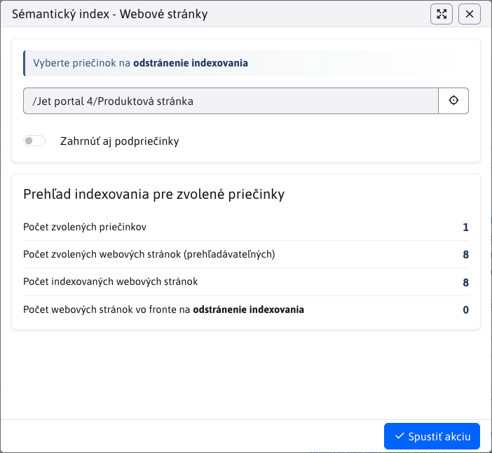

# Sémantický index

Sémantický index převádí obsah stránek na vektorové reprezentace (`embedding`) pomocí OpenAI API a ukládá je do vektorové databáze. Používá se pro sémantické vyhledávání, hybridní vyhledávání i pro generování RAG odpovědi ve vyhledávání.

Pro přesnější výsledky se obsah rozděluje na menší části - **chunky**. Každý chunk je indexován samostatně, což systému umožňuje porovnávat dotazy s konkrétními částmi textu a ne s celou stránkou najednou.

Zprávu vektorů naleznete v sekci **Nastavení → Sémantický index**.

Aktuálně je podporováno indexování **webových stránek**. Další typy mohou přibýt v budoucnosti.

!>**Upozornění:** Indexování **neprobíhá okamžitě**. Každý požadavek (přidání, úprava, vymazání) se zařadí do **fronty** a zpracuje se v pravidelných intervalech pomocí cron úlohy.

Pro zobrazení seznamu indexovaných objektů je třeba mít právo Sémantický index.

## Indexování webových stránek

Indexuje se čistý text stránky bez HTML značek. Do indexování vstupují pouze webové stránky, které jsou povoleny pro vyhledávání. Obsah se rozdělí na chunky, které jsou zobrazeny v tabulce níže.

Každý chunk obsahuje tyto sloupce:

- **ID entity** - ID webové stránky.
- **Index části** - pořadí chunku v rámci stránky (0, 1, 2, ...).
- **Text části** - text, pro který byl vygenerován embedding. Samotný embedding se v tabulce nezobrazuje.
- **Model** - použitý OpenAI model, například. `text-embedding-3-small`.
- **Dimenze** - počet dimenzí vektoru. `1536`.
- **Jazyk** - jazyková verze stránky.
- **Stav** - stav zpracování:
  - **COMPLETED** - úspěšně zpracován.
  - **ERROR** - nastala chyba.
  - **PENDING** - čeká na zpracování.
- **Chybová zpráva** - popis chyby, pokud zpracování selhalo.
- **Datum vytvoření** - čas zpracování, ne čas přidání do fronty.

V databázi se navíc ukládá `group_id` a sloupce `root_group_l1`, `root_group_l2`, `root_group_l3`. Tyto hodnoty se používají k rychlému omezení sémantického a hybridního vyhledávání podle složek zvolených v aplikaci **Vyhledávání**.

## Rozdělení textu na chunky

Velikost chunků se nastavuje konfiguračními proměnnými:

- `ragEmbeddingChunkSize` - ​​maximální velikost jedné části textu ve znacích, ve výchozím nastavení `1000`.
- `ragEmbeddingChunkOverlap` - ​​počet znaků překrytí mezi sousedními částmi, ve výchozím nastavení `200`.

Při dělení textu se systém snaží zachovat přirozený kontext. Konec chunku se vybírá v tomto pořadí:

1. konec odstavce,
2. konec řádku,
3. konec věty nebo podobná interpunkce,
4. mezera mezi slovy,
5. tvrdé rozdělení podle maximální velikosti.

Překrytí se používá k zachování kontextu mezi sousedními částmi. Při RAG odpovědi se sousední chunky jedné stránky mohou znovu sloučit, přičemž se odstraní duplicitní text vzniklý překrytím.

!>**Upozornění:** Starší konfigurační proměnné `ragChunkSize` a `ragChunkOverlap` se již nepoužívají. Po změně velikosti chunků nebo po přechodu ze starších nastavení spusťte opětovné indexování.

## Filtrování

V hlavičce tabulky jsou dostupné tyto filtry:

- **Výběr složky** - zobrazí chunky pouze pro stránky z dané složky v rámci aktuální domény.
- **Zobrazit iz podsložek** - zahrne do výsledků i stránky z podsložek.

!>**Upozornění:** Pokud vyberete **Kořenovou složku** bez zapnutí možnosti **Zobrazit iz podsložek**, nezískáte žádné výsledky. Kořenová složka je virtuální a neobsahuje stránky přímo.

## Přesměrování z Webových stránek

V sekci **Webové stránky** můžete u zvolené složky kliknout na tlačítko <button class="btn btn-sm buttons-selected btn-outline-secondary"><i class="ti ti-database-search"></i></button> v hlavičce složek. Tím se otevře sekce **Sémantický index** s automaticky nastaveným filtrem pro danou složku.

### Automatické indexování

Systém automaticky zařadí stránku do fronty při:

- **vytvoření nebo úpravě** - stránka se indexuje nebo aktualizuje bez manuálního zásahu,
- **smazání nebo přesunutí do koše** - všechny související chunky se odstraní z databáze,
- **obnovení z koše** - stránka se opětovně indexuje.

### Manuální indexování

Klepněte na tlačítko <button class="btn btn-sm btn-success" type="button"><i class="ti ti-database-plus"></i></button> pro otevření dialogu indexování.

Dialog zobrazí přehled stránek zvolené složky - celkový počet, počet již indexovaných a počet ve frontě. Složka se nastaví podle aktivního filtru. Po potvrzení se do fronty zařadí všechny vyhledatelné stránky ze zvolené složky. Pokud se text chunku nezměnil, systém se pokusí použít existující embedding podle jeho hash hodnoty.

Akci spustíte tlačítkem <button class="btn btn-primary"><i class="ti ti-check"></i>Spustit akci</button> .

### Manuální odstranění indexování

Klepněte na tlačítko <button class="btn btn-sm btn-danger" type="button"><i class="ti ti-database-minus"></i></button> pro otevření dialogu odstranění indexů.

Dialog zobrazí stejný přehled jako při indexování. Po potvrzení se stránky zařadí do fronty pro odstranění všech chunků pro stránky zvolené složky.

Akci spustíte tlačítkem <button class="btn btn-primary"><i class="ti ti-check"></i>Spustit akci</button> .

## Chyby při indexování

Pokud při indexování stránky nastane chyba, systém uloží záznam se stavem **ERROR** a zkrácenou chybovou zprávou. Chyba se zapisuje i do administrátorského logu v kategorii **RAG**. Pokud selže zpracování položky ještě na úrovni fronty, položka zůstane ve frontě a systém se ji pokusí zpracovat při dalším běhu cron úlohy.

## Detaily implementace

Technický popis procesu indexování naleznete v [dokumentaci pro vývojáře](../../../custom-apps/apps/rag/semantic-search/README.md).
