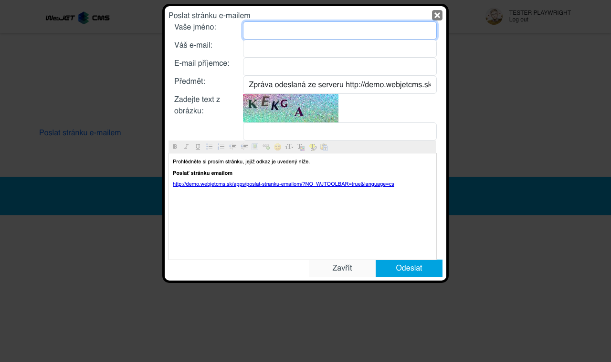

# Odeslání stránky e-mailem

Vloží do stránky aplikaci, která umožňuje odeslat odkaz na aktuální stránku spolu s vyplněným textem na e-mailovou adresu. Pokud návštěvník najde na vašich stránkách zajímavé informace, může je přeposlat na svůj e-mail nebo na e-mail přítele, se kterým chce stránku sdílet.

## Nastavení aplikace

V nastavení můžete vybrat z následujících možností:
- Odeslání celé stránky e-mailem
- Odeslání názvu stránky, perexu a odkazu na stránku e-mailem

## Zobrazení aplikace

Uživatel má k dispozici tato pole:
- Vaše jméno
- Váš e-mail
- E-mail příjemce
- Předmět
- Zadejte text z obrázku
- Nahlásit

Všechna pole kromě zprávy jsou povinná

