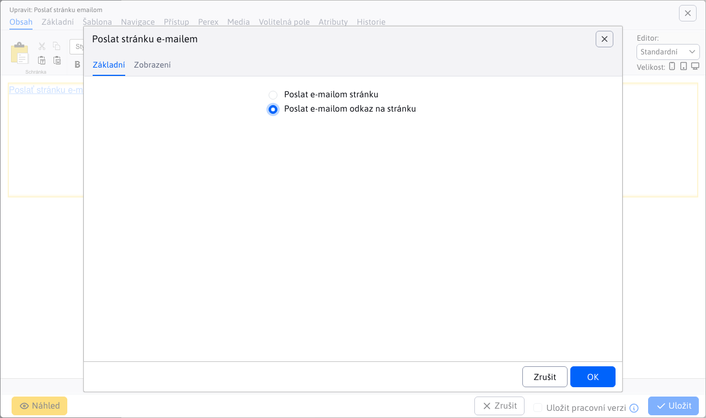

# Poslat stránku emailem

Vloží do stránky aplikaci, která umožňuje poslat odkaz na aktuální stránku spolu s doplněným textem na e-mail adresu. Pokud návštěvník najde zajímavé informace na vašem webu, může si je přeposlat na svůj email, nebo na email přítele kterému chce stránku sdílet.

## Nastavení aplikace

V nastaveních lze vybrat z možností:
- Poslat e-mailem celou stránku
- Poslat e-mailem název stránky, perex a linku na stránku

## Zobrazení aplikace

Pro uživatele jsou pole:
- Vaše jméno
- Váš e-mail
- E-mail příjemce
- Předmět
- Zadejte text z obrázku
- Zpráva

Přičemž všechna pole kromě zprávy jsou povinná

