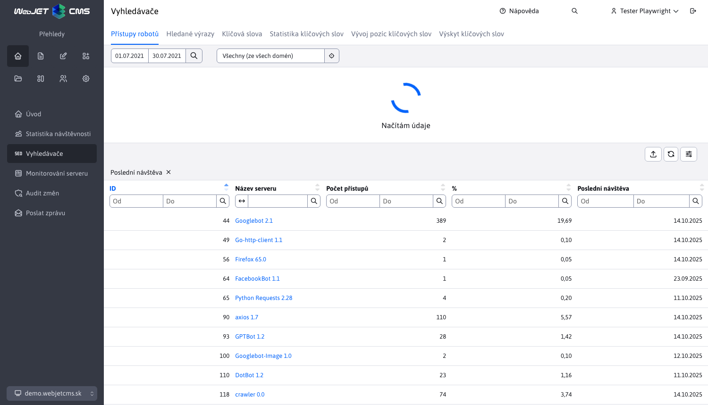
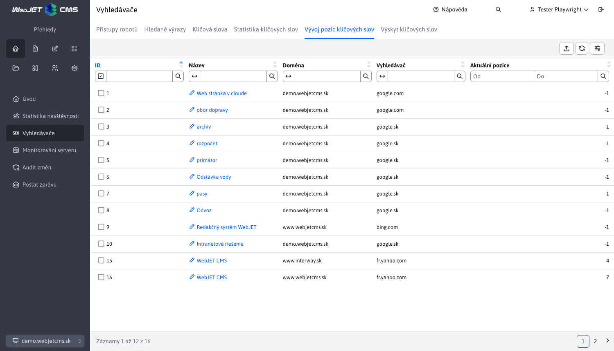

# SEO

Aplikace SEO je podpůrný nástroj pro optimalizaci pro vyhledávače. Je k dispozici v sekci Aplikace v levém menu jako položka SEO.

Sekce SEO používá externí filtr, který je podrobněji popsán zde. [Externí filtr](../stat/external-filter.md)

## Přístupy vyhledávacích robotů

V této části se zobrazují statistiky přístupů na webové stránky z vyhledávačů. Můžete si prohlédnout jejich aktivitu a datum posledního přístupu.

Součástí je také tabulka, jejíž sloupec **Název serveru** nás přesměruje na podrobné statistiky konkrétního vyhledávače.

## Vyhledávací podmínky

V této části se zobrazují statistiky vyhledávaných výrazů ve vyhledávačích při přechodu na vaši stránku. Poskytuje informace o tom, jaká slova návštěvníci ve vyhledávačích hledají a na jakou stránku kvůli tomuto slovu na vaše stránky přišli.

Další informace naleznete zde [Vyhledávače](../stat/README.md#vyhledávače)

## Správa klíčových slov

Tato část umožňuje definovat a spravovat důležitá klíčová slova, pro která můžete určit pozice ve vyhledávačích a hustotu klíčových slov na vašich webových stránkách.

Podporováno je vytváření/úprava/odstranění/duplikování klíčových slov, jakož i jejich import a export.

Při vytváření, úpravách a duplikování je nutné zadat všechny hodnoty.

## Statistiky klíčových slov

V této části se zobrazí statistiky vyhledávání pro zadaná klíčová slova, které ukazují procentuální a celkové počty a rozložení klíčového slova mezi vyhledávače.

Obsažená datová tabulka obsahuje sloupec **Název výrazu**, který nás přesměruje na detail statistiky konkrétního klíčového slova.

## Vývoj pozic klíčových slov

Tato část zobrazuje statistiky pozic a vývoj pozic klíčových slov v čase. Aktuální pozice každého klíčového slova na `Google`, `Yahoo` nebo `Bing` je aktualizován jednou denně. Na kterém vyhledávači se pozice slova ověřuje, závisí na doménové sadě.

Obsažená datová tabulka obsahuje sloupec **Název**, která nás přesměruje na podrobnosti o vývoji pozice konkrétního klíčového slova.

Získávání pozic pomocí služby [SerpApi](https://serpapi.com) na kterém se musíte zaregistrovat a získat klíč API. Používají se následující konfigurační proměnné:
- `seo.serpApiKey` - Klíč API od služby `SerpApi`.
- `seo.serpApiGoogleMaxResult` - maximální počet záznamů pro kontrolu výsledků (výchozí 10).

## Výskyt klíčových slov

Tato část zobrazuje počet výskytů definovaných klíčových slov na webové stránce. To umožňuje určit hustotu klíčových slov na webu/stránce.

## Analýza stránky

Při úpravě stránky můžete do stránky vložit aplikaci SEO. Technicky vzato se do stránky nevkládá, ale zobrazí analýzu klíčových slov aktuálně zobrazené webové stránky.

Aplikace analyzuje čitelnost textu, používá techniku analýzy `Gunning fog index`. Odhaduje počet let vzdělání potřebných k pochopení textu. V praxi:
- 6 znamená vynikající čitelnost.
- 8 až 10 jsou články z časopisů a novin, krátké příběhy, které se snadno čtou a jsou srozumitelné.
- 11 až 14 let se již dostávají k odbornějším článkům. Vědecké články obvykle dosahují úrovně 15 až 20 a již vyžadují plné soustředění čtenáře.
- Nad 20 pouze texty, kde autor zcela ignoruje čtenáře.

Tabulka zobrazuje výskyt definovaných klíčových slov v textu aktuální webové stránky. Seznam klíčových slov můžete upravit v poli Klíčová slova (jednotlivá slova/fráze oddělte čárkou) a kliknutím na tlačítko OK tabulku obnovíte.

