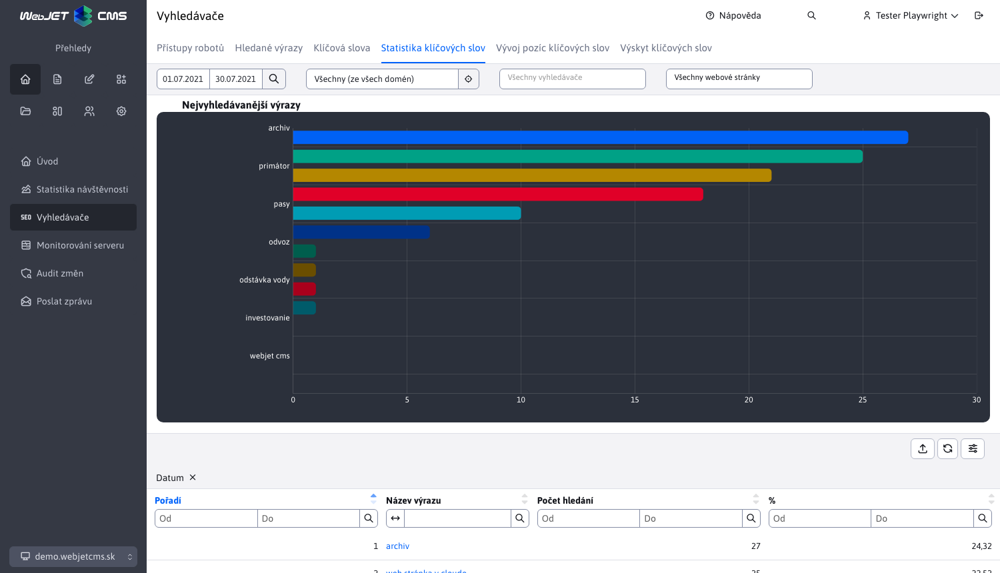
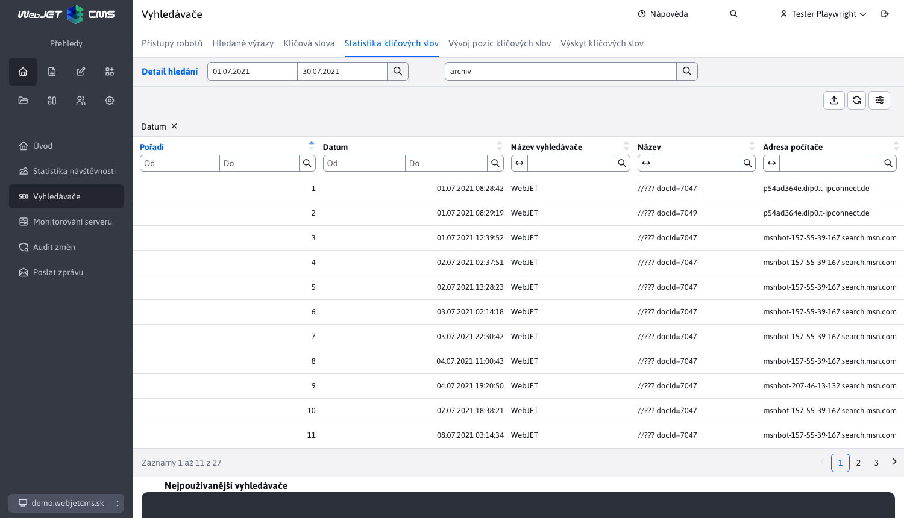
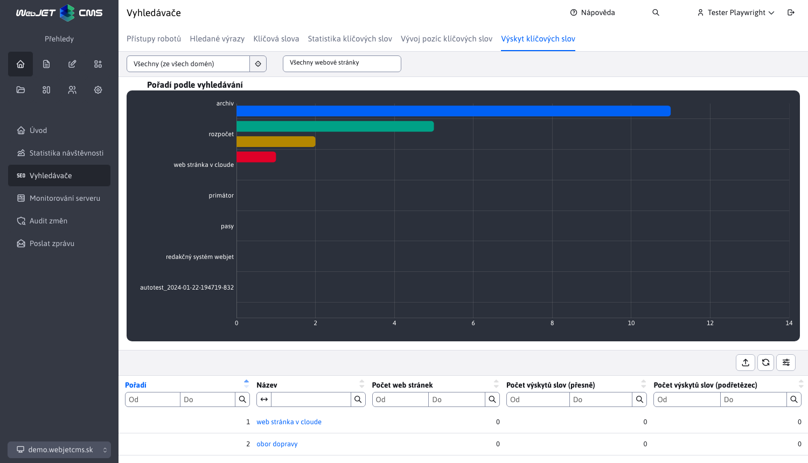

# Vyhledávače (SEO)

Aplikace Vyhledávače (SEO) je podpůrný nástroj pro optimalizaci stránek pro vyhledávače. Je dostupný v sekci Přehledy v levém menu jako položka Vyhledávače.

Sekce SEO využívá externí filtr, který je podrobněji popsán zde [Externí filtr](../stat/external-filter.md)

## Přístupy vyhledávacích robotů

Tato část zobrazuje statistiku přístupů vyhledávacích robotů na web sídlo. Můžete zjistit jejich aktivitu a datum posledního přístupu.

Obsažená je také tabulka, jejíž sloupec **Název serveru** nás po kliknutí přesměruje na detail statistiky konkrétního vyhledávacího robota.

## Vyhledávané výrazy

Tato část zobrazuje statistiku vyhledávaných výrazů na vyhledávačích při přechodu na vaši stránku. Dává informaci jaká slova návštěvníci hledají na vyhledávačích a na jakou stránku se k vám na dané slovo dostali.

Bližší informace naleznete zde [Vyhledávače](../stat/README.md#vyhledávače)

## Správa klíčových slov

Tato část umožňuje definovat a spravovat důležitá klíčová slova, pro která lze zjišťovat pozice ve vyhledávačích a zjišťovat hustotu klíčových slov na vašem web sídle.

Poskytnuta je podpora pro vytváření/editování/mazání/duplikování klíčových slov, jakož i jejich importování a exportování.

Při vytváření, editování i duplikování je třeba zadat všechny hodnoty.

## Statistika klíčových slov

Tato část zobrazuje statistiku vyhledávání zadefinovaných klíčových slov, zobrazuje procentuální a celkové počty a rozdělení klíčového slova mezi jednotlivé vyhledávače.

Obsažená datatabulka obsahuje sloupec **Název výrazu**, který nás po kliknutí přesměruje na detail statistiky konkrétního klíčového slova.

## Vývoj pozic klíčových slov

Tato část zobrazuje statistiku pozic a vývoj pozice klíčových slov v čase. Aktuální pozice jednotlivých klíčových slov na `Google`, `Yahoo` nebo `Bing` se aktualizuje jednou denně. To na kterém vyhledávači se ověřuje pozice slova závisí na nastavené doméně.

Obsažená datatabulka obsahuje sloupec **Název**, který nás po kliknutí přesměruje na detail vývoje pozice konkrétního klíčového slova.

Získání pozic používá službu [SerpApi](https://serpapi.com) na které je třeba provést registraci a získat API klíč. Používají se následující konf. proměnné:
- `seo.serpApiKey` - API klíč ze služby `SerpApi`.
- `seo.serpApiGoogleMaxResult` - maximální počet záznamů pro kontrolu výsledků (výchozí 10).

## Výskyt klíčových slov

Tato část zobrazuje počet výskytů definovaných klíčových slov na web sídle / web stránce. Umožňuje tak určovat hustotu klíčových slov na web sídle / stránce.

## Analýza stránky

Při editaci stránky můžete do stránky vložit aplikaci SEO. Technicky se do stránky nevloží, ale zobrazí analýzu klíčových slov aktuálně zobrazené web stránky.

Aplikace analyzuje čitelnost textu, používá techniku analýzy `Gunning fog index`. Odhaduje počet let vzdělávání potřebný k porozumění textu. Z praxe:
- 6 znamená vynikající čitelnost.
- 8 až 10 jsou časopisové a novinové články, povídky, snadno čitelné a pochopitelné.
- 11 až 14 již dosahují odbornějších článků. Vědecké práce se obvykle dostávají na úroveň 15 až 20 a vyžadují již od čtenáře plnou soustředěnost.
- nad 20 mají jen texty, u kterých pisatel zcela ignoruje čtenáře.

V tabulce se zobrazuje výskyt definovaných klíčových slov v textu aktuální webové stránky. Seznam klíčových slov můžete upravit v poli Klíčová slova (jednotlivá slova/výrazy oddělte čárkou) a klepnutím na OK obnovit tabulku.

