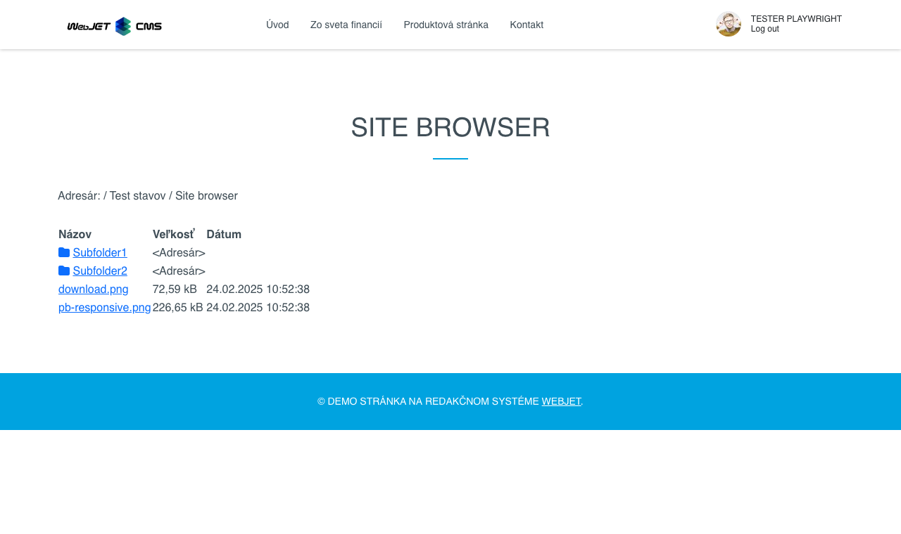

# Zobrazit soubory

Aplikace Zobrazení souborů umožňuje vložit do stránky prohlížeč složek a souborů na disku serveru.

Aplikace má v editoru následující parametry:
- Kořenový adresář - zadejte adresář, který lze prohledávat spolu s jeho podadresáři. V případě, že nezadáte žádný adresář, bude považován za kořenový adresář webové stránky.
- Kde zobrazit - můžete určit, kde se vybraný soubor otevře. Výchozí hodnota je do nového okna.
- Zobrazit název aktuálního adresáře - pokud toto políčko neoznačíte, zobrazí se cesta z kořenového adresáře do aktuálního adresáře.

