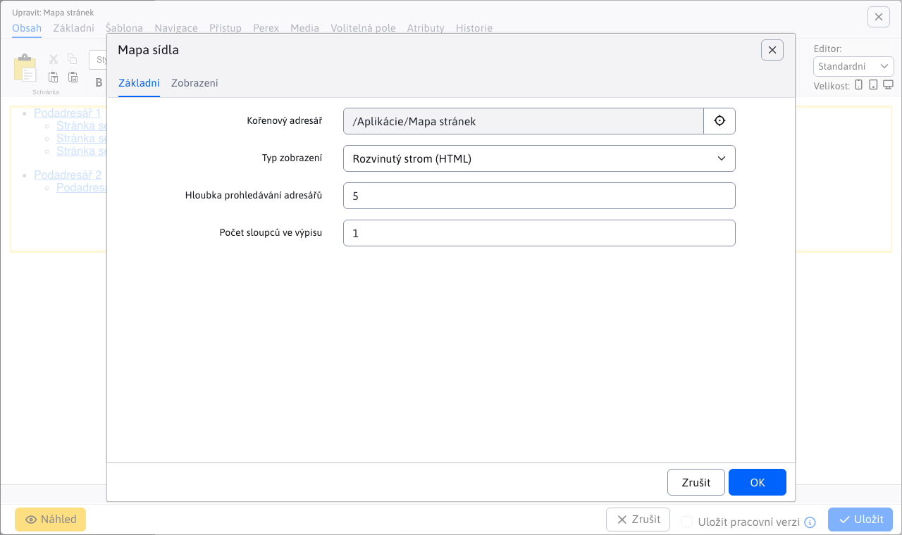

# Mapa stránek

Aplikace Mapa webu dokáže automaticky vygenerovat stromovou strukturu webu.

Zobrazení položky na mapě webu závisí na nastavení pole Navigační panel na kartě Navigace v adresáři webu. Má následující možnosti:
- Stejně jako v nabídce - zobrazení v mapě stránek se chová stejně, jako je nastaveno pole zobrazení v nabídce.
- Zobrazit - položka se zobrazí v mapě stránek.
- Nezobrazovat - položka se nezobrazí v mapě stránek (včetně podsložek).
- Zobrazit bez podsložek - položka se zobrazí v mapě stránek, ale její další podsložky se nezobrazí (výhodou je, že podsložky nemusí nastavovat způsob zobrazení).
- Zobrazit včetně webových stránek - v mapě webu se zobrazí složka a všechny webové stránky z této složky se zobrazí také jako samostatné položky. Ve výchozím nastavení možnost Zobrazit nezobrazuje webové stránky ze složky jako samostatné položky v mapě stránek.

Při zobrazování včetně webových stránek můžete stále nastavit, aby se v mapě stránek zobrazovala každá webová stránka zvlášť. Tato možnost se nachází také na kartě Navigace a obsahuje tyto možnosti:
- Stejně jako v nabídce - zobrazení v mapě stránek se chová stejně, jako je nastaveno pole zobrazení v nabídce.
- Zobrazit - webová stránka se zobrazí v mapě stránek.
- Nezobrazovat - webová stránka se nezobrazí v mapě stránek.

## Nastavení aplikace

Ve vlastnostech aplikace můžete nastavit:
- Kořenový adresář - výběr kořenového adresáře
- Typ zobrazení - způsob zobrazení mapy webu, viz možnosti níže.

pro některé typy zobrazení lze nastavit i nadále:
- Hloubka vyhledávání v adresáři - maximální vnoření zobrazených položek
- Počet sloupců ve výpisu - zobrazení lze rozdělit do zadaného počtu sloupců (pro hezčí zobrazení na webové stránce).

## Vyvinutý strom (HTML)

Stromová struktura je v kódu HTML zobrazena jako vnořený seznam UL-LI. Jedná se o nejlepší řešení mapy stránek s ohledem na vyhledávače. Není vhodné pro rozsáhlé webové stránky (resp. maximální vnoření by mělo být omezeno, aby stránka nebyla příliš velká).

## Mapa sedadel (Průzkumník Windows)

Stromová struktura je podobná struktuře Průzkumníka Windows, takže je návštěvníkům známá a snadno se v ní orientují. V levém sloupci se zobrazuje seznam adresářů a v pravém sloupci stránky ve vybraném adresáři.

Kliknutím na znaménko + nebo - otevřete/zavřete webové stránky v daném adresáři. Kliknutím na název adresáře se zobrazí hlavní dokument daného adresáře, kliknutím na název webové stránky se zobrazí požadovaná stránka.

## Vyvinutý strom (Javascript)

Stromovou strukturu lze rozšířit pomocí JavaScriptu. Nedoporučuje se pro velké webové stránky.

Kliknutím na znaménko + nebo - otevřete/zavřete webovou stránku/adresář.

## Vyvinutý strom (AJAX)

Stromová struktura je klikací pomocí JavaScriptu, jednotlivé části stromu se načítají ze serveru pomocí volání AJAX (jQuery).

Kliknutím na znaménko + nebo - otevřete/zavřete webovou stránku/adresář.

## Soubor XML pro vyhledávače

Vyhledávače stránek (např. Google) automaticky vyhledají soubor. `/sitemap.xml` s mapou webu. WebJET automaticky poskytuje tento soubor pomocí souboru `/components/sitemap/google-sitemap.jsp`.

Vygenerované položky se chovají podobně jako v zobrazení Rozšířený strom (HTML).
