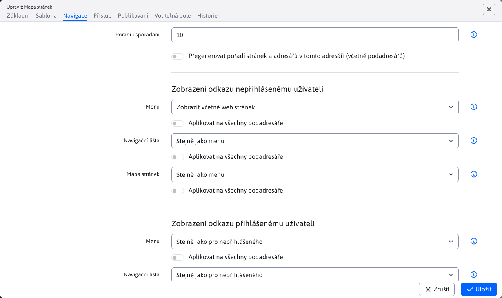

# Mapa stránek

Aplikace Mapa stránky dokáže automaticky generovat stromovou strukturu web sídla.

Zobrazení položky v mapě stránek je závislé na nastavení pole Navigační lišta v kartě Navigace adresáře web stránek. Má následující možnosti:
- Stejně jako menu - zobrazení v mapě stránek se chová stejně jako je nastaveno pole pro zobrazení v menu.
- Zobrazit - položka se v mapě stránek zobrazí.
- Nezobrazit - položka se v mapě stránek nezobrazí (a to včetně podsložek).
- Zobrazit bez podsložek - položka se v mapě stránek zobrazí, ale nebudou zobrazeny její další pod-složky (výhoda je v tom, že pod-složkou není třeba nastavovat způsob zobrazení).
- Zobrazit včetně web stránek - v mapě stránek se zobrazí složka a zobrazí se také všechny web stránky ze složky jako samostatné položky. Standardně u možnosti Zobrazit se nezobrazují webové stránky z adresáře jako samostatné položky v mapě stránek.

Při zobrazení včetně webových stránek můžete ještě samostatně každé webové stránce nastavit možnost zobrazení v mapě stránek. Možnost je rovněž v kartě Navigace a obsahuje možnosti:
- Stejně jako menu - zobrazení v mapě stránek se chová stejně jako je nastaveno pole pro zobrazení v menu.
- Zobrazit - web stránka se v mapě stránek zobrazí.
- Nezobrazit - web stránka se v mapě stránek nezobrazí.

## Nastavení aplikace

Ve vlastnostech aplikace lze nastavit:
- Kořenový adresář - výběr kořenového adresáře
- Typ zobrazení - způsob zobrazení mapy stránek, viz. možnosti níže

pro některé typy zobrazení je ještě možné nastavit:
- Hloubka prohledávání adresářů - maximální vnoření zobrazených položek
- Počet sloupců ve výpisu - zobrazení lze rozdělit do zadaného počtu sloupců (pro krásnější zobrazení na web stránce)

## Rozvinutý strom (HTML)

Stromová struktura je zobrazena v HTML kódu jako vnořený UL-LI seznam. Jedná se o nejlepší řešení mapy stránek s ohledem na vyhledávače. Není vhodné pro rozsáhlá web sídla (případně je třeba maximální vnoření omezit aby stránka nebyla příliš rozsáhlá).

## Mapa sídla (Windows Explorer)

Stromová struktura je podobná jako v Exploreru systému Windows, takže je pro návštěvníky známá a jednoduchá na ovládání. V levém sloupci je zobrazen seznam adresářů a v pravém sloupci stránky ve vybraném adresáři.

Klepnutím na znak + nebo - se zobrazí / zavřou web stránky v daném adresáři. Klepnutím na název adresáře se zobrazí hlavní dokument daného adresáře, kliknutím na název web stránky se zobrazí požadovaná stránka.

## Rozvinutý strom (Javascript)

Stromová struktura je rozklikatelná pomocí JavaScriptu. Nedoporučujeme pro rozsáhlá web sídla.

Klepnutím na znak + nebo - se zobrazí / zavřou web stránky / adresář.

## Rozvinutý strom (AJAX)

Stromová struktura je rozklikatelná pomocí JavaScriptu, jednotlivé části stromu jsou nahrávány ze serveru pomocí AJAX volání (jQuery).

Klepnutím na znak + nebo - se zobrazí / zavřou web stránky / adresář.

## XML soubor pro vyhledávače

Vyhledávače stránek (např. Google) automaticky hledají soubor `/sitemap.xml` s mapou stránek web sídla. WebJET tento soubor automaticky poskytuje pomocí souboru `/components/sitemap/google-sitemap.jsp`.

Generované položky se chovají podobně jako zobrazení Rozvinutý strom (HTML).
