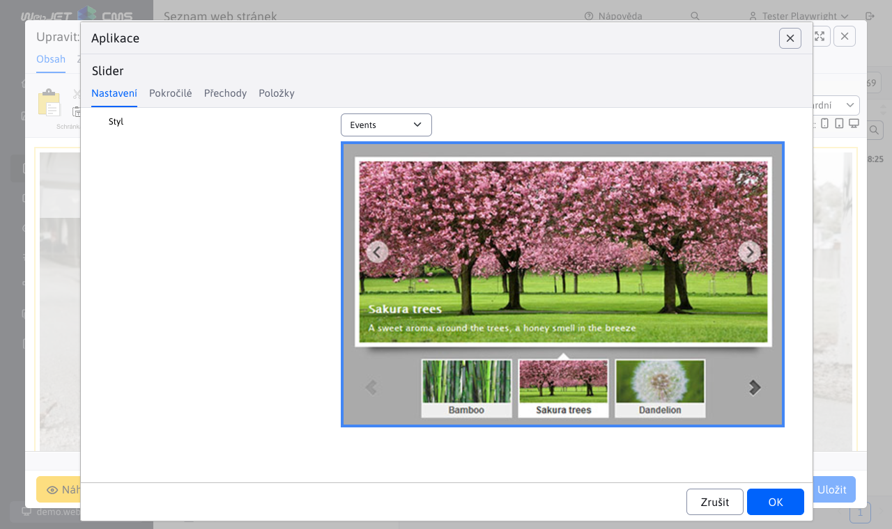
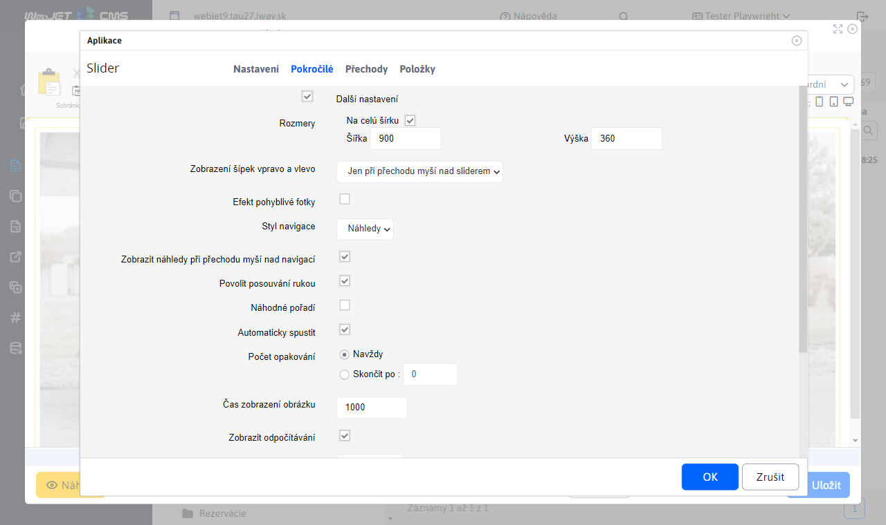
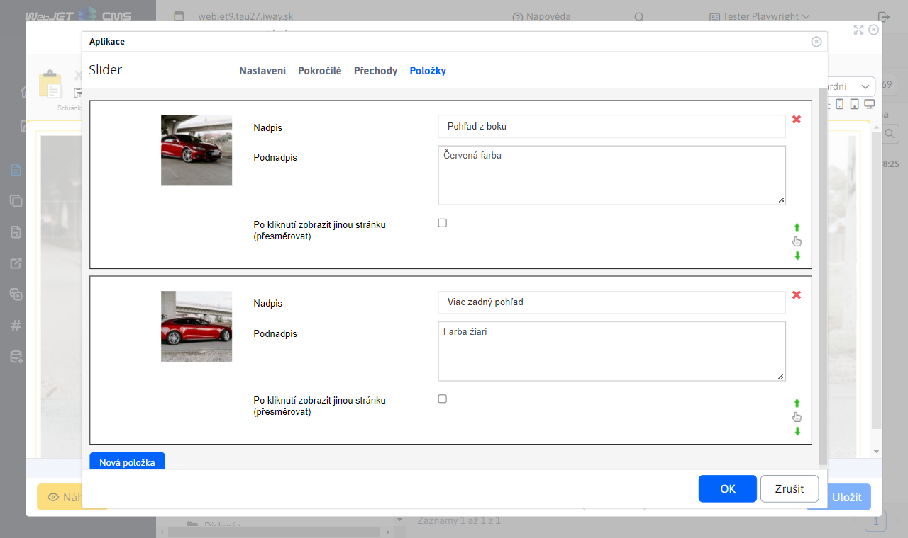
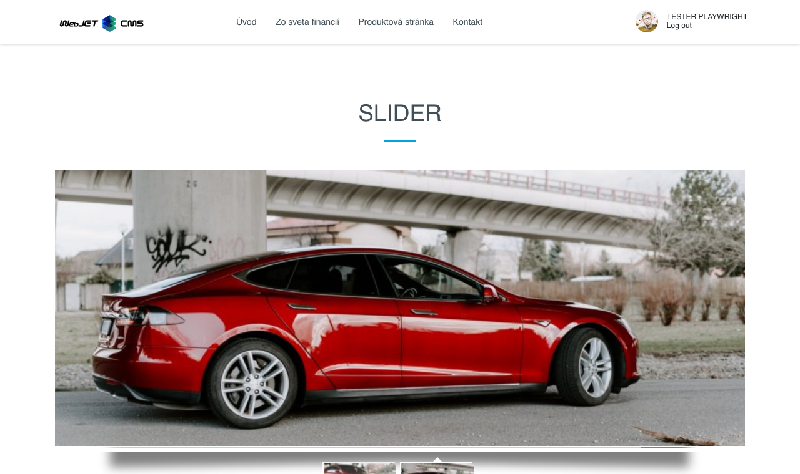

# Slider

Přidejte na svou stránku poutavý animovaný slider s obrázky. Vyberte si z široké nabídky designových stylů a animačních efektů, některé designy obsahují také nadpis a doplňkový text.

## Nastavení aplikace

### Nastavení

V této části lze nastavit styl výběrem z dostupných stylů:
- Classic
- ContentBox
- Cube
- Elegant
- Events
- FeatureList
- FrontPage
- Gallery
- Header
- Lightbox
- TextNavigation

### Pokročilé

V této části lze nastavit:
- Rozměry
- Zobrazení šipek vpravo a vlevo
- Efekt pohyblivé fotky
- Styl navigace
- Zobrazit náhledy při přejetí myší přes navigaci
- Povolit posouvání chycením
- Náhodné pořadí
- Automaticky spustit
- Počet smyček
- Čas zobrazení obrázku
- Zobrazit odpočítávání
- Barva odpočítávání
- Pozice odpočítávání
- Přechod na první obrázek
- Pozastavit při přejetí myší
- Číslování
- Stín

### Přechody

V této části lze vybrat přechody:
- Fade
- Cross fade
- Slide
- Elastic
- Slice
- Blinds
- Blocks
- Shuffle
- Tiles
- Flip
- Flip with zoom
- 3D
- 3D horizontal
- 3D with zoom
- 3D horizontal with zoom
- 3D flip
- 3D flip with zoom
- 3D tiles
- Ken bums

### Položky

V této části lze přidat nebo odebrat položku:
- Při přidání lze vyplnit nadpis, podnadpis, přesměrování.
- U položek lze změnit pořadí přesunutím.
- Odebrání položky lze kliknutím na červený křížek.

## Zobrazení aplikace

