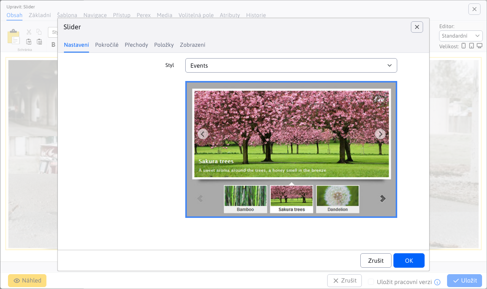
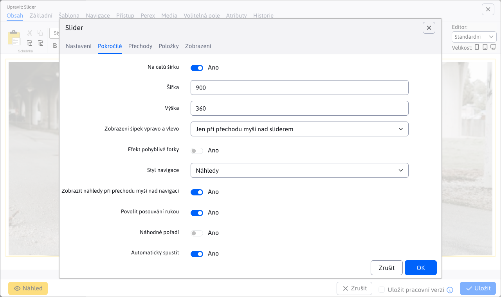
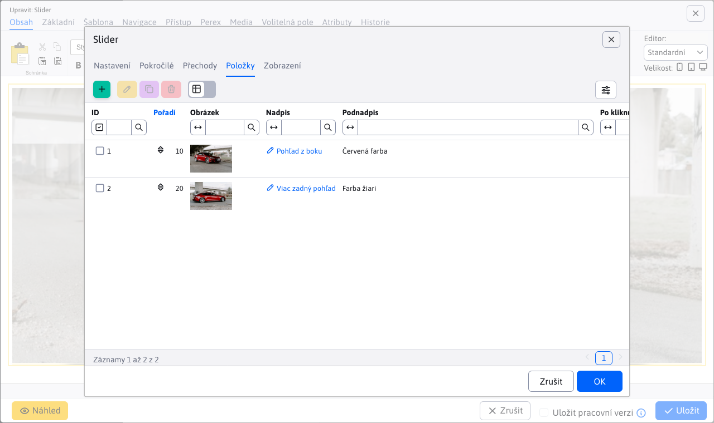
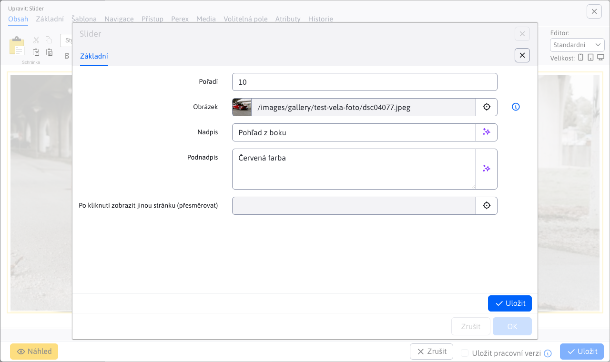

# Slider

Přidejte na svou stránku poutavý animovaný slider s obrázky. Vyberte si z široké nabídky designových stylů a animačních efektů, některé designy obsahují také nadpis a doplňkový text.

## Nastavení aplikace

Dostupné karty:
- **Generované CSS styly**
- **Pokročilé**
- **Přechody**
- **Položky**

### Generované CSS styly

V této části lze nastavit styl pro Slider.

### Pokročilé

V této části lze nastavit:
- Na celou šířku
- Šířka
- Výška
- Zobrazení šipek vpravo a vlevo (Není, Vždy, Jen při najetí myší přes slider)
- Efekt pohyblivé fotky
- Styl navigace (Není, Kuličky, Čísla, Náhledy)
- Zobrazit náhledy při přejetí myší přes navigaci
- Povolit posouvání chycením
- Náhodné pořadí
- Automaticky spustit
- Počet smyček (Navždy, Skončit po)
- Čas zobrazení obrázku
- Zobrazit odpočítávání
- Barva odpočítávání (hex/ENG)
- Pozice odpočítávání (Nahoru, Dolů)
- Přechod na první obrázek
- Pozastavit při přejetí myší
- Číslování
- Stín

### Přechody

V této části lze vybrat přechod (animaci), která se bude používat při změně obrázků.

### Položky

V této části lze vidět a spravovat položky aplikace, takže klasické akce jako přidání/úprava/mazání…

Pro jednotlivé položky můžete nastavit tyto parametry:
- **Obrázek**, podporován je výběr obrázku pomocí průzkumníka, jakož i přímé zadání cesty obrázku
- **Nadpis**, nadpis obrázku
- **Podnadpis**, podnadpis obrázku
- **Po kliknutí zobrazit jinou stránku (přesměrovat)**, výběr stránky na kterou budete přesměrováni (podporováno je i přímé zadání cesty)

## Zobrazení aplikace

