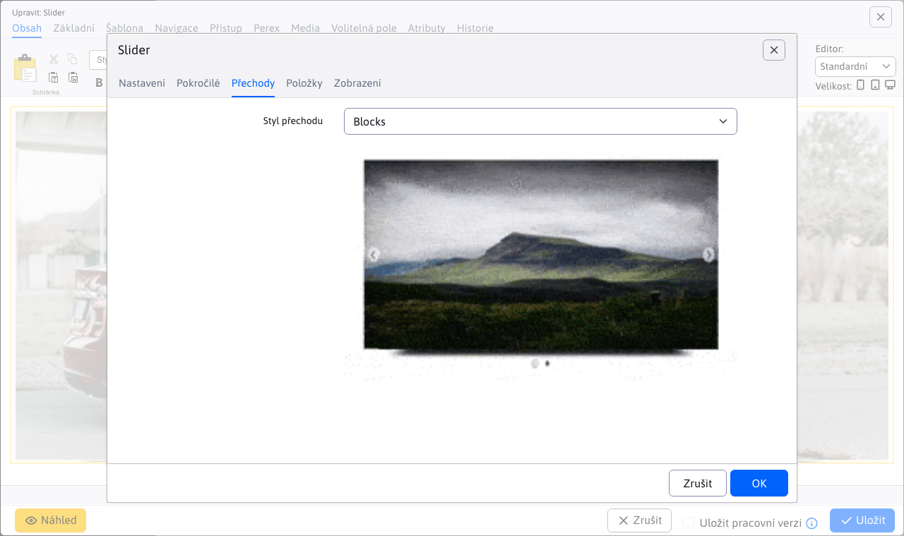

# Slider

Přidejte na stránku poutavý animovaný posuvník s obrázky. Vyberte si ze široké škály stylů designu a animačních efektů, některé návrhy obsahují také nadpis a další text.

## Nastavení aplikace

### Nastavení

V této části můžete nastavit styl výběrem z dostupných stylů:
- Classic
- ContentBox
- Kostka
- Elegantní
- Události
- Seznam funkcí
- FrontPage
- Galerie
- Záhlaví
- Lightbox
- TextNavigation

### Pokročilé

V této části lze nastavit:
- Rozměry
- Zobrazení šipek vpravo a vlevo
- Efekt pohyblivé fotografie
- Styl navigace
- Zobrazení miniatur při najetí na navigaci
- Povolení posouvání uchopením
- Náhodné pořadí
- Automatické spuštění
- Počet smyček
- Doba zobrazení obrázku
- Zobrazit odpočítávání
- Barva odpočítávání
- Pozice odpočítávání
- Přejděte na první obrázek
- Pozastavení při najetí myší
- Číslování
- Stín

### Přechody

V této části lze vybrat přechody:
- Fade
- Cross fade
- Sklíčko
- Elastické
- Slice
- Žaluzie
- Bloky
- Shuffle
- Dlaždice
- Flip
- Flip se zoomem
- 3D
- 3D horizontální
- 3D se zoomem
- 3D horizontální se zoomem
- 3D flip
- 3D flip se zoomem
- 3D dlaždice
- Ken boom

### Položky

V této části můžete přidat nebo odebrat položku:
- Při přidávání můžete vyplnit název, podnázev, přesměrování.
- Pořadí položek můžete změnit jejich přetažením.
- Položku můžete odebrat kliknutím na červený křížek.

## Zobrazení aplikace

