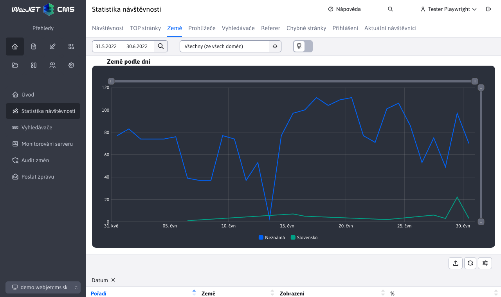
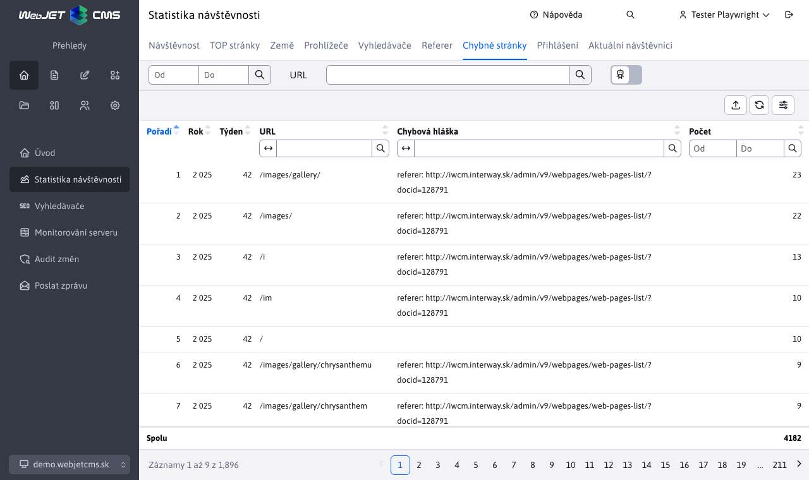

# Statistiky

Aplikace statistiky umožňuje zobrazit statistické informace o návštěvnících vašich webových stránek. Je k dispozici v sekci Přehled v levém menu jako položka Statistiky.

V žádosti jsou použity následující pojmy:
- views - celkový počet zobrazených stránek
- návštěvy (nebo relace) - počet návštěv každé osoby, přičemž za návštěvu se považuje doba, po kterou návštěvník nezavřel webový prohlížeč. Pokud tedy návštěvník přišel na váš web a zobrazil si 5 stránek, započítává se 5 zobrazení a 1 návštěva. Pokud zavře prohlížeč (nebo si žádnou stránku neprohlíží déle než 30 minut) a přijde na web znovu, počítá se to jako další návštěva.
- různých uživatelů - přibližný počet skutečně různých návštěvníků webu. Pokud návštěvník navštíví vaše stránky, bude mu zaslán soubor cookie, který bude použit k jeho identifikaci při další návštěvě. Platnost tohoto souboru cookie je nastavena na jeden rok, takže i když přijde na web po relativně dlouhé době, bude stále považován za stejného návštěvníka

Upozornění: ukládání statistických údajů podléhá souhlasu s ukládáním statistických souborů cookie podle GDPR. Pokud návštěvník nedá souhlas s jejich ukládáním, jsou statistiky anonymizovány:
- doba návštěvy se zaokrouhluje na 15 minut
- prohlížeč je nastaven na hodnotu unknown
- krajina je připravena pro neznámé

Sekce Statistiky používá externí filtr, který je podrobněji popsán zde. [Externí filtr](./external-filter.md)

## Doprava

> Můžete zjistit, ve kterých dnech (např. pravidelně ve středu) se návštěvnost zvyšuje, nebo v seskupení podle hodin, kdy máte nejvyšší/nejnižší návštěvnost.

Sekce **Doprava** nabízí přehled návštěvnosti celého webu a sloupcové grafy návštěvnosti podle dnů, týdnů, měsíců a hodin.

**Volba seskupení**

K dispozici jsou čtyři možnosti seskupení statistik. Seskupování mění počítání především jedinečných (různých) uživatelů. Pokud jako jedinečný uživatel navštívím webovou stránku dnes a zítra, jsem do seskupení započítán každý den. Ale ve seskupení podle týdne nebo měsíce se mohu seskupit pouze jednou.

Měsíční seskupení porovnává celkovou návštěvnost mezi více měsíci. Můžete vidět celkový počet zobrazení stránek a také počet různých uživatelů podle měsíců v roce.

Seskupení podle hodin je užitečné pro určení nejvyšší návštěvnosti během dne - v kterou hodinu je na webu největší provoz, což je obvykle spojeno s největším zatížením serverů a infrastruktury.

## Horní stránky

> Jaké stránky jsou nejnavštěvovanější?

Zobrazí seznam webových stránek s největším počtem zobrazení. Zobrazuje koláčový graf 10 nejnavštěvovanějších stránek, časovou osu a tabulku 100 nejnavštěvovanějších stránek.

V následující tabulce jsou uvedeny nejnavštěvovanější stránky s údaji o počtu zobrazení, návštěv a počtu různých uživatelů.

## Země

> Z jakých zemí návštěvníci přicházejí? Na které jazyky se zaměřit?

Zobrazuje provoz podle země. Země se určuje podle hlavičky HTTP `accept-language` prohlížeč, který zobrazuje webovou stránku. Obvykle se jedná o jazyk, který uživatel nastavil v operačním systému. Pokud se zemi nepodařilo identifikovat, je klasifikována jako **Neznámý**.

## Prohlížeče

> Jaké prohlížeče návštěvníci používají? Pro které prohlížeče a operační systémy je třeba web optimalizovat?

Seznam prohlížečů a jejich verzí. Tabulka zobrazuje nejpoužívanější prohlížeče s verzí, časovým zobrazením a kompletní tabulkou.

Hodnota **Neznámý** nebo **???** se zobrazuje u neznámých prohlížečů a u prohlížečů, u nichž návštěvník nedal souhlas ke shromažďování statistických souborů cookie.

**Poznámka:** typ, verze, operační systém se zjišťuje pomocí hlavičky HTTP `User-Agent`. Knihovna se používá [UAP-java](https://github.com/ua-parser/uap-java). Použité [YAML](https://github.com/ua-parser/uap-core/blob/master/regexes.yaml) soubor lze aktualizovat a cestu k němu lze nastavit v proměnné conf. `uaParserYamlPath`. Použije se po restartování aplikačního serveru.

## Vyhledávače

> Co návštěvníci na našich webových stránkách hledají? Jaké výrazy přišly na naše stránky z vyhledávačů?

Seznam vyhledávaných výrazů na vašich webových stránkách, ale také v externích vyhledávačích `Google`, `Seznam` atd. Kliknutím na hledaný výraz se zobrazí podrobný seznam časů a vyhledávač, který byl pro hledání daného výrazu použit. Ve sloupci adresa počítače se zobrazuje IP adresa/název domény počítače, ze kterého bylo vyhledávání provedeno. Hodnota `0.0.0.0` se zobrazí, pokud návštěvník nesouhlasil se shromažďováním statistických souborů cookie.

Graf a tabulku lze dále filtrovat v hlavním horním filtru podle vyhledávače a případně podle stránky, na které se výsledky vyhledávání nacházejí (nebo na kterou bylo přejito z externího vyhledávače).

## Odkud pocházejí

> Z jakých externích stránek se návštěvníci "proklikli" na naše webové stránky?

Seznam domén webových stránek, ze kterých návštěvníci přišli na vaši webovou stránku (klikli na odkaz na dané doméně). Stránka, ze které přišli, musí být na zabezpečeném protokolu (https) a nesmí zakazovat přenos odkazu na jiný server (hlavička HTTP `referrer`).

## Vadné stránky

> Jaké adresy URL/stránky jsou "někam" odkazovány, ale stránka/URL již neexistuje?

Seznam adres URL, pro které se zobrazí chybová stránka (kód HTTP 404). Každá chybná adresa URL je seskupena podle týdnů, takže v tabulce vidíte počet volání chybné adresy URL za týden.

Graf a tabulku můžete dále filtrovat v hlavním horním filtru podle výrazu URL (hledáno v režimu obsahuje). Můžete tak zúžit zobrazení pouze na zadaný výraz (např. `/files/` nebo `.pdf` zobrazit odkazy na chybějící soubory).

**TIP:** Doporučujeme opravit nesprávné stránky nebo je přesměrovat na jinou vhodnou stránku/URL adresu.

## Přihlášení

> Jak dlouho a kolikrát se návštěvníci nebo správci webu přihlašovali?

Statistiky přihlášení uživatelů do zabezpečené (heslem chráněné) zóny nebo do administrace. Počet minut přihlášení nemusí být přesný, uživatel nemusí být správně odhlášen a může být přihlášen ve více oknech/prohlížečích současně, jedná se pouze o orientační údaj.

Kliknutím na jméno uživatele zobrazíte podrobné statistiky přihlášení vybraného uživatele.

## Současní návštěvníci

> Kolik návštěvníků mají webové stránky právě teď?

Seznam aktuálních relací na webové stránce, obsahuje také seznam nepřihlášených uživatelů (jejich relací). Pokud máte webovou stránku v clusteru, obsahuje tento seznam pouze uživatele na uzlu, na kterém jste právě přihlášeni, nevidíte seznam ze všech uzlů.

Kliknutím na jméno uživatele zobrazíte podrobné statistiky přihlášení vybraného uživatele.

