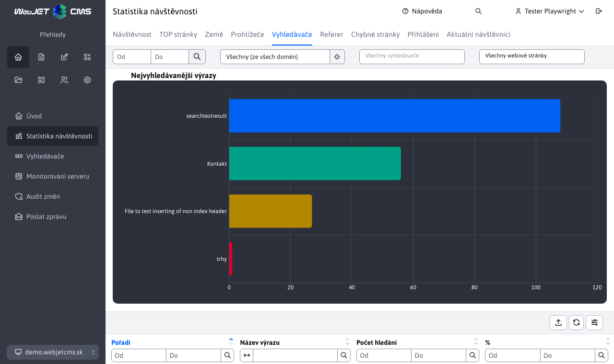
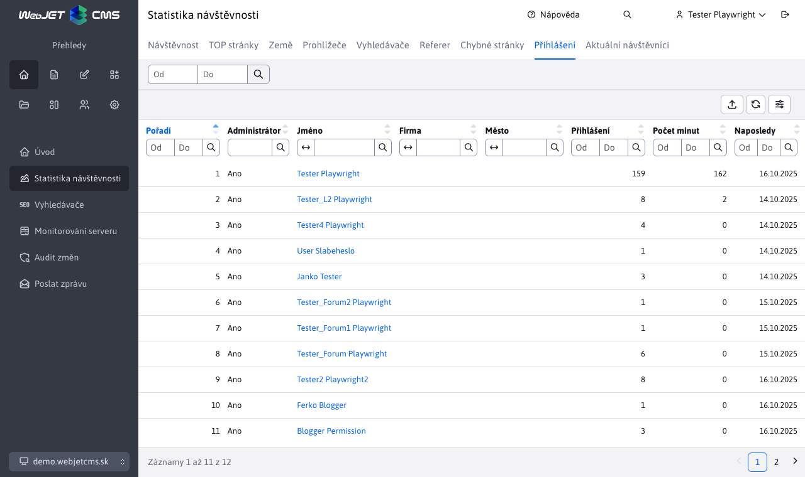

# Statistika

Aplikace statistika vám umožňuje zobrazit statistické informace o návštěvnících vašeho web sídla. Je dostupná v sekci Přehled levém menu jako položka Statistiky.

V aplikaci se používají následující výrazy:
- vidění - celkový počet zobrazených stránek
- návštěv (nebo sezení) - počet návštěv jednotlivých lidí, přičemž za jednu návštěvu se považuje doba, po kterou návštěvník nezavřel internetový prohlížeč. Čili pokud se návštěvník dostal na vaši stránku a prohlédl si 5 stránek započítá se 5 vidění a 1 návštěva. Když zavře internetový prohlížeč (nebo si nepodívá žádnou stránku za více než 30 minut) a na stránku přijde znovu, započítá se to jako další návštěva
- různých uživatelů – přibližné číslo skutečně rozdílných návštěvníků stránky. Pokud návštěvník navštíví vaši stránku zašle se mu cookie, pomocí kterého bude identifikován i při příští návštěvě. Platnost této cookie je nastavena na jeden rok, čili i kdyby přišel na stránku za relativně dlouhé období, stále se bude považovat za stejného návštěvníka

Upozornění: ukládání statistiky je podmíněno GDPR souhlasem na ukládání statistických cookies. Pokud návštěvník nedá souhlas k jejich ukládání je statistika anonymizována:
- doba návštěvy je zaokrouhlena na 15 minut
- prohlížeč je nastaven na neznámý
- země je nastavena na neznámá

Sekce Statistika využívá externí filtr, který je podrobněji popsán zde [Externí filtr](./external-filter.md)

## Návštěvnost

> Zjistíte ve které dny (např. pravidelně ve středy) roste návštěvnost, případně v seskupení podle hodin, ve kterém čase máte nejvyšší/nejnižší návštěvnost.

Sekce **Návštěvnost** nabízí přehled návštěvnosti celého web sídla a čárové grafy návštěvností podle dní, týdnů, měsíců a hodin.

**Výběr seskupení**

K výběru jsou čtyři možnosti seskupení statistik. Seskupení mění počítání hlavně unikátních (různých) uživatelů. Pokud já jako unikátní uživatel navštívím web stránku dnes i zítra jsem v seskupení podle dní započítán každý den. V uskupení podle týdne nebo měsíce ale už jen jednou.

Měsíční uskupení porovná celkovou návštěvnost mezi několika měsíci. Vidíte celkový počet zobrazení web stránky a také počet různých uživatelů podle měsíců v roce.

Seskupení podle hodin je vhodné pro určení největší návštěvnosti během dne – ve kterou hodinu má web největší návštěvnost, což je typicky spojeno s největší zátěží na servery a infrastrukturu.

## Top stránky

> Jaké stránky jsou nejnavštěvovanější?

Zobrazuje seznam web stránek s největším počtem vidění. Zobrazen je koláčový graf 10 nejnavštěvovanějších stránek, časový přehled a tabulka se seznamem 100 nejnavštěvovanějších stránek.

V tabulce je seznam nejnavštěvovanějších stránek s údaji o počtu vidění, návštěv a počtu různých uživatelů.

## Země

> Ze kterých zemí přicházejí návštěvníci? Na jaké jazykové mutace je třeba se zaměřit?

Zobrazuje návštěvnost podle zemí. Země se určí podle HTTP hlavičky `accept-language` prohlížeče, který zobrazuje web stránku. Typicky je to jazyk, který má uživatel nastaven v operačním systému. Pokud se zemi nepodařilo identifikovat je zařazena jako **Neznámá**.

## Prohlížeče

> Jaké prohlížeče návštěvníci používají? Na jaké prohlížeče a jaké operační systémy je třeba stránku optimalizovat?

Seznam používaných prohlížečů a jejich verzí. V grafu jsou zobrazeny nejpoužívanější prohlížeče s verzí, časové zobrazení a kompletní tabulka.

Hodnota **Neznámý** nebo **???** se zobrazuje pro neznámé prohlížeče a pro prohlížeče u kterých návštěvník nedal souhlas ke sbírání statistických cookies.

**Poznámka:** typ, verze, operační systém se detekuje podle HTTP hlavičky `User-Agent`. Používá se knihovna [UAP-java](https://github.com/ua-parser/uap-java). Použitý [YAML](https://github.com/ua-parser/uap-core/blob/master/regexes.yaml) soubor lze aktualizovat a cestu k němu nastavit do konf. proměnné `uaParserYamlPath`. Aplikuje se po restartování aplikačního serveru.

## Vyhledávače

> Co návštěvníci vyhledávají na naší stránce? Na jaké vyhledávané výrazy se dostaly na náš web z vyhledávačů?

Seznam vyhledávaných výrazů na vašem web sídle, ale také na externích vyhledávačích `Google`, `Seznam` atp. Klepnutím na hledaný výraz zobrazíte detailní seznam časů a použitého vyhledávače pro hledání daného výrazu. Ve sloupci adresa počítače se zobrazuje IP adresa/doménové jméno počítače ze kterého bylo provedeno hledání. Hodnota `0.0.0.0` se zobrazí pokud návštěvník nedal souhlas ke sbírání statistických cookies.

Graf a tabulku můžete dále v hlavním horním filtru filtrovat podle vyhledávače a případně stránky kde se nacházejí výsledky vyhledávání (nebo byl přechod na danou stránku z externího vyhledávače).

## Odkud přišli

> Z jakých externích stránek se "pre-klikli" návštěvníci na náš web?

Seznam domén web stránek ze kterých přišli návštěvníci na vaši web stránku (klikli na odkaz na uvedené doméně). Stránka ze které přicházejí musí být na zabezpečeném (https) protokolu a nesmí zakazovat přenos odkazu na jiný server (HTTP hlavička `referrer`).

## Chybné stránky

> Na jaké URL adresy/stránky vede "někde" odkaz, ale stránka/URL již neexistuje?

Seznam URL adres, pro které je zobrazena chybová stránka (HTTP kód 404). Každá chybná URL adresa je seskupena podle týdne, v tabulce tak vidíte počty volání chybné URL adresy za týden.

Graf a tabulku můžete dále v hlavním horním filtru filtrovat podle URL výrazu (vyhledává se v režimu obsahuje). Můžete tak zúžit zobrazení pouze pro zadaný výraz (např. `/files/` nebo `.pdf` zobrazí odkazy na chybějící soubory).

**TIP:** Chybné stránky doporučujeme opravit, nebo přesměrovat na jinou vhodnou stránku/URL adresu.

## Přihlášení

> Jak dlouho a kolikrát se přihlásili návštěvníci nebo administrátoři web sídla?

Statistika přihlášení uživatelů do zabezpečené (zaheslované) zóny, nebo do administrace. Údaj o počtu minut přihlášení nemusí být přesný, uživatel se nemusí korektně odhlásit a zároveň může být najednou přihlášen ve více oknech/prohlížečích, jedná se pouze o orientační údaj.

Klepnutím na uživatelské jméno zobrazíte podrobnou statistiku přihlášení zvoleného uživatele.

## Aktuální návštěvníci

> Kolik má web právě návštěvníků?

Seznam aktuálních sezení na web stránce, obsahuje také seznam nepřihlášených uživatelů (jejich sezení). Pokud máte web sídlo v clusteru obsahuje tento seznam pouze uživatele na uzlu na kterém jste právě přihlášeni, není vidět seznam ze všech uzlů.

Klepnutím na uživatelské jméno zobrazíte podrobnou statistiku přihlášení zvoleného uživatele.

