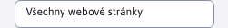

# Externí filtr

Externí filtr je speciální druh filtru, který se používá v sekcích. **Statistiky** a **SEO**. Údaje lze filtrovat v horní části stránky pod názvem stránky podle níže uvedených možností. Tento filtr funguje jinak než ostatní datové tabulky. V horní části u nadpisu je hlavní filtr, který filtruje data získaná ze serveru. Následně v datových tabulkách můžete filtrovat zobrazená data podle dalších sloupců, ale filtrování probíhá již pouze nad daty načtenými podle hlavního filtru.

Pokud externí filtr obsahuje filtrování podle sloupce, který je také v datové tabulce, filtrování přes tento sloupec se automaticky zakáže. Důvodem je zabránit vícenásobnému filtrování pro stejný parametr.

Takový případ je vidět na následujícím obrázku, kde externí filtr obsahuje filtrování podle data a stejné filtrování v datové tabulce je zakázáno.

> Nastavení data si hlavní filtr nahoře **si prohlížeč pamatuje, dokud jej nezavřete**. Pokud tedy nastavíte období od-do, můžete procházet sekce. **Statistiky** a **SEO**, zatímco všechny externí filtry obsahující filtrování období se automaticky nastaví podle zadané hodnoty. V tomto případě se data automaticky filtrují při načítání ze serveru. Totéž platí pro filtrování podle složek atd.

## Filtr data

Filtr data umožňuje nastavit rozsah dat pro zobrazení dat (např. provoz pro Statistiky).

Pokud není filtr zadán, budou se zobrazovat údaje pro:

**SEO**

- posledních 30 dní

**Statistiky**

- posledních 30 dní v případě seskupení podle dnů, týdnů a hodin.
- posledních 6 měsíců v případě seskupení podle měsíců.

Pokud je zadána pouze část "od", zobrazí se provoz od zadaného data do aktuálního dne. Pokud je zadána pouze část "do", zobrazí se :

**SEO**

- za posledních 30 dní.

**Statistiky**

- posledních 30 dnů k dnešnímu dni v případě statistik za dny, týdny a hodiny a 6 měsíců v případě statistik za měsíce.

## Pohled ze složky

Můžete filtrovat data pouze pro určitou složku, např. pro jazykové mutace nebo produktové mikrostránky. Můžeme si to představit jako provoz pro statistiky. Možnost **Všechny (ze všech domén)** je výchozí hodnota a zobrazí data bez ohledu na složku a doménu, což v případě statistik představuje **kompletní docházka**.

Pokud má přihlášený uživatel omezená práva ke složkám, nezobrazí se. **kompletní docházka**, ale nastaví se první složka, ke které má uživatel oprávnění.

Složky, ke kterým uživatel nemá oprávnění, se zobrazí s ikonou , nelze takovou složku vybrat. Složka však může obsahovat podsložku, na kterou má uživatel právo a bude ji samozřejmě moci vybrat.

V situacích, kdy chcete uživateli umožnit zobrazit **kompletní docházka** statistiky, ale chcete zachovat omezení práv, použijte přístupové právo. **Zobrazení statistik pro všechny složky**. Uživatelé s tímto oprávněním budou moci vidět **kompletní docházka** v sekci statistik i přes omezená práva ke složkám. Toto právo ovlivní pouze výběr složek v sekci statistik.

## Filtrování webových stránek

Filtrování webových stránek (např. v části Vyhledávače) umožňuje vybrat konkrétní webovou stránku z vybrané složky. Pokud není vybrána žádná složka (filtrování složek má vybranou hodnotu **Všechny (ze všech domén)**), nezobrazí se žádná webová stránka pro výběr.

Výchozí možnost je **Všechny webové stránky** a zobrazí data všech webových stránek, které odpovídají ostatním parametrům.

## Filtr vyhledávače

Filtrování na základě vybraného vyhledávače.

**Statistiky**

V této sekci se používá filtrování, například k vyfiltrování vyhledávaných výrazů pouze pro určitý vyhledávač, což nám umožňuje ověřit, který vyhledávač byl nejčastěji používán k přístupu na naše webové stránky.

**SEO**

V této části se filtrování používá např. k zadání vyhledávače pro ověření nejhledanějších klíčových slov.

Nabízené vyhledávače pro filtrování závisí na zvoleném časovém rozsahu, vybrané složce a filtrované webové stránce.

Výchozí možnost je **Všechny vyhledávače** a zobrazuje data ze všech vyhledávačů.

## Přepínač pro odfiltrování botů

Pokud nechcete ve statistikách zobrazovat data od botů (vyhledávacích botů, spamových botů), můžete je odfiltrovat. Pro zjištění zatížení serveru je nutné boty zohlednit, ale pro marketingové účely je vhodné je odfiltrovat.

