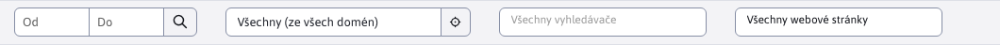
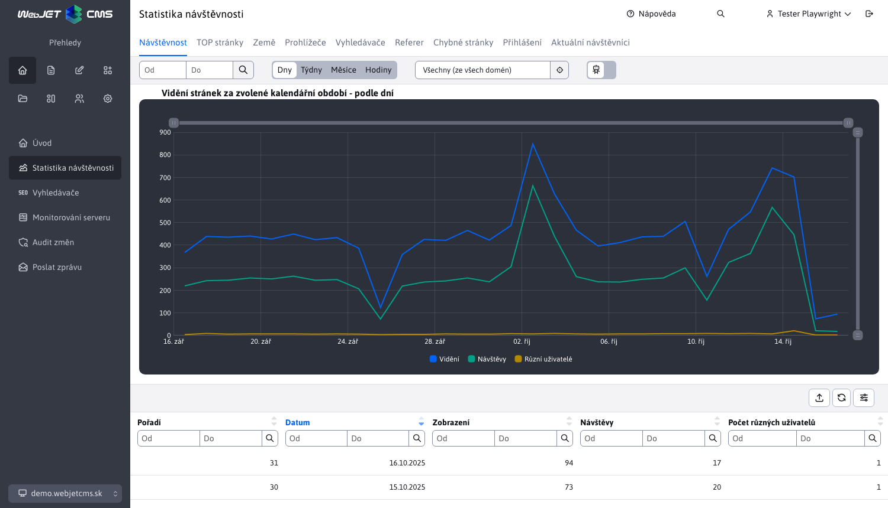
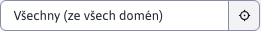

# Externí filtr

Externí filtr je speciální druh filtru, který využívají sekce **Statistika** a **SEO**. Údaje lze v horní části pod nadpisem stránky filtrovat dle níže uvedených možností. Tento filtr pracuje jinak, než v ostatních datatabulkách. V horní části u nadpisu je hlavní filtr, který filtruje načtení dat ze serveru. Následně v datatabulkách lze filtrovat v zobrazených datech podle dalších sloupců, filtrování se ale už děje jen nad daty načtenými podle hlavního filtru.

V případě, že externí filtr obsahuje filtrování podle sloupce, který je iv datatabulce, filtrování nad tímto sloupcem je automaticky znemožněno. Důvod je, aby se zabránilo vícenásobnému filtrování pro tentýž parametr.

Takový případ můžete vidět na následujícím obrázku, kde externí filtr obsahuje filtrování podle data a totéž filtrování v datatabulce je znemožněno.

> Nastavené údaje si hlavní filtr v horní části **pamatuje v prohlížeči dokud ho nezavřete**. Pokud tedy nastavíte období od-do můžete procházet přes jednotlivé části sekcí **Statistika** a **SEO**, přičemž všechny externí filtry obsahující filtrování podle období se automaticky nastaví podle Vámi zadané hodnoty. Data jsou v takovém případě automaticky filtrována při načítání ze serveru. Totéž platí i pro filtrování pomocí složky atp.

## Filtr data

Filtr data umožňuje nastavit rozsah dat pro zobrazení dat (např. návštěvnosti u Statistiky).

Pokud filtr není zadán, načtou se údaje za:

**SEO**

- posledních 30 dní

**Statistika**

- posledních 30 dní v případě seskupení podle dnů, týdnů a hodin
- posledních 6 měsíců v případě seskupení podle měsíců.

Pokud je zadaná pouze část "od", zobrazí se návštěvnost od zadaného data do aktuálního dne. Pokud je nastavena pouze část do, zobrazí se :

**SEO**

- posledních 30 dní k danému datu.

**Statistika**

- posledních 30 dní k danému datu v případě statistiky pro dny, týdny a hodiny a 6 měsíců v případě statistiky měsíců.

## Zobrazit ze složky

Data můžete filtrovat pouze pro určitou složku. při jazykových mutacích, nebo produktových mikro stránkách. Představit si pod tím můžeme návštěvnost u statistiky. Možnost **Všechny (ze všech domén)** je přednastavená hodnota a zobrazí data bez ohledu na složku a doménu, což v případě Statistiky reprezentuje **kompletní návštěvnost**.

Pokud přihlášený uživatel má omezená práva na složky se nezobrazí **kompletní návštěvnost**, ale je nastavena první složka, na kterou má uživatel uděleno právo.

Složky, na které uživatel nemá právo, se zobrazí s ikonou , takovou složku nelze zvolit. Složka ale může obsahovat pod složku na kterou uživatel právo má a bude ji samozřejmě umět zvolit.

V situaci pokud chcete uživateli umožnit zobrazit **kompletní návštěvnost** statistiky, ale chcete ponechat omezení práv, využijte přístupové právo **Zobrazit statistiku pro všechny složky**. Uživatelé s tímto právem budou schopen vidět **kompletní návštěvnost** v sekce statistiky i přes omezená práva ke složkám. Toto právo ovlivní pouze výběr složky v sekci statistika.

## Filtr web stránek

Filtrování web stránek (např. v sekci Vyhledávače) umožňuje vybrat konkrétní web stránku ze zvolené složky. Pokud žádná složka není zvolena (filtrování složky má zvolenou hodnotu **Všechny (ze všech domén)**), není zobrazena žádná web stránka k výběru.

Přednastavená možnost je **Všechny webové stránky** a zobrazí data všech web stránek, které vyhovují ostatním parametrům.

## Filtr vyhledávače

Filtr na základě vybraného vyhledávače.

**Statistika**

V této sekci je filtrování využito nap. k odfiltrování vyhledaných výrazů pouze pro konkrétní vyhledávač, což umožňuje ověřit, který vyhledávač byl použit nejvíce k přístupu na náš web.

**SEO**

V této sekci je filtrování využito nap. pro specifikování vyhledávače k ověření nejvíce vyhledávaných klíčových slov.

Nabízené vyhledávače k filtrování jsou závislé na zvoleném časovém rozsahu, zvolené složce a filtrované web stránky.

Přednastavená možnost je **Všechny vyhledávače** a zobrazí data všech vyhledávačů.

## Přepínač odfiltrovat botů

Pokud nechcete ve statistice zobrazovat údaje od botů (vyhledávací roboty, spam boty) můžete je v zobrazení odfiltrovat. Pro určení zátěže na server je třeba počítat is boty, ale pro marketingové účely je vhodné je filtrovat.

