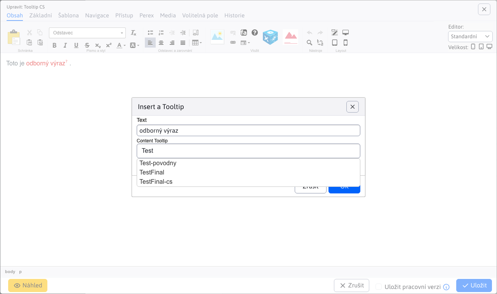

# Tooltip

V aplikaci Tooltip můžete definovat pomocný text/vysvětlení pro odborné výrazy, které zobrazujete na webové stránce. Obvykle se zobrazují jako pomocný text v "bublinu" po průchodu kurzorem přes odborný výraz. Definování Tooltipu přes aplikaci umožňuje na jednom místě globálně upravovat vysvětlení těchto odborných výrazů. Následně když jej upravíte změní se ve všech použitích najednou.


## Vytvoření tooltipu


Klepnutím na ikonu „Přidat“ se vám zobrazí dialogové okno pro vytvoření tooltipu.

V tomto okně definujete následující parametry:
- Název – jednoznačný identifikátor pro daný Tooltip / odborný výraz
- Jazyková verze – SK / CZ / EN ...
- Doména – volba, na které doméně se má daný Tooltip použít
- Text – textový obsah tooltipu


Rovněž vypadá i dialogové okno pro editaci stávajícího tooltip-u.

V tabulce máte k dispozici tlačítko „Duplikovat“, pokud chcete stávající tooltip zkopírovat a uložit pod jiným názvem, pro jinou jazykovou verzi, nebo pro jinou doménu.

## Import tooltip-ů

V záložce Import se nachází formulář pro nahrání excelu s tooltipy. Formát excelu by měl být totožný s formátem, který získáte při exportu aktuálního seznamu do Excelu. Ikonka pro export se nachází v levé horní části.


## Vložení tooltipu do stránky

Vytvoření bubliny nad odborným výrazem je možné přímo v editoru označením odborného výrazu a následným kliknutím na ikonu:
-  Vložit tooltip

Otevře se dialogové okno, v poli Tooltip (klíč) zadejte začátek odborného výrazu. Ze serveru se načte seznam výrazů obsahujících zadaný text, kliknutím myší vyberte přesný výraz:



Následně v HTML kódu stránky vznikne kód typu:

```html
<p>Toto je <span class="wjtooltip" title="!REQUEST(wjtooltip:TestFinal)!">odborný výraz</span>.</p>
```

který je na serveru zpracován a je vloženo aktuální znění textu. Pro hezké zobrazení "bubliny" je třeba v šabloně (nebo přes aplikaci skripty, nebo v nejhorším případě přes pole HTML kód do hlavičky v editoru stránky v kartě Šablona) doplnit následující JavaScript kód:

```javascript
<script type="text/javascript">
    $(document).ready(function() {
        $(".wjtooltip").tooltip();
    });
</script>
```


použité je rozšíření [Bootstrap Tooltip](https://getbootstrap.com/docs/4.0/components/tooltips/).
